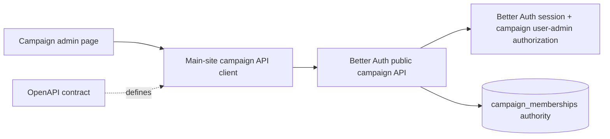

# Main-Site Campaign API Front-End Refactor Plan

## Status

Front-end integration reference. Endpoint implementation is external.

## Source of Truth

- Contract: `docs/contracts/user-account-management-api.openapi.yaml`
- Main-site developer guide: `docs/integrations/main-site-campaign-api-refactor-guide.md`
- Historical comparison only: `docs/contracts/user-account-management-api_old.openapi.yaml`

Do **not** edit OpenAPI specs in this repo. If implementation exposes a contract issue, document a request for the owning team instead.

## Corrected Ownership Boundary

This repository does **not** own or implement the campaign user-management API endpoints. It owns only the main website front-end integration that consumes those endpoints.

The `/api/v1/campaigns/**` member-management paths used by the UI are external API calls. Missing local route files under `src/pages/api/v1/campaigns/**` are expected and should not be treated as a backend gap in this repo.

Owned here:

- Campaign management UI/pages in the public Astro site.
- Front-end fetch/client code that calls the documented public campaign endpoints.
- Better Auth session participation from the website side, meaning same-origin/authenticated requests must carry the user session as expected by the deployed API boundary.
- Authorization-aware UI behavior based on API responses, especially `GET /admin-capability`.

Not owned here:

- OpenAPI contract changes.
- `/api/v1/campaigns/**` endpoint business logic, including add/update/revoke membership behavior.
- `/api/v1/admin/**` or `/api/v1/admin/campaigns/**` endpoints.
- Cloudflare Access-protected global operator workflows.
- D1 campaign membership mutations from the campaign admin UI.

## Goal

Refactor the main website campaign management front-end so it consumes the new Better Auth public-site campaign API contract, while keeping all endpoint implementation and business logic external.

The front-end must call only these non-admin public campaign endpoints:

- `GET /api/v1/campaigns/{campaignSlug}/admin-capability`
- `GET /api/v1/campaigns/{campaignSlug}/members`
- `POST /api/v1/campaigns/{campaignSlug}/members`
- `PUT /api/v1/campaigns/{campaignSlug}/members/{userId}`
- `DELETE /api/v1/campaigns/{campaignSlug}/members/{userId}`

It must never call or depend on:

- `/api/v1/admin/**`
- `/api/v1/admin/campaigns/**`
- Cloudflare Access headers
- `CF-Access-Jwt-Assertion`
- global admin/operator assumptions
- local D1-backed implementations of these public campaign API routes

## Architecture Direction

Use a thin front-end API client/helper for campaign management calls. This helper is a consumer-side integration seam for a real external API boundary, not an owner of API behavior.

Recommended shape:



Keep the client small and explicit. Do not generate a client or add dependencies unless separately approved.

## Current Implementation Signals to Inspect

- `src/pages/campaigns/[campaign]/admin.astro`
  - likely owns the current management UI and client-side fetch behavior.
- Local `src/pages/api/v1/campaigns/**` route files
  - should not exist for campaign member-management business logic in this repo under the current boundary.
  - if found, treat them as stale prototypes or explicit proxies to review, not as the owned backend implementation.
- `src/utils/campaign-admin-api.ts`
  - currently mixes DTOs, validation, API responses, and D1-backed context resolution. For front-end-only integration, keep only reusable DTO/client concerns if useful; avoid endpoint/server business logic for campaign membership mutation.
- `src/lib/campaign-membership-repo.ts`
  - can remain for existing site-owned auth/access/account summary reads if still needed, but campaign admin UI must not mutate memberships directly through this repo.

## Implementation Plan

### 1. Freeze contract files

- Do not edit `docs/contracts/user-account-management-api.openapi.yaml`.
- Do not edit `docs/contracts/user-account-management-api_old.openapi.yaml`.
- Use `docs/integrations/main-site-campaign-api-refactor-guide.md` as the implementation guide.
- If discrepancies appear, add a note to the implementation summary for the contract-owning team.

### 2. Keep endpoint routing external

The front-end calls same-origin `/api/v1/campaigns/**` contract paths, but endpoint behavior is external to this repository.

- If `/api/v1/campaigns/**` is routed externally at Cloudflare/edge level, this repo should not contain local route files that shadow it.
- If the main site ever requires a same-origin transport proxy, that proxy must be a separate, explicit architecture decision. It must forward authenticated requests and responses without owning business logic.
- This repo must not inspect Cloudflare Access, implement D1 membership mutation, or reshape contract DTOs for campaign member-management behavior.

Default target:

- Front-end code calls same-origin `/api/v1/campaigns/**` contract paths.
- The endpoint implementation is external or edge-routed, not local D1 code.
- No local backend implementation is required or expected in this repo.

### 3. Introduce a main-site campaign API client

Create a small front-end/client-safe helper, for example:

- `src/utils/campaign-management-api-client.ts`

Responsibilities:

- Build URLs with encoded `campaignSlug`, `userId`, cursor, role, and limit values.
- Use documented HTTP methods.
- Send JSON request bodies for POST/PUT/DELETE where applicable.
- Parse success DTOs and error DTOs.
- Preserve Better Auth session behavior by relying on same-origin cookies. In browser fetches, use `credentials: 'include'` only if needed for clarity/consistency.
- Avoid any D1 imports.
- Avoid any Cloudflare Access headers.

Types to model from the contract:

```ts
type CampaignRole = 'member' | 'gm';

type CampaignMember = {
  userId: string;
  displayName: string | null;
  email: string;
  role: CampaignRole;
  joinedAt?: string | null;
  updatedAt?: string | null;
};

type CampaignMemberPage = {
  campaignSlug: string;
  items: CampaignMember[];
  nextCursor: string | null;
};

type CampaignAdminCapability = {
  campaignSlug: string;
  actor: {
    userId: string;
    displayName: string | null;
  };
  canAdministerUsers: boolean;
  capabilities: Array<'user-admin'>;
  source: 'campaign-gm' | 'global-admin' | 'none';
};

type AddCampaignMemberRequest = {
  email: string;
  role: CampaignRole;
};

type CampaignMemberCreateResponse = {
  member: CampaignMember;
  outcome: 'created';
  confirmationMessage: string;
};

type CampaignMemberUpdateResponse = {
  member: CampaignMember;
  outcome: 'updated' | 'unchanged';
  confirmationMessage: string;
};

type CampaignMembershipSummary = {
  campaignSlug: string;
  userId: string;
  role: CampaignRole;
  grantedAt?: string | null;
  updatedAt?: string | null;
};

type CampaignMemberRevokeResponse = {
  revokedMembership: CampaignMembershipSummary;
  outcome: 'revoked';
  confirmationMessage: string;
};

type ApiError = {
  error: string;
  message: string;
  requestId?: string;
};
```

Client functions:

- `getCampaignAdminCapability(campaignSlug)`
- `listCampaignMembers({ campaignSlug, role, limit, cursor })`
- `addCampaignMember({ campaignSlug, email, role })`
- `updateCampaignMember({ campaignSlug, userId, role, reason })`
- `revokeCampaignMember({ campaignSlug, userId, reason })`

### 4. Refactor campaign admin page/UI to consume the client

Update `src/pages/campaigns/[campaign]/admin.astro` and any inline script or extracted client script.

Required flow:

1. Resolve `campaignSlug` from route/page data.
2. On page/client bootstrap, call:
   - `GET /api/v1/campaigns/{campaignSlug}/admin-capability`
3. If `canAdministerUsers` is false:
   - hide or disable member-management controls
   - show a campaign-scoped permission message
4. If true, call:
   - `GET /api/v1/campaigns/{campaignSlug}/members`
5. Render returned `items` exactly as campaign-scoped identities.
6. For mutations:
   - add by email: `POST /members`
   - role change: `PUT /members/{userId}`
   - revoke: `DELETE /members/{userId}`
7. After success:
   - show `confirmationMessage`
   - update local state from response or re-fetch `GET /members`

Do not pre-load member data server-side through D1 for the management UI. The contract API is authoritative for management state.

### 5. Remove direct D1 mutation from management UI path

The campaign management UI must not call or import:

- `CampaignMembershipRepo` for member mutation
- D1 binding helpers for member mutation
- local endpoint utility functions that implement campaign membership mutation behavior

It is acceptable for unrelated site features to continue using D1 membership reads if they are genuinely site-owned, such as:

- protected campaign content access checks
- account page membership summaries
- search result access filtering

Do not expand this refactor into unrelated access-control rewrites.

### 6. Handle documented errors explicitly

Implement UI/client behavior for:

| Status | Main-site behavior |
| --- | --- |
| `400` | Show validation/malformed request message; keep state unchanged. |
| `401` | Trigger sign-in prompt or redirect to `/login` with return path. |
| `403` | Hide controls and show campaign-scoped permission message. |
| `404` | For add-by-email, show “No existing account found for that email.” For member actions, refresh list. |
| `409` | Show conflict message and re-fetch members. |
| `429` | Disable repeated submissions temporarily; show retry/rate-limit message. |
| `503` | Keep local state unchanged and allow retry. |

Always prefer API `message` for user-facing status where safe, and retain `requestId` for support copy/logging where appropriate. Never log cookies or auth material.

### 7. Remove Cloudflare Access assumptions from main-site integration

Search front-end integration code for:

- `CloudflareAccess`
- `CF-Access-Jwt-Assertion`
- `/api/v1/admin`
- `admin/campaigns`
- global admin/operator language in main-site UI paths

Remove or replace with Better Auth/campaign capability language.

Important distinction:

- Do not delete Cloudflare Access references from the source OpenAPI contract; global admin routes in that contract legitimately use Cloudflare Access.
- Do not edit the OpenAPI spec.

### 8. Tests to add/update

Recommended test targets:

- API client URL construction:
  - properly encodes `campaignSlug`, `userId`, query params
  - calls only `/api/v1/campaigns/**`
  - never calls `/api/v1/admin/**`
- API client methods:
  - `GET admin-capability`
  - `GET members`
  - `POST members`
  - `PUT members/{userId}`
  - `DELETE members/{userId}`
- Request behavior:
  - sends `Accept: application/json`
  - sends `Content-Type: application/json` where a body exists
  - includes credentials if the implementation chooses explicit credentials
  - never sends Cloudflare Access headers
- Error mapping:
  - parses JSON `ApiError`
  - preserves `status`, `error`, `message`, and `requestId`
  - handles non-JSON failures gracefully
- UI behavior if practical:
  - capability false hides controls
  - successful mutation displays `confirmationMessage`
  - `409` triggers or recommends refetch

Remove or rewrite tests that assert local D1 endpoint mutation behavior for campaign management UI. Keep repository tests that cover D1 membership reads used by site-owned access paths.

### 9. Verification commands

Run:

```bash
pnpm test
pnpm build
```

Manual verification in auth/parity lane if available:

```bash
pnpm dev:cf:auth
```

Manual checklist:

- Sign in through Better Auth.
- Open campaign admin page.
- Confirm admin controls are hidden or disabled when capability is false.
- Confirm controls render when `canAdministerUsers` is true.
- List members.
- Add member by exact email through `POST /members`.
- Update role through `PUT /members/{userId}`.
- Revoke member through `DELETE /members/{userId}`.
- Confirm browser/network calls never target `/api/v1/admin/**` and never send Cloudflare Access headers.

## Non-Goals

- Do not edit OpenAPI specs.
- Do not implement campaign API endpoint business logic in this repo.
- Do not implement `/api/v1/admin/**` or `/api/v1/admin/campaigns/**`.
- Do not add Cloudflare Access support to this repo.
- Do not mutate D1 campaign memberships directly from the campaign admin UI.
- Do not add global user search.
- Do not add invitations, pending memberships, access requests, or notification emails.
- Do not add dependencies or generated clients without explicit approval.

## Code Handoff Notes

- Treat `docs/contracts/user-account-management-api.openapi.yaml` as immutable contract input.
- Treat `docs/integrations/main-site-campaign-api-refactor-guide.md` as the main implementation guide.
- If local prototype endpoint files block same-origin routing to the real API, remove them after confirming they are stale. Do not replace them with business logic in this repo.
- If a proxy is ever required, document that as a separate decision; it must forward rather than own behavior: no D1 membership mutation, no Cloudflare Access, no contract-shape invention.
- Keep changes scoped to the campaign management front-end integration and supporting client/tests.
