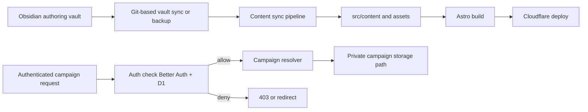

# World of Aletheia

A live worldbuilding and campaign platform for tabletop RPG play.

**Live site:** [worldofaletheia.com](https://worldofaletheia.com)

This started as a practical tool for my table (my brother and I as GMs, plus our players), not a demo project. It then evolved into something worth publishing: both the product and the architecture behind it.


## What This Project Is

World of Aletheia is a production Astro site with three active domains:

- **Canon**: setting reference content (lore, places, sentients, flora, bestiary, factions)
- **Using Aletheia**: systems and play documentation
- **Campaigns**: active campaign/session domain, designed for progressively richer interactive tooling

The core design goal is simple: keep publishing fast and reliable for content, while creating a clean runway for campaign features that need authenticated runtime behavior.

## Content Authoring Workflow (Obsidian-First)

This project follows an **Obsidian-first source-of-truth model**.

- Canonical content is authored in an Obsidian vault
- The website repo is the publish/deploy target, not the primary writing surface
- Markdown + frontmatter are synchronized into this repo through the content sync workflow

Current practical setup:

- Multiple authors write in Obsidian
- Obsidian's Git plugin is used for vault sync/backup/versioning
- A local working copy of this repo is used by the sync pipeline for simplicity and deterministic builds

This is a workflow choice, not a hard product limitation:

- Other sync/backup approaches can work, as long as they preserve markdown/frontmatter structure expected by the pipeline

Reference decision: `plans/adrs/0001-obsidian-first-content-architecture.md`

## Why This Repo Is Public

- Share the product implementation openly for anyone curious how this is built
- Share architecture decisions and trade-offs, not just code snapshots
- Include the project in my portfolio for freelance and long-term contract work

Short version: this is real software used by real humans, with enough scars to be useful.

## Product Focus

Current priorities:

- Stable, readable content publishing
- Campaign access control and private campaign content boundaries
- Expandability toward campaign tooling beyond static pages

Planned near-term roadmap:

- **Custom calendar** (in active design/implementation planning)
- **Player character and NPC organization capabilities**
- **Potential interactive maps**

Useful planning references:

- `plans/features/aletheia-calendar-architecture-recommendation.md`
- `plans/features/aletheia_calendar_developer_handoff.md`
- `plans/adrs/0009-campaign-content-source-separation-for-public-repo.md`

## Architecture Snapshot

This is an Astro-first architecture with static content where possible and runtime complexity only where needed.



If you like decision records more than mystery architecture, see `plans/adrs/`.

## Tech Stack and Infrastructure

- **Framework:** Astro (static-first, Islands when interaction is justified)
- **Styling:** Tailwind CSS + DaisyUI
- **Runtime/deploy:** Cloudflare (Workers/Pages flow, Wrangler tooling)
- **Auth/data:** Better Auth + Cloudflare D1
- **Content pipeline:** Obsidian-first sync tooling in `scripts/content-sync/`
- **Testing:** Vitest
- **Package manager:** pnpm

## Authorship and AI Collaboration

I own the architecture, technical direction, decision-making, reviews, approvals, and overall product outcomes.

Implementation is **AI-assisted by design**:

- Primary coding agent workflow: **Kilo Code** via **Kilo Gateway**
- Model ecosystem includes providers such as **OpenAI**, **Anthropic**, and **Google**
- I use agents as force multipliers, not as autopilot; architectural intent and acceptance criteria are human-led

Or put differently: the AI writes plenty of lines, but it does not get final say in system design.

## Developer Setup (Concise)

Prereqs:

- Node.js 20+
- pnpm
- Cloudflare account + Wrangler (for cloud-backed/auth flows)

Install and run:

```bash
pnpm install
pnpm dev
```

Build/test:

```bash
pnpm build
pnpm test
```

Content workflow helpers:

```bash
pnpm content:sync
pnpm content:sync:dry-run
pnpm content:validate
```

For local config setup, copy `config/content-sync.config.example.json` to `config/content-sync.config.json` and set your `vaultRoot`.

More detailed docs:

- `docs/content-ingestion-user-guide.md`
- `docs/runbook/obsidian-content-sync-troubleshooting.md`

A more end-user-friendly setup guide may be added later if there is enough outside interest.

## Contributing

- Issues are welcome
- PRs are considered selectively to preserve architectural coherence

## Work With Me

I am available for architecture-heavy consulting and implementation leadership, especially where product direction and system design need to stay tightly coupled.

This section will point to my portfolio/CV contact links.

[LinkedIn](https://www.linkedin.com/in/bradarnst/)
[CV/Portfolio Site](https://brad.nexusseven.com)

## License

MIT.

