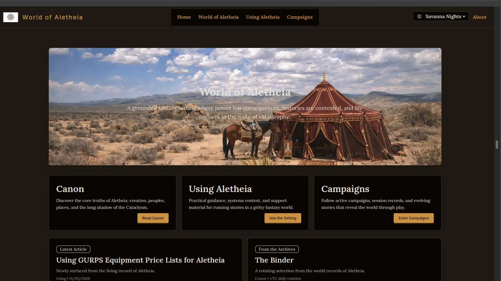
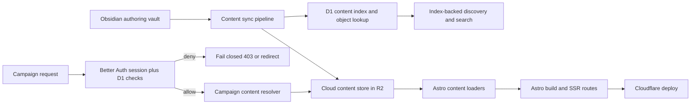

# World of Aletheia

A live worldbuilding and campaign platform for tabletop RPG play.

**Live site:** [worldofaletheia.com](https://worldofaletheia.com)

This started as a practical tool for our table (my brother and I as GMs, plus our players), not a demo project. It has since grown into a production system with real architecture constraints: cloud-backed content, authenticated campaign boundaries, and discovery-focused navigation.



## What This Project Is

World of Aletheia is an Astro-first site with four product domains:

- **Canon** (`/lore`, `/places`, `/sentients`, `/bestiary`, `/flora`, `/factions`) for world reference content
- **Using Aletheia** (`/systems`, `/meta`, `/about`) for play/system documentation
- **Reference** (`/references`, `/references/calendar`, `/references/timeline`, `/references/maps`) for shared lookup and visualization surfaces
- **Campaigns** (`/campaigns/**`) for campaign-specific content with runtime access control

Design-wise, the homepage follows a story-first pattern instead of acting like a sitemap. The visual layer is intentionally curated (hero governance, multi-theme support, readability-first structure), and discovery tools are woven directly into collection pages.

## Current Functionality

Core capabilities currently implemented:

- **Content publishing and domain separation** across 23 Astro collections with schema validation in `src/content.config.ts`
- **Taxonomy-aware discovery** on high-volume collections (latest/grouped views, type/subtype/tag filtering, pagination)
- **Reference surfaces** with live chronology routes:
  - `/references/calendar` (month/week/year views)
  - `/references/timeline` (dated lore event chronology)
  - `/references/maps` (Reference-domain map placeholder)
  - `/api/calendar/*` (month/week/year, moon phase, and date-diff JSON contracts)
- **Campaign family model** with explicit campaign collections (`campaignLore`, `campaignPlaces`, `campaignCharacters`, `campaignScenes`, `campaignAdventures`, `campaignHooks`, etc.)
- **Campaign access boundaries** using Better Auth + D1 membership checks and fail-closed behavior for protected content
- **Protected campaign media delivery** through API routes with auth-aware gating and sync-time `thumb`/`detail`/`fullscreen` variants
- **Search API foundation** via `/api/search` backed by the discovery metadata index

## Content Workflow (Obsidian-First)

This project follows an Obsidian-first source-of-truth model (ADR-0001):

- Canonical writing happens in an Obsidian vault
- Markdown + frontmatter are synchronized through `scripts/content-sync/`
- Default sync mappings target cloud-backed collections in R2
- The website repo is the publication/deployment target

The flow is one-way by design: Obsidian -> repo sync -> build/deploy. There is no CMS or bidirectional sync pattern.

## Architecture Snapshot

This architecture stays static-first where possible and uses runtime checks only where required.



Cloud-backed content mode is now the canonical runtime lane (ADR-0010), with local mode retained for rollback and local authoring workflows.

## Tech Stack

- **Framework:** Astro 6 (`@astrojs/cloudflare` adapter)
- **UI:** Tailwind CSS 4 + DaisyUI 5
- **Runtime/deploy:** Cloudflare Workers/Pages + Wrangler
- **Auth:** Better Auth
- **Data/index:** Cloudflare D1 (`content_index` object lookup/discovery index, auth/session data)
- **Content storage:** Cloudflare R2 object storage with D1-backed markdown lookup
- **Content sync:** Node ESM scripts in `scripts/content-sync/`
- **Testing:** Vitest
- **Package manager:** pnpm

## Developer Setup

Prerequisites:

- Node.js 20+
- pnpm
- Cloudflare account and Wrangler CLI

Install and run the fast local lane:

```bash
pnpm install
pnpm dev
```

Run Cloudflare parity lane (authoritative for cloud-mode behavior):

```bash
pnpm dev:cf:build
pnpm dev:cf
```

Run auth + parity lane together:

```bash
pnpm dev:cf:auth
```

Build and test:

```bash
pnpm build
pnpm test
```

## Content Sync Commands

```bash
pnpm content:sync
pnpm content:sync:dry-run
pnpm content:validate
pnpm campaign:rename -- --from=old-campaign-slug --to=new-campaign-slug
```

Initial setup:

1. Copy `config/content-sync.config.example.json` to `config/content-sync.config.json`
2. Set `vaultRoot`
3. Set your cloud content credentials (`R2_ACCESS_KEY_ID`, `R2_SECRET_ACCESS_KEY`)

## ADRs and Planning

Architecture decisions are tracked in `plans/adrs/`.

Key recent decisions:

- ADR-0010: cloud-default content source mode
- ADR-0011: D1 metadata index for discovery/search
- ADR-0013: campaign-domain collection taxonomy refactor
- ADR-0018: Reference domain and `/references/*` route namespace policy

## Why This Repo Is Public

- Share practical implementation details, not just screenshots
- Document architectural trade-offs through ADRs
- Maintain a transparent portfolio artifact for architecture + engineering work

Short version: this is production software used by real people.

## Authorship and AI Collaboration

I own architecture, technical direction, review, and final acceptance.

Implementation is AI-assisted by design:

- Primary coding agent workflow: Kilo Code via Kilo Gateway
- Model ecosystem includes OpenAI, Anthropic, and Google providers
- Agents are force multipliers, not autonomous decision makers

## Contributing

- Issues are welcome
- PRs are reviewed selectively to preserve architectural coherence

## Work With Me

I am available for architecture-heavy consulting and implementation leadership.

- [LinkedIn](https://www.linkedin.com/in/bradarnst/)
- [CV/Portfolio Site](https://brad.nexusseven.com)

## License

MIT.
