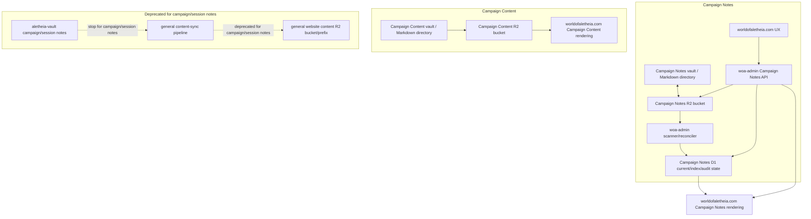

# Campaign Notes and Campaign Content Architecture Handoff Plan

## Status

- Date: 2026-06-30
- Status: Finalized planning handoff
- Scope: Clarify how `worldofaletheia.com` should consume, author, deprecate, and separate Campaign Notes versus broader Campaign Content after the `woa-admin` Campaign Notes service work.

## Existing `woa-admin` contract context

`woa-admin` already owns the narrow Campaign Notes service/API. The current Campaign Notes contract uses a split canonical model:

- R2 owns the current Campaign Notes Markdown body and portable frontmatter representation.
- D1 owns document identity, current/index/search metadata, current hash/etag/version, visibility, audit, and reconciliation state.
- `woa-admin` owns validation, write sessions, scanner/reconciliation, API behavior, conflict handling, and note visibility/edit semantics.

Relevant references:

- `docs/contracts/campaign-notes-api.openapi.yaml`
- `docs/contracts/campaign-notes-deployment-guide.md`
- `.kilo/plans/1782129981893-campaign-notes-direct-sync-correction-plan.md`
- `.kilo/plans/1782114374711-campaign-notes-api-service-plan.md`
- `docs/content-field-naming-conventions.md`

## Glossary

- **Authoring channel**: A user-facing or operator-facing path where humans create or modify Campaign Notes. V1 has two Campaign Notes authoring channels: the `worldofaletheia.com` UX through `woa-admin` APIs, and the Campaign Notes vault/direct Markdown directory through direct R2 sync.
- **Campaign Notes canonical state**: The combined accepted Campaign Notes state managed by `woa-admin`: stable R2 Markdown objects plus D1 current/index/audit/reconciliation state.
- **Campaign Notes vault**: A separate Obsidian vault or Markdown-equivalent directory that mirrors Campaign Notes Markdown directly with the Campaign Notes R2 bucket. It is bidirectional.
- **Runtime editor lane**: The `worldofaletheia.com` website UX path for creating/editing Campaign Notes via `woa-admin` write-session APIs.
- **Direct R2 sync lane**: The GM/operator Campaign Notes vault path that syncs Markdown directly to/from the Campaign Notes R2 bucket and relies on `woa-admin` scanner reconciliation.
- **Deprecated campaign content-sync lane**: The existing `aletheia-vault` to `worldofaletheia.com` general content-sync pipeline for campaign/session notes. This must be stopped for Campaign Notes.
- **Campaign Content**: Broader authoritative campaign material such as campaign landing pages, overview/reference pages, setting summaries, roster-like pages, or GM-vetted campaign documentation. This is not Campaign Notes.

## Resolved decisions

### 1. Campaign Notes have two active authoring channels

Campaign Notes can be authored through either:

1. `worldofaletheia.com` UX via `woa-admin` Campaign Notes APIs.
2. A separate Campaign Notes vault or Markdown directory via bidirectional direct R2 sync.

The website UX is an authoring channel, not just a reader. The Campaign Notes vault is also an authoring channel, but only for GM/operator direct R2 sync.

### 2. `aletheia-vault` stops being an authoring channel for campaign/session notes

After the main-site migration, `aletheia-vault` should no longer be used to author or publish Campaign Notes/session notes.

Existing campaign/session note material in `aletheia-vault` should be treated as migration source or archive only. Since there are currently only two notes and publication is frozen, no complex legacy migration or dual-path compatibility layer is required.

### 3. Existing general content-sync must be deprecated for campaign/session notes

The current `aletheia-vault` to `worldofaletheia.com` general content-sync pipeline should stop publishing campaign/session notes.

Immediate requirement for the `worldofaletheia.com` handoff:

1. Stop publishing session/campaign notes through the old content-sync path.
2. Replace note/session rendering with Campaign Notes API-backed rendering.

Target architecture:

- General world/lore content may continue through the existing general content-sync path.
- Campaign/session notes move to Campaign Notes.
- Broader campaign content should eventually move out of the general content-sync path as a separate Campaign Content concern.

### 4. Campaign Notes are narrowly defined

Campaign Notes are narrowly scoped to note-like documents, including:

- session notes;
- recaps;
- downtime notes;
- GM notes;
- player/GM-authored campaign notes that need note visibility/edit/audit semantics.

Campaign Notes may become numerous over time, but the concept stays narrow.

### 5. Campaign Content is separate and owned by `worldofaletheia.com` for now

Broader Campaign Content is separate from Campaign Notes. It includes authoritative GM-produced or GM-vetted campaign material such as:

- campaign landing/overview pages;
- campaign reference pages;
- campaign metadata;
- campaign setting summaries;
- roster-like or guide material;
- other non-note campaign pages.

For now, `worldofaletheia.com` owns Campaign Content consumption/rendering. It is fed by a GM-controlled Campaign Content vault or Markdown directory. `woa-admin` should not own broader Campaign Content in the near-term slice.

A later architecture/design effort should define the long-term Campaign Content plan.

### 6. Campaign Notes and Campaign Content use separate logical stores and separate buckets now

Campaign Notes and Campaign Content are separate logical stores.

Near-term implementation should use separate R2 buckets:

```text
Campaign Notes R2 bucket
  - bidirectional sync
  - website UX writes via woa-admin APIs
  - Campaign Notes vault direct R2 sync
  - woa-admin D1 scanner/index/audit/reconciliation

Campaign Content R2 bucket
  - one-way GM/vetted content sync
  - rendered/consumed by worldofaletheia.com
  - no website write path for now
```

Future Campaign-as-a-Service work may revisit physical bucket layout. Consumers should depend on logical store roles, not hard-coded assumptions about bucket names or object layout.

### 7. Campaign Notes vault is bidirectional

The Campaign Notes vault/direct Markdown directory must mirror the Campaign Notes R2 bucket bidirectionally.

Expected behavior:

```text
Website-created note
  -> woa-admin API writes approved Campaign Notes R2 object
  -> Campaign Notes vault sync pulls/sees Markdown file

Vault-created or vault-edited note
  -> direct R2 sync writes approved Campaign Notes R2 object
  -> woa-admin scanner validates and updates D1
  -> worldofaletheia.com reads/renders updated note
```

### 8. Campaign Content sync is one-way

Campaign Content is authoritative and GM-vetted. It should be authored only through an Obsidian vault or Markdown-equivalent directory and synced one-way to its Campaign Content R2 bucket.

No bidirectional website editing is planned for Campaign Content in this slice.

### 9. Cross-store links should use standard Markdown root-relative website URLs

Links between Campaign Notes, Campaign Content, and canon/world content should use durable website route URLs in standard Markdown.

Preferred examples:

```md
[Captain Rael](/campaigns/shattered-coast/npcs/captain-rael)
[Velmara](/world/places/velmara)
[Session 12](/campaigns/shattered-coast/notes/shattered-coast-session-note-20260630-session-12)
```

Do not use:

- R2 keys;
- bucket names;
- object IDs;
- vault-relative paths;
- physical storage identifiers.

Obsidian wikilinks may remain supported as compatibility/convenience where unambiguous, but they are not the recommended durable cross-store link format.

`worldofaletheia.com` owns rendering/link resolution for published pages. `woa-admin` stores and returns Campaign Notes Markdown; it should not own broader campaign/canon route resolution.

### 10. `worldofaletheia.com` exposes rendered note pages, not raw Markdown downloads

For V1, `worldofaletheia.com` should expose Campaign Notes as rendered website pages only.

Raw Markdown remains an internal/API/vault authoring format available through:

- Campaign Notes vault sync;
- authorized `woa-admin` Campaign Notes APIs for editing;
- internal R2 storage.

Do not add a public raw Markdown download surface unless a later explicit export/download feature is approved.

### 11. Simple route replacement, no legacy URL preservation

Because there are currently only two notes and publication is frozen, simple wins.

Do not preserve old session/note URLs or add legacy aliases for this migration. Replace old campaign/session-note publication with new Campaign Notes API-backed routes.

Canonical Campaign Notes route on `worldofaletheia.com`:

```text
/campaigns/{campaignSlug}/notes/{documentId}
```

Optional list/filter route:

```text
/campaigns/{campaignSlug}/notes
```

The route maps directly to the `woa-admin` Campaign Notes API:

```text
GET /api/v1/campaigns/{campaignSlug}/notes/documents
GET /api/v1/campaigns/{campaignSlug}/notes/documents/{documentId}
```

### 12. Main-site implementation should be staged read-only first

Documented sequence for `worldofaletheia.com`:

1. Stop publishing campaign/session notes through old `aletheia-vault` content-sync.
2. Add a Campaign Notes API client in `worldofaletheia.com`.
3. Add `/campaigns/{campaignSlug}/notes` list route.
4. Add `/campaigns/{campaignSlug}/notes/{documentId}` detail route.
5. Render Campaign Notes Markdown as website pages.
6. Validate Campaign Notes vault bidirectional sync with the Campaign Notes R2 bucket and D1 scanner/index state.
7. Add website create/edit UX via `woa-admin` write-session APIs in a second slice.

### 13. Website writes are immediately visible after finalize

Website-created or website-edited Campaign Notes should become visible immediately after successful `woa-admin` finalize.

Direct R2 sync lane changes become visible only after scanner reconciliation.

```text
Runtime editor lane:
website write -> woa-admin finalize -> D1 current state advances -> visible immediately

Direct R2 sync lane:
vault write -> R2 object changes -> scanner validates/reconciles -> D1 current state advances -> visible after scan
```

### 14. GM/operator vault sync may supersede website-authored notes

The Campaign Notes vault is a GM/operator authoring channel. It may overwrite website-authored content by writing the same stable R2 object.

After scanner reconciliation, D1 current state advances to the vault-synced version.

Website writes must detect stale revision/R2 drift and fail with conflict rather than blindly overwrite newer vault-synced content.

### 15. Valid vault-synced changes become current automatically

If the Campaign Notes vault writes a valid Markdown file to the approved Campaign Notes R2 path, scanner reconciliation should make it current automatically.

No manual approval queue is planned for V1.

Mitigations for mistaken syncs are validation, revision/audit state, object/history recovery, and operational runbooks; not an approval workflow.

### 16. Direct R2 sync credentials are GM/operator-only

Regular campaign members author Campaign Notes only through the `worldofaletheia.com` UX and `woa-admin` API path.

Direct R2 sync credentials for Campaign Notes and Campaign Content should be limited to GMs/operators.

Reason: direct R2 sync bypasses API-level per-user edit checks and can supersede website-authored content.

### 17. Direct R2 sync audit attribution is `r2Sync` in V1

V1 direct Campaign Notes vault/R2-sync changes should be audited as the `r2Sync` lane, not as a specific GM user, unless future sync tooling can provide reliable signed identity.

Note authorship remains represented by `authorUserIds` in frontmatter/API state, but that is content attribution, not proof of which human performed a direct R2 write.

## Target architecture diagram



## Main-site handoff requirements

The `worldofaletheia.com` project should receive a handoff that says:

1. Stop using the existing `aletheia-vault` general content-sync pipeline for campaign/session notes.
2. Do not build a local authoritative Campaign Notes repository in the main-site repo.
3. Consume Campaign Notes through the `woa-admin` Campaign Notes API.
4. Implement canonical routes:
   - `/campaigns/{campaignSlug}/notes`
   - `/campaigns/{campaignSlug}/notes/{documentId}`
5. The Campaign Notes API returns Markdown bodies intended for downstream presentation/rendering by API consumers such as `worldofaletheia.com`. Raw Markdown should not be treated as the public end-user presentation surface for V1.
6. Prefer standard Markdown root-relative website URLs for cross-store links.
7. Treat Obsidian wikilinks as optional compatibility/convenience only.
8. Implement read-only rendering first.
9. Add website create/edit UX later via the `woa-admin` write-session APIs.
10. Treat Campaign Content as separate from Campaign Notes and owned/rendered by the main-site project for now.
11. Plan a separate architecture/design effort for moving broader Campaign Content out of the existing general content-sync path.

## Operational/runbook gaps to fill next

The current `woa-admin` deployment guide covers R2 buckets, D1 migrations, secrets, scanner/reconciler setup, and cleanup setup. The following runbooks or main-site handoff docs are still needed:

1. Campaign Notes vault bidirectional R2 sync setup:
   - bucket selection;
   - credential scope;
   - local path mapping;
   - stable R2 key layout;
   - frontmatter template;
   - scanner verification;
   - conflict/recovery behavior.
2. Campaign Content vault one-way R2 sync setup:
   - separate bucket;
   - GM/operator credential scope;
   - route/link conventions;
   - validation expectations owned by `worldofaletheia.com`.
3. Main-site implementation handoff:
   - deprecate old content-sync campaign/session-note path;
   - add Campaign Notes API client;
   - add canonical notes routes;
   - render Markdown securely with visibility checks;
   - defer create/edit UX to second slice.

## ADR recommendation

This planning outcome likely warrants two ADRs, because the domain/storage boundary and the Campaign Notes write/sync model are related but distinct decisions.

### ADR 1

Recommended title:

```text
Separate Campaign Notes from broader Campaign Content
```

This ADR would record:

- the narrow definition of Campaign Notes;
- the separation between Campaign Notes and broader Campaign Content;
- `woa-admin` ownership of Campaign Notes;
- current `worldofaletheia.com` ownership of broader Campaign Content;
- separate logical stores and near-term separate R2 buckets;
- deprecating `aletheia-vault` as the campaign/session-note authoring path.

### ADR 2

Recommended title:

```text
Use API-mediated website writes and GM-operated direct R2 sync for Campaign Notes
```

This ADR would record:

- the two Campaign Notes authoring channels;
- website UX writes via `woa-admin` APIs;
- GM/operator-only direct bidirectional R2 sync for the Campaign Notes vault;
- immediate visibility after website finalize;
- scanner-gated visibility for direct R2 sync changes;
- automatic acceptance of valid vault-synced changes;
- conflict behavior between website writes and newer vault-synced content;
- V1 audit attribution as `r2Sync` for direct sync changes.

Do not create either ADR until the implementation handoff is ready or the project owner explicitly asks for the decisions to be recorded formally.
