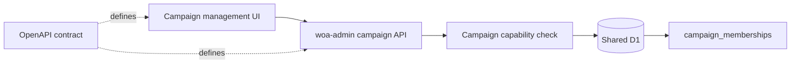

# Campaign User Management Front-End Developer Guide

This guide is for front-end developers building campaign-scoped user management UI against the `woa-admin` campaign APIs and OpenAPI contract.

The source-of-truth API contract is [`user-account-management-api.openapi.yaml`](../contracts/user-account-management-api.openapi.yaml). This guide explains how to consume that contract from an authenticated front-end, especially an Astro-based public-site UI.

## Scope

Campaign user management v1 supports managing active campaign memberships for one known campaign:

- Check whether the current actor can administer users for the campaign.
- List current campaign members.
- Add an already-known existing user to the campaign.
- Change a member role between `member` and `gm`.
- Revoke a member from the campaign.

Version 1 deliberately does not include invitations, access requests, acceptance links, email notifications, global user search, provider account management, password reset, session management, or direct database writes.

## Architecture boundary

The front-end should treat `woa-admin` APIs as the only mutation boundary for campaign membership state.



Do not infer behavior from D1 tables, SvelteKit page code, or local form implementations. Use the OpenAPI file for endpoint paths, request DTOs, response DTOs, and error shapes.

## Authentication and authorization assumptions

The examples assume authentication has already happened outside this codebase.

For public-site campaign controls, requests are expected to carry the World of Aletheia signed-in user session, usually by sending same-origin credentials/cookies through the site or proxy that exposes the campaign API. The OpenAPI security scheme names this `BetterAuthSession`, but cookie names may vary by deployment.

Campaign authorization is still enforced by the API:

- The actor must have `user-admin` capability for the exact `campaignSlug`.
- By default, `campaign_memberships.role = 'gm'` grants `user-admin` for that campaign.
- A `gm` can administer only campaigns where they have that capability.
- The UI must not provide global user/account search or expose unrelated account data.

Global `woa-admin` operator access through Cloudflare Access is a separate trusted-operator path. A public campaign UI should not depend on Cloudflare Access headers.

## Campaign roles

The API currently supports two membership roles:

| Role | Meaning |
| --- | --- |
| `member` | Can access member-protected campaign content. |
| `gm` | Can access GM-protected content and member content; also grants campaign `user-admin` capability by default. |

A role change is an active membership mutation. There is no pending state in v1.

## Endpoints used by a campaign management UI

| UI need | Method and path | Operation ID |
| --- | --- | --- |
| Bootstrap permissions | `GET /api/v1/campaigns/{campaignSlug}/admin-capability` | `getCampaignAdminCapability` |
| List members | `GET /api/v1/campaigns/{campaignSlug}/members` | `listCampaignMembers` |
| Filter by role | `GET /api/v1/campaigns/{campaignSlug}/members?role=gm` | `listCampaignMembers` |
| Add or update a member | `PUT /api/v1/campaigns/{campaignSlug}/members/{userId}` | `upsertCampaignMember` |
| Revoke a member | `DELETE /api/v1/campaigns/{campaignSlug}/members/{userId}` | `revokeCampaignMember` |

Use URL encoding for `campaignSlug`, `userId`, cursors, and query parameters.

## Suggested UI flow

1. Load the campaign page with a known `campaignSlug` from routing or page data.
2. Call `GET /admin-capability` for that campaign.
3. If `canAdministerUsers` is false, hide or disable membership management controls and show a campaign-scoped permission message.
4. If allowed, call `GET /members` and render the member list.
5. For add/update/revoke actions, submit the exact `userId`, exact `campaignSlug`, and target role or revoke reason.
6. Show the API response `confirmationMessage` after a successful mutation.
7. Re-fetch the member list or update local state from the mutation response.

## Response shapes to model in the UI

Representative TypeScript shapes, derived from the OpenAPI contract:

```ts
type CampaignRole = 'member' | 'gm';

type CampaignMember = {
  userId: string;
  displayName: string | null;
  email: string;
  role: CampaignRole;
  joinedAt?: string | null;
  updatedAt?: string | null;
};

type CampaignMemberPage = {
  campaignSlug: string;
  items: CampaignMember[];
  nextCursor: string | null;
};

type CampaignAdminCapability = {
  campaignSlug: string;
  actor: {
    userId: string;
    displayName: string | null;
  };
  canAdministerUsers: boolean;
  capabilities: Array<'user-admin'>;
  source: 'campaign-gm' | 'global-admin' | 'none';
};

type CampaignMemberMutationResponse = {
  member: CampaignMember;
  outcome: 'created' | 'updated' | 'unchanged';
  confirmationMessage: string;
};

type CampaignMemberRevokeResponse = {
  revokedMember: CampaignMember;
  outcome: 'revoked';
  confirmationMessage: string;
};

type ApiError = {
  error: string;
  message: string;
  requestId?: string;
};
```

These examples are intentionally demonstrative. Prefer generated types from the included OpenAPI spec when your tooling supports it.

## Astro example: server-side page data

This example demonstrates loading capability and the first member page from an Astro page or endpoint context. It assumes the deployment already forwards authenticated cookies/session material to the API origin.

```ts
---
type Props = {
  campaignSlug: string;
};

const { campaignSlug } = Astro.params as Props;
const apiBase = Astro.locals.apiBaseUrl ?? Astro.url.origin;

async function apiGet<T>(path: string): Promise<T> {
  const response = await fetch(`${apiBase}${path}`, {
    credentials: 'include',
    headers: {
      Accept: 'application/json'
    }
  });

  if (!response.ok) {
    const error = await response.json().catch(() => null);
    throw new Error(error?.message ?? `API request failed: ${response.status}`);
  }

  return response.json() as Promise<T>;
}

const encodedCampaign = encodeURIComponent(campaignSlug);
const capability = await apiGet<CampaignAdminCapability>(
  `/api/v1/campaigns/${encodedCampaign}/admin-capability`
);

const members = capability.canAdministerUsers
  ? await apiGet<CampaignMemberPage>(`/api/v1/campaigns/${encodedCampaign}/members`)
  : { campaignSlug, items: [], nextCursor: null };
---

{capability.canAdministerUsers ? (
  <CampaignMembersTable members={members.items} />
) : (
  <p>You cannot administer users for this campaign.</p>
)}
```

## JavaScript helper example

This helper demonstrates native `fetch` usage without prescribing a framework or client library.

```js
export async function listCampaignMembers({ apiBase = '', campaignSlug, role, cursor, limit }) {
  const url = new URL(`/api/v1/campaigns/${encodeURIComponent(campaignSlug)}/members`, apiBase || window.location.origin);

  if (role) url.searchParams.set('role', role);
  if (cursor) url.searchParams.set('cursor', cursor);
  if (limit) url.searchParams.set('limit', String(limit));

  const response = await fetch(url, {
    credentials: 'include',
    headers: { Accept: 'application/json' }
  });

  if (!response.ok) {
    const error = await response.json().catch(() => ({ message: response.statusText }));
    throw Object.assign(new Error(error.message), { status: response.status, error });
  }

  return response.json();
}
```

## TypeScript mutation examples

Add or update a campaign member:

```ts
async function upsertCampaignMember(args: {
  apiBase?: string;
  campaignSlug: string;
  userId: string;
  role: CampaignRole;
  reason?: string;
}): Promise<CampaignMemberMutationResponse> {
  const base = args.apiBase ?? '';
  const path = `/api/v1/campaigns/${encodeURIComponent(args.campaignSlug)}/members/${encodeURIComponent(args.userId)}`;

  const response = await fetch(`${base}${path}`, {
    method: 'PUT',
    credentials: 'include',
    headers: {
      Accept: 'application/json',
      'Content-Type': 'application/json'
    },
    body: JSON.stringify({ role: args.role, reason: args.reason })
  });

  if (!response.ok) {
    throw await toApiError(response);
  }

  return response.json() as Promise<CampaignMemberMutationResponse>;
}
```

Revoke a campaign member:

```ts
async function revokeCampaignMember(args: {
  apiBase?: string;
  campaignSlug: string;
  userId: string;
  reason?: string;
}): Promise<CampaignMemberRevokeResponse> {
  const base = args.apiBase ?? '';
  const path = `/api/v1/campaigns/${encodeURIComponent(args.campaignSlug)}/members/${encodeURIComponent(args.userId)}`;

  const response = await fetch(`${base}${path}`, {
    method: 'DELETE',
    credentials: 'include',
    headers: {
      Accept: 'application/json',
      'Content-Type': 'application/json'
    },
    body: args.reason ? JSON.stringify({ reason: args.reason }) : undefined
  });

  if (!response.ok) {
    throw await toApiError(response);
  }

  return response.json() as Promise<CampaignMemberRevokeResponse>;
}

async function toApiError(response: Response): Promise<Error & { status: number; api?: ApiError }> {
  const api = await response.json().catch(() => undefined) as ApiError | undefined;
  return Object.assign(new Error(api?.message ?? response.statusText), {
    status: response.status,
    api
  });
}
```

## Error handling guidance

The API returns JSON errors with `error`, `message`, and usually `requestId`.

| Status | Front-end interpretation |
| --- | --- |
| `400` | The request is malformed. Validate role, campaign slug, user id, cursor, and limit before retrying. |
| `401` | The actor is not authenticated. Redirect to or trigger the site authentication flow owned outside this codebase. |
| `403` | The actor cannot administer users for this exact campaign. Hide management controls and show a campaign-scoped permission message. |
| `404` | The campaign or exact membership was not found or not visible. Refresh state before showing destructive controls again. |
| `409` | The mutation could not be applied to current state or failed a postcondition. Re-fetch the member list. |
| `429` | Rate limit exceeded. Disable repeated submissions and retry later. |
| `503` | Service unavailable. Keep local state unchanged and allow retry. |

For support workflows, log or display `requestId` where appropriate. Do not log session cookies or other auth material.

## Front-end state recommendations

- Treat `campaignSlug` and `userId` as exact identifiers for mutations.
- Disable submit buttons while a mutation is in flight to avoid duplicate actions.
- Use `confirmationMessage` from successful mutation responses as the primary success copy.
- After mutation, either re-fetch `GET /members` or update local state from `member` / `revokedMember` in the response.
- Keep role controls explicit: use `member` and `gm` values only.
- Do not expose forms that imply invitations, pending access, or email notification behavior in v1.
- Do not retain stale authorization state indefinitely; re-check capability when entering the campaign management screen and after sign-in changes.

## Privacy and data minimization

Campaign-scoped responses intentionally include only campaign-relevant identity fields for existing members. A campaign UI should not attempt to surface or infer:

- provider account rows
- session metadata or session tokens
- password state, password hashes, salts, or pepper material
- OAuth access, refresh, or ID tokens
- verification or reset tokens
- unrelated users outside the campaign
- global account search results

## OpenAPI tooling notes

The included OpenAPI spec can be used to generate typed clients or validators. Generated code should still preserve the same behavioral assumptions:

- Send authenticated requests using the site/session mechanism already established by the host application.
- Use `/api/v1/campaigns/{campaignSlug}/*` for campaign-scoped user management.
- Honor response DTOs rather than raw database shapes.
- Handle `401`, `403`, `404`, `409`, `429`, and `503` explicitly.
- Keep global `/api/v1/admin/*` APIs out of campaign-scoped public UI code.

## v1 non-goals

Do not build UI around these behaviors unless the OpenAPI contract is revised:

- inviting a user by email
- accepting or declining campaign access requests
- pending memberships
- membership notification emails
- self-service player onboarding
- direct D1 writes from the browser or public site
- global user search from a campaign-scoped UI
- provider account, password, session, soft-delete, or deprovisioning workflows
