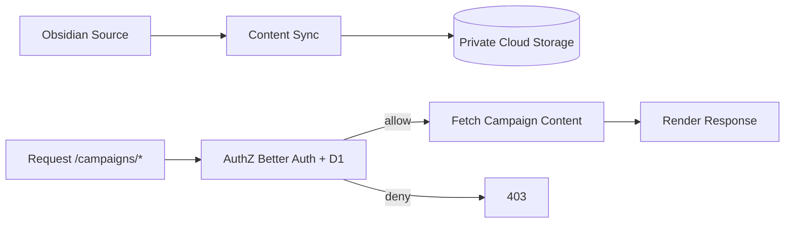

# Campaign Content Source Separation for Public Repository

## Status

- **Date:** 2026-03-16
- **Status:** Accepted
- **Deciders:** Brad

## Context

The repository is planned to become public, but campaign markdown and campaign assets currently contain private content that must not be publicly visible through source control.

Existing route-level authorization in the app is required but does not solve repository confidentiality by itself when private campaign files are Git-tracked.

Project context and constraints:

- Obsidian remains source-of-truth for authoring (`0001-obsidian-first-content-architecture`).
- Campaigns are expected to evolve toward possible extraction but are currently in one Astro app.
- Current architecture guidance favors Astro-native simplicity and YAGNI (`0004-campaigns-astro-native-content-access-policy`).
- Cloudflare stack is already active (Workers, D1), making Cloudflare storage a practical extension.
- Storage product decision required before code handoff to avoid implementation ambiguity.

## Decision Drivers

- **Confidentiality first:** private campaign content must not be exposed in a public repository.
- **Delivery speed:** unblock public-repo release quickly.
- **Low disruption:** keep existing routes and UX stable.
- **Operational fit:** align with current Cloudflare-first and Obsidian-first workflows.
- **Future flexibility:** preserve a clean path to eventual campaign extraction.

## Considered Options

### Option 1: Build-time private injection in one app

Campaign private content is synced to a gitignored local/CI path, read during build, and not committed.

**Pros**

- Fastest implementation path.
- Minimal runtime changes.

**Cons**

- Keeps campaign publishing tightly coupled to build-time mechanics.
- Weaker long-term seam for runtime protection and extraction.

### Option 2: Runtime private cloud storage for campaign content (Chosen)

Campaign private content is stored in private cloud storage and resolved at request-time only after authorization checks.

**Pros**

- Removes private campaign source from Git-tracked repository.
- Preserves existing route and UX structure.
- Establishes a concrete seam for future extraction.
- Supports protected image delivery and resizing strategies.
- Keeps advanced image products optional for cost control at current scale.

**Cons**

- Introduces a second active data source.
- Adds runtime fetch and caching complexity.

### Option 3: Full campaigns app/service split now

Move campaigns to a separate app/repository and compose routes at edge/proxy level.

**Pros**

- Strongest isolation and independent evolution.

**Cons**

- Highest immediate complexity and delivery risk.
- Requires cross-app auth/session and deployment coordination now.

## Decision Outcome

**Chosen option:** Option 2 - runtime private cloud storage for campaign private content while keeping one Astro app and stable `/campaigns/**` routes.

### Decision Details

1. Campaign private markdown/assets are moved out of Git-tracked repository content.
2. **Cloudflare R2** is the canonical storage layer for campaign private markdown, images, and occasional PDFs.
3. Campaign access remains enforced through Better Auth + D1 checks before content fetch.
4. Storage/read failures use deny-by-default behavior for protected campaign content.
5. Public canonical domains remain repo-backed in this phase.
6. Image delivery defaults to pre-generated variants stored in R2.
7. Worker on-the-fly resizing and Cloudflare Images are explicitly optional future upgrades only.
8. Full app/service split is deferred until explicit split triggers are met.

## Consequences

### Positive

- Public repository release can proceed without disclosing private campaign content.
- Existing campaign URLs and IA remain intact.
- Campaign domain gains a practical extraction seam without immediate split cost.
- Private media handling becomes compatible with protected full-screen image delivery.

### Negative

- Additional operational complexity from dual source model (repo + cloud storage).
- Runtime dependency and caching behavior must be designed and monitored.

### Neutral

- No immediate requirement to change interactive UI framework decisions.
- No immediate requirement to migrate all non-campaign content out of repository.
- No requirement to implement Worker dynamic resizing or Cloudflare Images unless future needs justify them.

## Links

- `plans/adrs/0001-obsidian-first-content-architecture.md`
- `plans/adrs/0004-campaigns-astro-native-content-access-policy.md`
- `plans/potential-todos-2026-03-16.md`
- `plans/content-sync-workflow-plan.md`
- `plans/auth-production-account-management-mvp-options-2026-03.md`
