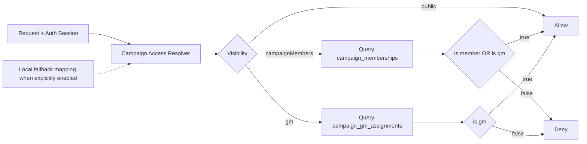

# Option 2 LLD Handoff — D1-Authoritative GM Access with Multi-GM Support

## Status

- Date: 2026-03-12
- Audience: Code implementation handoff
- Scope: Incremental consistency fix (no large refactor)

## Context

Current campaign authorization has split authority:

- Membership checks read D1 (`campaign_memberships`).
- GM checks read config/env (`gmAssignments` / `CAMPAIGN_GM_ASSIGNMENTS`).
- D1 also has `campaign_gm_assignments`, but current schema is one-GM-per-campaign (`campaign_slug` primary key).

This creates mismatch risk between D1 state and runtime authorization behavior.

## Goals

1. Make staging/production GM authorization D1-authoritative.
2. Support multiple GMs per campaign.
3. Keep local/dev fallback available when explicitly enabled.
4. Minimize blast radius and preserve current delivery timeline.

## Non-Goals

- No migration to full single-table role model in this phase.
- No admin UI/API redesign.
- No broad architecture rewrite.

## Current References

- `migrations/0001_campaign_memberships.sql`
- `migrations/0002_campaign_gm_assignments.sql`
- `src/utils/campaign-access.ts`
- `src/lib/campaign-membership-repo.ts`
- `scripts/operator-sql/templates/gm-assignment-upsert.sql`
- `scripts/operator-sql/templates/gm-assignment-revoke.sql`
- `docs/runbook/phase-2-1-auth-google-d1-mailjet-email.md`

## Target State

- D1 is authoritative for GM checks in staging/prod.
- `campaign_gm_assignments` supports many GMs per campaign.
- Config/env GM mapping is local fallback only.
- Operator templates and runbook align with runtime behavior.

## Request-Time Flow



## Data Model Changes

### New migration: `migrations/0005_campaign_gm_assignments_multi.sql`

Convert GM table from one-to-one to many-to-many.

Target schema:

```sql
CREATE TABLE campaign_gm_assignments (
  campaign_slug TEXT NOT NULL,
  user_id TEXT NOT NULL,
  created_at TEXT NOT NULL,
  updated_at TEXT,
  PRIMARY KEY (campaign_slug, user_id)
);
CREATE INDEX idx_campaign_gm_assignments_user_id
  ON campaign_gm_assignments(user_id);
```

Migration approach (D1/SQLite-safe):

1. Create replacement table with target schema.
2. Copy distinct data from old table.
3. Drop old table.
4. Rename replacement table to `campaign_gm_assignments`.
5. Recreate index.

## Runtime Changes

### `src/utils/campaign-access.ts`

In `createCampaignAccessResolverFromRequest`:

- Keep session resolution behavior.
- For authenticated user:
  - `isMember` from `campaign_memberships`.
  - `isGm` from `campaign_gm_assignments` using `(campaign_slug, user_id)`.
- If DB query fails:
  - non-local/default (`allowLegacyEnvFallback = false`): deny.
  - local fallback enabled: use legacy config/env resolver path.

Logging:

- Keep `campaign.membership.query_failed`.
- Add `campaign.gm.query_failed` with campaign slug and sanitized error message.

## Repo Layer Changes

### `src/lib/campaign-membership-repo.ts` (or adjacent authz repo)

Add:

- `isUserGmOfCampaign(userId: string, campaignSlug: string): Promise<boolean>`
- optional: `listCampaignGms(campaignSlug: string): Promise<string[]>`

Suggested query:

```sql
SELECT 1
FROM campaign_gm_assignments
WHERE campaign_slug = ?1 AND user_id = ?2
LIMIT 1;
```

## Operator Template Changes

### `scripts/operator-sql/templates/gm-assignment-upsert.sql`

Use composite conflict target:

```sql
INSERT INTO campaign_gm_assignments (campaign_slug, user_id, created_at, updated_at)
VALUES ('<campaignSlug>', '<userId>', '<ISO8601>', '<ISO8601>')
ON CONFLICT(campaign_slug, user_id) DO UPDATE SET
  updated_at = excluded.updated_at;
```

### `scripts/operator-sql/templates/gm-assignment-revoke.sql`

Ensure per-user revoke:

```sql
DELETE FROM campaign_gm_assignments
WHERE campaign_slug = '<campaignSlug>'
  AND user_id = '<userId>';
```

## Documentation Changes

### `docs/runbook/phase-2-1-auth-google-d1-mailjet-email.md`

Update policy:

- Staging/prod GM source-of-truth: D1 `campaign_gm_assignments`.
- `gmAssignments` config and `CAMPAIGN_GM_ASSIGNMENTS` env var are local/dev fallback only.
- Verification checklist includes DB check for GM rows.

## Rollout Plan

### Must change now

1. Add and apply `0005` migration.
2. Switch non-local GM authorization path to D1.
3. Update GM operator templates.
4. Update runbook source-of-truth statements.

### Should change soon

1. Add tests for multi-GM campaign behavior.
2. Add explicit GM query failure logs.
3. Add optional query snippets for operator verification.

### Consider later

1. Option 3 unification to one table with role-driven authz.

## Test Plan

Unit tests:

1. `campaignMembers` allows member.
2. `gm` allows GM.
3. `gm` denies non-GM member.
4. Multiple GMs on one campaign both pass `gm` gate.
5. DB failure + fallback disabled => deny.
6. DB failure + fallback enabled => legacy fallback behavior.

Staging verification:

1. Apply migration in staging.
2. Add two GM assignments for same campaign.
3. Verify both GM users can access `visibility: gm` pages.
4. Verify non-GM member cannot access `visibility: gm`.

## Acceptance Criteria

1. GM checks in staging/prod are D1-based, not config/env-based.
2. Multiple GMs per campaign are supported.
3. Operator templates match runtime semantics.
4. Runbook clearly states non-local source-of-truth behavior.
5. No regression in campaign member authorization behavior.

## Risks and Mitigations

- Migration risk (table rebuild): mitigate with dry-run, ordered rollout, and verification queries.
- Partial rollout mismatch (code vs templates): ship as one release unit.
- Fallback confusion: keep fallback explicit and local-only in docs and defaults.

