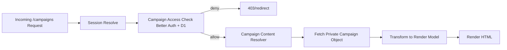

# Campaign Content Source Separation - Handoff to Code (2026-03-16)

## Intent

Implement the approved architecture direction to keep campaign private content out of Git-tracked repository files while preserving existing `/campaigns/**` behavior.

This handoff is for implementation planning and coding in small, testable phases.

## In Scope

- Campaign private content storage separation from repository source.
- Content-sync enhancement for cloud-target publishing of campaign content.
- Runtime campaign content read path behind existing authz checks.
- Protected campaign image delivery path with resize strategy.

## Out of Scope

- Full campaigns app/service extraction.
- Global migration of all public domain content to cloud storage.
- New admin UI/API build for account management.
- Broad auth model refactor (Option 3) in same delivery unit.

## Existing Inputs and Constraints

- `plans/adrs/0001-obsidian-first-content-architecture.md`
- `plans/adrs/0004-campaigns-astro-native-content-access-policy.md`
- `plans/adrs/0009-campaign-content-source-separation-for-public-repo.md`
- `plans/content-sync-workflow-plan.md`
- `plans/auth-mvp-production-readiness-plan-2026-03.md`
- `plans/option-3-unified-membership-role-upgrade-todo.md`

Key constraints:

1. Keep one Astro app now.
2. Keep route surface stable (`/campaigns/**`).
3. Keep Better Auth + D1 authz as authority for protected campaign access.
4. Deny-by-default on protected content read failures.

## Cloudflare Storage and Media Decisions (Implementation Defaults)

1. Use **R2** as canonical campaign private content storage for markdown, images, and occasional PDFs.
2. Use **D1** for authz and content-index metadata only; do not store blobs in D1.
3. Do not use KV as primary campaign content storage.
4. Serve protected campaign assets through authorized request paths; no direct public private-asset URLs.

### Image Strategy

- **Default (in scope):** pre-generate image variants during sync and store variants in R2.
- **Optional (not required):** Worker on-the-fly resizing if variant management becomes painful.
- **Optional (not required):** Cloudflare Images product if traffic/transform economics justify it.

## Manual Cloudflare R2 Setup (before running cloud sync)

1. **Create the bucket** (one time per environment):
   ```bash
   pnpm wrangler r2 bucket create woa-campaign-private
   pnpm wrangler r2 bucket list
   ```
   Use this exact same bucket name in `campaignCloud.bucket`.
   In this example, set `campaignCloud.bucket` to `woa-campaign-private`.
2. **Disable public r2.dev URL** (recommended):
   ```bash
   pnpm wrangler r2 bucket dev-url disable woa-campaign-private
   ```
3. **Create R2 S3 credentials (Access Key ID + Secret Access Key)** scoped to this bucket:
   - In Cloudflare Dashboard, go to **R2 object storage**.
   - Open **Manage R2 API tokens**.
   - Create an **Account API token** or **User API token** with object read/write scope for your target bucket.
   - After creation, copy both values shown by Cloudflare:
     - **Access Key ID**
     - **Secret Access Key**

   These are the credentials consumed by this project's S3 client for `pnpm content:sync`.
   They are different from a single global Cloudflare API token string.

   Export them before running sync:
   ```bash
   export R2_ACCESS_KEY_ID="<access-key>"
   export R2_SECRET_ACCESS_KEY="<secret-key>"
   ```
   These env var names match the defaults referenced by `campaignCloud.accessKeyIdEnv` and `.secretAccessKeyEnv`.
4. **Capture the account ID** via `pnpm wrangler whoami` or the Cloudflare dashboard; use it for `campaignCloud.accountId`.
5. **Update `config/content-sync.config.json`:**
   - Set `campaignCloud.bucket`, `campaignCloud.accountId`, and confirm env var names.
   - Mark campaign mappings with `{ "target": "cloud" }` and set their `to` prefix (for example `"campaigns"`).
6. **Verify credentials** by running a dry run:
   ```bash
   pnpm content:sync --dry-run
   ```
   If credentials or bucket details are missing you will see a clear error from the config loader.

## Target Runtime Flow



## Proposed Delivery Phases

## Phase 1 - Storage and Sync Foundation

### Deliverables

- Add campaign sync target mode to content-sync workflow.
- Campaign private content publish path writes to private cloud storage.
- Public domain content sync remains repo-targeted.

### Notes

- Reuse existing sync engine phases where possible (`discover`, `diff`, `dry-run`, `apply`).
- Keep mapping rules explicit for campaign directories.
- Preserve safety prompts for stale file handling.

### Acceptance

- Campaign private content is no longer required in Git-tracked source.
- Sync command can publish campaign content to private storage deterministically.

## Phase 2 - Campaign Content Resolver Integration

### Deliverables

- Introduce a campaign content resolver that reads from private storage after authz pass.
- Maintain current route ownership and URL structure.
- Add deny-by-default behavior on storage errors/timeouts.

### Notes

- Keep resolver seam narrow and route-focused to avoid premature service layering.
- Add minimal reusable helper only where duplication appears.

### Acceptance

- Protected campaign pages are rendered from private storage.
- Unauthorized users cannot fetch or infer protected campaign content.

## Phase 3 - Protected Images and Full-Screen UX (optional enhancement phase)

### Deliverables

- Add protected campaign image endpoint/path.
- Add resize strategy for thumbnails/detail/full-screen variants (default: pre-generated variants in R2).
- Ensure full-screen image view works for authorized users.

### Notes

- Do not expose direct public object URLs for protected assets.
- Cache only authorized-safe outputs.

### Acceptance

- Authorized users can view optimized images and full-screen variants.
- Unauthorized users are denied both page and private image payloads.

## Phase 4 - Verification, Hardening, and Docs

### Deliverables

- Automated checks for authz + resolver behavior (unit/integration as practical).
- Runbook updates for operations and incident handling.
- Doc cleanup for any stale assumptions about campaign files in repo.

### Acceptance

- Regression checks cover at least: member access, gm access, denied access, resolver failure deny path.
- Ops documentation matches actual runtime/storage behavior.

## Implementation Worklist

- [ ] Define campaign storage key scheme (slug/session/path conventions).
- [ ] Define resolver input/output contract for campaign pages.
- [ ] Extend content-sync config to support campaign cloud target.
- [ ] Implement campaign cloud upload and verification output.
- [ ] Implement runtime campaign resolver and route wiring.
- [ ] Implement protected image path and resizing behavior.
- [ ] Add tests and verification scripts.
- [ ] Update runbooks and planning docs.

## Data and Contract Considerations

- Keep campaign metadata required for authz and routing deterministic (campaign slug, session slug, visibility).
- Keep content payload format implementation-friendly (markdown body + validated frontmatter fields).
- Keep storage object paths stable and machine-derivable from route identity.

## Security and Failure Policy

1. Authz before private content fetch.
2. Deny-by-default if authz context is missing or ambiguous.
3. Deny-by-default on storage errors for protected content.
4. Do not log sensitive payload content.
5. Keep private identities and assignments out of Git-tracked files.

## Rollout Plan

1. Staging: deploy sync and resolver changes with test campaign content in private storage.
2. Verify member/gm/public behavior and error-path handling.
3. Production: migrate campaign private source path and deploy resolver path.
4. Post-rollout: monitor access failures, storage fetch errors, and image path behavior.

## Done Criteria

- Public repository no longer exposes campaign private content.
- Campaign protected pages and assets are authorization-gated end-to-end.
- Existing `/campaigns/**` route structure remains intact.
- Operational and developer docs match implemented behavior.

## Follow-on (optional separate workstreams)

- Revisit Option 3 unified membership roles once storage separation is stable and verified.
