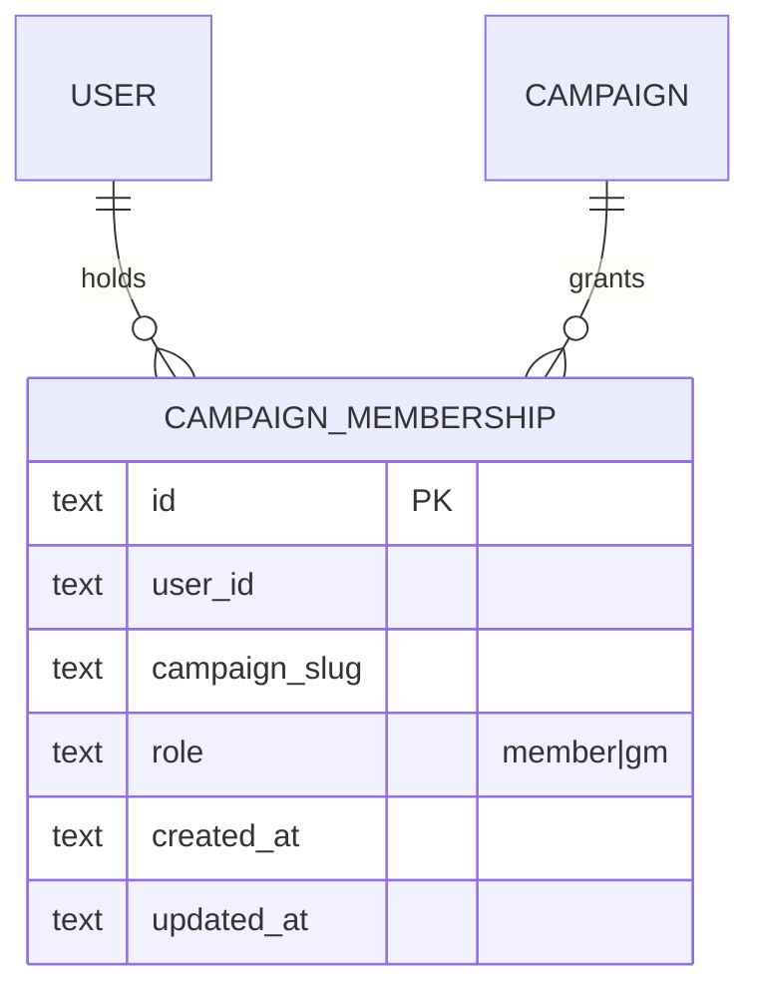

# Campaign Membership Role Unification Migration Strategy (2026-04-09)

## Status

- Status: Ready for implementation handoff
- Related ADR: `plans/adrs/0019-campaign-membership-role-unification.md`
- Implementation handoff: `plans/campaign-membership-role-unification-lld-handoff-2026-04-09.md`
- Primary execution checklist: `plans/option-3-unified-membership-role-upgrade-todo.md`

## Goal

Move campaign authorization from the current dual-table model to one canonical role-based table:

- canonical table: `campaign_memberships`
- canonical roles: `member`, `gm`
- legacy table to retire after burn-in: `campaign_gm_assignments`

## Current State Inventory

Current implementation is split across three surfaces:

1. **Database**
   - `campaign_memberships` stores one row per `(user_id, campaign_slug)` and already has a `role` column.
   - `campaign_gm_assignments` separately stores GM authority.
2. **Runtime**
   - member checks read `campaign_memberships`
   - GM checks read `campaign_gm_assignments`
3. **Fallback and operations**
   - `config/campaign-access.config.json` stores `memberships` and `gmAssignments` separately
   - operator SQL templates include both membership-role templates and GM-assignment templates

This means the same campaign relationship can require two independent writes and two independent audit paths.

## Authentication Boundary (Unchanged)

This migration does not change the authentication model:

- Better Auth remains the source of identity and session validity.
- Request-time gating still resolves `session.user.id` before any campaign authorization decision.
- The unification work changes only campaign entitlement lookup in D1.
- Better Auth tables (`user`, `account`, `session`, `verification`) and auth route plumbing are out of scope for this migration unless a bug fix is required.

## Target Model

### Authorization rules

- `public` -> allow without membership lookup
- `campaignMembers` -> allow when membership role is `member` or `gm`
- `gm` -> allow only when membership role is `gm`

### Logical model



### Canonical table contract

`campaign_memberships` remains the single table, with these behavioral constraints:

- one row per `(user_id, campaign_slug)`
- `role` constrained to `member | gm`
- `gm` implies member-level access
- no separate GM authority table after decommission

## Conflict and Normalization Rules

These rules should be explicit before any migration file is written:

1. **Allowed roles only**
   - Valid values are `member` and `gm`.
   - Any other existing role value blocks migration and must be corrected manually first.

2. **Overlap policy**
   - If a `(user_id, campaign_slug)` pair exists in both `campaign_memberships` and `campaign_gm_assignments`, the resulting unified row role is `gm`.

3. **GM-only rows**
   - If a GM assignment exists without a membership row, create a membership row with role `gm`.

4. **Timestamp merge rule**
   - `created_at`: use the earliest non-null known timestamp across the overlapping records.
   - `updated_at`: use the latest non-null known timestamp across the overlapping records.

5. **ID policy**
   - Preserve existing `campaign_memberships.id` values where a row already exists.
   - For GM-only backfilled rows, use a deterministic id based on user and campaign slug.

## Recommended Migration Phases

### Phase 0 - Preflight and freeze window

Run a short operator freeze for GM mutations during cutover and collect these checks first:

```sql
SELECT role, COUNT(*)
FROM campaign_memberships
GROUP BY role
ORDER BY role;

SELECT DISTINCT role
FROM campaign_memberships
WHERE role NOT IN ('member', 'gm');

SELECT g.campaign_slug, g.user_id
FROM campaign_gm_assignments g
LEFT JOIN campaign_memberships m
  ON m.campaign_slug = g.campaign_slug
 AND m.user_id = g.user_id
WHERE m.user_id IS NULL;
```

Preflight must fail if unsupported membership roles are present.

### Phase 1 - Expand and backfill (`0009_campaign_memberships_role_unification.sql`)

Implement one migration that rebuilds `campaign_memberships` with a real role constraint and backfills GM rows into it.

Recommended approach:

1. Create `campaign_memberships_next` with:
   - same columns as current table
   - `CHECK (role IN ('member', 'gm'))`
   - existing uniqueness and supporting indexes preserved
2. Copy existing valid membership rows into `campaign_memberships_next`.
3. Upsert GM rows from `campaign_gm_assignments` into `campaign_memberships_next` with role forced to `gm`.
4. Merge timestamps using the normalization rules above.
5. Replace `campaign_memberships` with the rebuilt constrained table.
6. Keep `campaign_gm_assignments` intact for the next phase as a rollback/parity artifact.

Notes:

- No new permissions table is needed.
- No additional role index is required yet; current query patterns remain bounded.

### Phase 2 - Runtime read-path cutover

Update runtime authorization to read only `campaign_memberships`:

- `isUserMemberOfCampaign(userId, campaignSlug)` -> membership row exists with role `member` or `gm`
- `isUserGmOfCampaign(userId, campaignSlug)` -> membership row exists with role `gm`
- `listCampaignGms(campaignSlug)` -> rows in `campaign_memberships` filtered to role `gm`

At the same time:

- remove staging/prod runtime reads of `campaign_gm_assignments`
- deprecate `CAMPAIGN_GM_ASSIGNMENTS` for non-local environments
- move local fallback toward one membership-role config source

### Phase 3 - Operator and runbook cutover

Make membership-role mutation the only active operator workflow:

- keep `membership-grant.sql`, `membership-role-update.sql`, and `membership-revoke.sql`
- retire GM grant/revoke templates from the active SOP
- update verify/audit SQL to treat `campaign_memberships` as the only live authority

Recommended fallback-config target shape for local/dev:

```json
{
  "memberships": {
    "brad": {
      "campaigns": {
        "brad": "gm",
        "barry": "member"
      }
    }
  }
}
```

This keeps one user-centric map while removing the separate GM authority channel.

### Phase 4 - Burn-in and parity verification

Keep `campaign_gm_assignments` in place briefly, but treat it as non-authoritative.

Verification during burn-in should include:

```sql
SELECT campaign_slug, user_id
FROM campaign_gm_assignments
EXCEPT
SELECT campaign_slug, user_id
FROM campaign_memberships
WHERE role = 'gm';

SELECT campaign_slug, user_id
FROM campaign_memberships
WHERE role = 'gm'
EXCEPT
SELECT campaign_slug, user_id
FROM campaign_gm_assignments;
```

Expected result during the burn-in window: no rows.

### Phase 5 - Contract and decommission (`0010_drop_campaign_gm_assignments.sql`)

After burn-in:

1. drop `campaign_gm_assignments`
2. remove GM-assignment templates from active operator docs
3. remove GM-assignment audit queries
4. remove deprecated config/env references from runbooks and planning docs

## Rollback Strategy

### Before Phase 5

Rollback remains straightforward:

1. revert runtime code to the old read path if needed
2. regenerate `campaign_gm_assignments` from canonical membership rows where `role = 'gm'`
3. re-run verify/audit queries

Suggested repair query:

```sql
INSERT OR REPLACE INTO campaign_gm_assignments (campaign_slug, user_id, created_at, updated_at)
SELECT campaign_slug, user_id, created_at, updated_at
FROM campaign_memberships
WHERE role = 'gm';
```

### After Phase 5

There is no structural rollback to the dual-table model. Recovery becomes forward-fix on top of canonical membership roles.

## Validation Requirements

Implementation is not complete until all of the following pass:

1. `pnpm test`
2. `pnpm build`
3. staging verification queries show expected role distribution
4. route smoke checks confirm:
   - unauthenticated users denied for `campaignMembers` and `gm`
   - members allowed for `campaignMembers`
   - GMs allowed for both `campaignMembers` and `gm`
5. no active runbook still instructs operators to use `campaign_gm_assignments` as the source of truth

## Implementation Surfaces

Primary change surfaces for the eventual code tranche:

- `migrations/0009_campaign_memberships_role_unification.sql`
- `migrations/0010_drop_campaign_gm_assignments.sql`
- `src/lib/campaign-membership-repo.ts`
- `src/utils/campaign-access.ts`
- `src/utils/campaign-membership-config.ts`
- `config/campaign-access.config.json`
- `docs/runbook/phase-2-1-auth-google-d1-mailjet-email.md`
- `docs/runbook/campaign-access-local-dev.md`
- `scripts/operator-sql/templates/*.sql`
- `scripts/operator-sql/verify.sql`
- `scripts/operator-sql/audit.sql`
- `scripts/db-migrate-auth-plan.mjs`

## Out of Scope

- New per-item ACL or permission-grant tables
- Non-campaign authorization changes
- Campaign route or visibility frontmatter redesign
- Campaign service extraction
