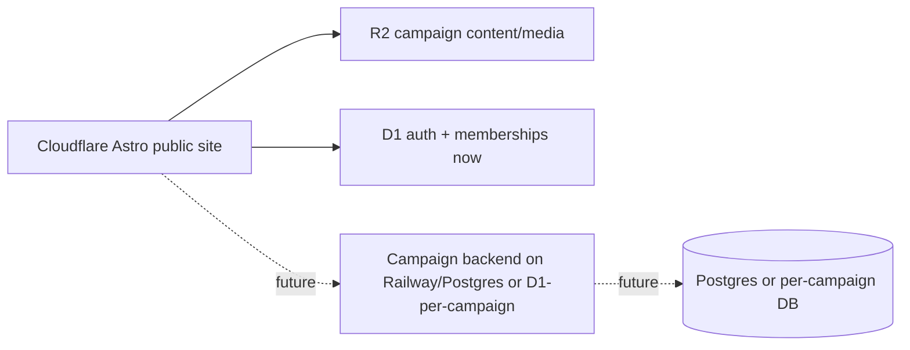

# Cloudflare WebCrypto Password Hashing HLD

## Status

- Date: 2026-06-02
- Status: Accepted
- Related ADR: `plans/adrs/0023-cloudflare-worker-friendly-versioned-password-hashing.md`

## Context

World of Aletheia currently runs Better Auth inside the Astro Cloudflare Worker with D1-backed auth tables. Email/password sign-in uses Better Auth's default password hashing behavior, which resolves to pure-JavaScript scrypt in the Cloudflare Workers runtime. Recent production errors on `POST /api/auth/sign-in/email` show Worker CPU exhaustion, and the request path strongly indicates password verification as the dominant CPU hotspot.

The project wants to preserve email/password signup and sign-in without forcing Google OAuth, while avoiding a near-term move to Railway/Postgres or a Cloudflare paid plan solely to raise CPU limits.

## Goals

1. Keep Better Auth, D1, and current `/api/auth/*` route ownership on Cloudflare for the near term.
2. Preserve email/password authentication as a first-class option.
3. Replace pure-JavaScript scrypt with a Worker-friendly password hashing strategy.
4. Store password hashes in an explicitly versioned format to preserve future migration flexibility.
5. Avoid introducing a separate auth service, external API boundary, or campaign backend split before the business/product trigger is real.
6. Keep the future hybrid Campaigns architecture path open: public site/content on Cloudflare, future paid campaign runtime potentially on a separate database/service.

## Non-goals

1. Do not migrate Better Auth to Railway now.
2. Do not move campaign memberships out of D1 now.
3. Do not redesign Campaigns authorization semantics.
4. Do not introduce new `src/services/`, `src/adapters/`, or `src/contracts/` layers for this change.
5. Do not preserve existing credential hashes if resetting the two current users is operationally simpler.
6. Do not treat PBKDF2/WebCrypto as a permanent commitment if future auth moves to Node/Postgres or a dedicated Campaigns backend.

## Proposed Architecture

Better Auth remains the authentication/session boundary. Its `emailAndPassword.password.hash` and `emailAndPassword.password.verify` hooks are overridden with a project-owned password hashing module that uses WebCrypto primitives available in Cloudflare Workers.

```mermaid
flowchart TD
  U[User submits email/password] --> R[/api/auth/sign-in/email]
  R --> BA[Better Auth handler]
  BA --> PH[Project password hash/verify hook]
  PH --> WC[crypto.subtle PBKDF2-SHA-256]
  PH --> P[Required production pepper secret]
  BA --> D1[(D1 Better Auth tables)]
  BA --> S[Session cookie]
```

## Hash Format

Use self-describing versioned hash strings in the Better Auth `account.password` field.

Initial format:

```text
woa-pbkdf2-sha256-v1:<iterations>:<saltBase64url>:<derivedKeyBase64url>
```

Rules:

1. `woa` identifies the project-owned hash contract.
2. `pbkdf2-sha256` identifies the KDF and digest.
3. `v1` identifies the versioned encoding and verification policy.
4. `iterations` is stored per hash to allow parameter increases over time.
5. Salt is random per password and encoded using base64url.
6. Derived key is encoded using base64url.
7. Unsupported formats fail closed unless an explicit legacy verifier is implemented.

## Algorithm

Initial algorithm:

1. Generate a random 16-byte or 32-byte salt.
2. Normalize password with Unicode NFKC before derivation.
3. Combine password material with a secret server-side pepper from Cloudflare env/secrets in production.
4. Import password material with `crypto.subtle.importKey`.
5. Derive a 256-bit key using `PBKDF2` + `SHA-256`.
6. Encode as the versioned hash string.
7. Verify using constant-time byte comparison after deriving the candidate key.

## Pepper Policy

Use a Cloudflare secret such as `PASSWORD_HASH_PEPPER` for production and staging.

Benefits:

- A D1 dump alone is not enough to verify password guesses offline.
- The pepper can compensate for PBKDF2 being less memory-hard than scrypt/Argon2.

Operational implications:

- Losing or rotating the pepper invalidates existing password hashes unless a multi-pepper rotation strategy is implemented.
- For the initial two-user state, this is acceptable if documented.
- Do not store the pepper in tracked files or Wrangler plain vars.

## Security Tradeoffs

PBKDF2-SHA-256 via WebCrypto is more compatible with Cloudflare Workers than pure-JavaScript scrypt, but it is not memory-hard. Compared with scrypt or Argon2, it generally offers weaker offline cracking resistance if the password database and pepper are compromised.

Mitigations:

1. Use high iteration counts calibrated to Cloudflare free-plan CPU limits.
2. Use a server-side pepper stored as a secret.
3. Keep minimum password length at least 8 and preferably guide users toward password-manager-generated passwords.
4. Keep Google OAuth available as an alternative.
5. Keep the hash format versioned so a future Campaigns backend can migrate to Argon2id or native scrypt.

## Runtime Considerations

Why this is Worker-friendly:

- `crypto.subtle` is provided by the Workers runtime.
- PBKDF2 execution avoids a large pure-JavaScript scrypt loop inside the Worker isolate.
- CPU behavior should be more predictable across Cloudflare colos.
- No new dependency is required.

Expected production impact:

- Email sign-in/sign-up should avoid the observed Worker CPU exhaustion path.
- Auth route ownership, session cookies, and D1 tables stay unchanged.
- No cross-service request is introduced for protected campaign pages.

## Future Compatibility

This HLD intentionally keeps the future hybrid Campaigns architecture open:



If paid Campaigns becomes real, the future backend may own campaign-specific authn/authz, memberships, campaign indexes, and runtime state while the public site remains Cloudflare-first. The versioned hash format makes that migration explicit rather than implicit.

## Acceptance Criteria

1. Better Auth email/password hashing uses the project-owned WebCrypto hook.
2. New credential hashes are stored in the `woa-pbkdf2-sha256-v1` format.
3. Unsupported hash formats fail safely or are handled by an explicitly documented reset/migration path.
4. Password material, derived keys, salts, and pepper values are never logged.
5. `pnpm build` passes.
6. Cloudflare parity lane validates email sign-up/sign-in without Worker CPU errors.
