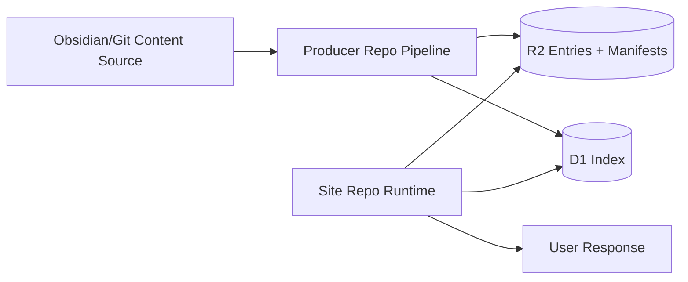

# Content Producer Extraction - LLD Handoff (2026-03-20)

## Status

- Date: 2026-03-20
- Audience: Architecture and implementation handoff
- Scope: Dedicated producer repository extraction plan

## Historical Status Note (2026-04-05)

Manifest-specific producer contract language in this handoff is superseded by `plans/adrs/0016-d1-as-canonical-cloud-content-index-and-r2-blob-storage.md`.

- Producer output contract is D1 index rows plus R2 blobs.
- Any manifest references here are historical transition context only.

## Intent

Extract content production (sync/publish/index) into a dedicated repository while preserving site delivery continuity and current product priorities.

## In Scope

- Producer repository boundaries and module ownership.
- Cutover phases from in-repo scripts to external producer pipeline.
- Contract governance between producer and site consumer.
- GitHub Actions-first runtime plan.

## Out of Scope

- Full campaign app/service extraction.
- Site route IA redesign.
- Immediate Worker-first ingestion migration (optional future phase).

## Inputs

- `plans/adrs/0012-content-producer-extraction-strategy.md`
- `plans/adrs/0010-global-content-source-mode-cloud-default.md`
- `plans/adrs/0011-discovery-navigation-and-search-index-strategy.md`
- `plans/content-sync-workflow-plan.md`
- `plans/content-source-mode-all-local-or-cloud-lld-handoff-2026-03-19.md`

## Target Boundary

Producer repo owns:

- source discovery and validation,
- content-index row derivation,
- R2 object publication,
- D1 index publication,
- dry-run + operator-safe reporting.

Site repo owns:

- runtime read/query logic,
- rendering and route behavior,
- authz enforcement at request-time.

## Architecture

## Contract Governance

## Phase 1 (transition)

- schema authority remains in current site repo.
- producer consumes contract docs and validation tests from site repo.
- compatibility checks run in producer CI against pinned contract revision.

## Phase 2 (multi-consumer readiness)

Promote shared contracts package only when both are true:

1. producer repo cutover is complete, and
2. at least one additional consumer exists.

Package scope should remain minimal:

- manifest schema,
- identity invariants,
- metadata index row schema.

## Cutover Plan

## Phase A - Contract freeze and parity hardening

1. Freeze manifest/index schemas and version numbers.
2. Add producer-consumer compatibility checklist.
3. Ensure cloud parity lane (`pnpm dev:cf`) is green.

## Phase B - Producer repo bootstrap

1. Create dedicated repository skeleton.
2. Move sync modules from `scripts/content-sync/` with minimal behavior changes.
3. Add CI with dry-run, validation, and publish gates.

## Phase C - GitHub Actions productionization

1. Trigger on source repo changes and manual dispatch.
2. Run validation -> publish R2 -> publish D1 index -> emit summary artifact.
3. Add failure notifications and retry-safe idempotency.

## Phase D - Consumer cutover and cleanup

1. Site app stops treating in-repo sync as primary publishing path.
2. Keep emergency local sync fallback for defined rollback window.
3. Remove stale coupling docs and update runbooks.

## Runtime Choice Policy

- Initial extraction target: GitHub Actions.
- Worker-first ingestion is optional follow-on when there is demonstrated need (latency, reliability, event-driven integration, or cost profile).

## Operational Requirements

1. Idempotent publish by `id` + `etag` semantics.
2. Explicit dry-run report for object/index changes.
3. Deterministic stale deletion policy with operator confirmation in manual flows.
4. Support codes and concise failure guidance for non-technical operators.

## Security Requirements

1. No secrets in logs or artifacts.
2. Least-privilege credentials for R2 and D1 writes.
3. Deny-by-default consumer behavior if producer outputs are missing/invalid for protected content.

## Test Plan

Producer CI:

1. Contract validation tests.
2. Dry-run diff tests.
3. Publish simulation tests for upsert/delete/reconcile logic.

Consumer verification:

1. Runtime reads from latest producer outputs.
2. Protected content behavior remains correct under authz checks.
3. Rollback lane (`local`) remains viable during transition window.

## Acceptance Criteria

1. Producer responsibilities are isolated in dedicated repo with CI and runbook.
2. Site runtime functions without primary dependency on in-repo sync scripts.
3. Contract compatibility checks prevent producer/consumer schema drift.
4. Extraction does not block active calendar and discovery/search deliveries.
