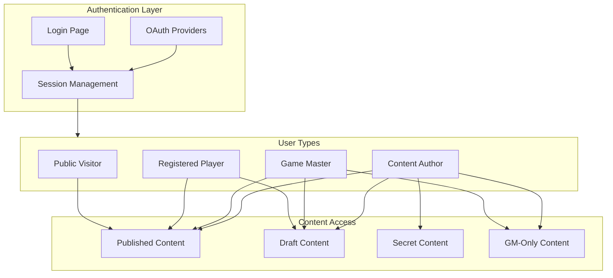
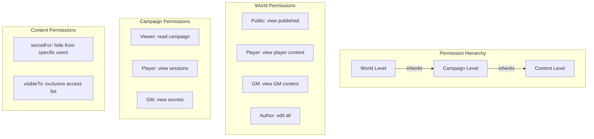

# Content Publishing System for World of Aletheia

## Executive Summary

This document outlines a comprehensive content publishing system for the World of Aletheia worldbuilding site, designed to handle:
- Multi-author content with author-specific secrets
- Three-tier visibility system: draft, published, and secret
- Obsidian-based Markdown content workflow
- Cloudflare Workers deployment via GitHub Actions

### 2026-03 Active Policy Shift (Phase 1)

The currently active direction for implementation prioritization is:

1. **Canon** and **Using Aletheia** are public-by-default domains.
2. **Campaigns** are the first enforced auth boundary.
3. Campaign root/index blurbs remain public, while per-campaign content may be gated.
4. `secret` is no longer treated as the primary long-term protection mechanism for main-site domains.
5. Protection is expected to move to authenticated request-time checks for campaign content.

This policy shift is intentionally incremental and aligned with Astro-native/YAGNI decisions. See:

- [`plans/campaign-permissions-phased-enhancement-plan.md`](plans/campaign-permissions-phased-enhancement-plan.md)
- [`plans/adrs/0001-obsidian-first-content-architecture.md`](plans/adrs/0001-obsidian-first-content-architecture.md)
- [`plans/adrs/0004-campaigns-astro-native-content-access-policy.md`](plans/adrs/0004-campaigns-astro-native-content-access-policy.md)

---

## Part 1: Secret Content Architecture Analysis

### The Challenge
Two authors (Brad and Barry) need to:
1. Share a collaborative worldbuilding space
2. Keep certain content secret from each other (GM materials, spoilers)
3. Maintain a simple, sustainable workflow
4. Eventually support player access with granular permissions

### Option Analysis

#### Option 1: Single Vault in Repository
```
/content/
├── shared/          # Both authors see
├── brad-secret/     # Brad only
└── barry-secret/    # Barry only
```
**Verdict: Not viable** - Git provides no file-level access control. Both authors would have full repo access.

#### Option 2: Separate Repositories Per Author
```
repo: worldofaletheia-main     # Shared content
repo: worldofaletheia-brad     # Brad's secrets
repo: worldofaletheia-barry    # Barry's secrets
```
**Verdict: Viable but complex** - Requires sophisticated CI/CD to merge at build time. Access control via GitHub repo permissions.

#### Option 3: Encrypted Content in Single Vault
```
/content/
├── shared/
└── secrets/
    ├── brad/
    │   ├── gm-notes.md.enc     # Encrypted with Brad's key
    │   └── spoilers.md.enc
    └── barry/
        └── campaign-plans.md.enc
```
**Verdict: Technically interesting but operationally complex** - Requires key management, breaks Obsidian's native editing, complicates preview workflow.

#### Option 4: Trust-Based Single Vault (Recommended Starting Point)
```
/content/
├── lore/
├── places/
├── sentients/
├── campaigns/
│   └── shattered-lands/
```
**Verdict: Recommended as Phase 1** - Simple, maintains full Obsidian workflow, can evolve to technical enforcement later.

### Recommended Evolution Path

```
Phase 1: Trust-Based         Phase 2: Repo-Based          Phase 3: Auth-Based
Single repo, honor system → Separate secret repos     → Full authentication
                            merged at CI/CD time         with encrypted storage
```

---

## Part 2: Content Status System

### Three-Tier Visibility Model

| Status | Development | Production | Secret Handling |
|--------|-------------|------------|-----------------|
| `draft` | ✅ Visible | ❌ Hidden | Appears in dev builds only |
| `published` | ✅ Visible | ✅ Visible | Public on all builds |
| `secret` | ❌ Excluded | ❌ Excluded | Never in any build until auth exists |

### Build-Time Filtering Logic

```typescript
// src/utils/content-filter.ts
export function shouldIncludeContent(
  status: 'draft' | 'published' | 'archived',
  secret: boolean,
  isDev: boolean = import.meta.env.DEV
): boolean {
  // Secret content is excluded from all builds until auth system exists
  if (secret) return false;
  
  switch (status) {
    case 'published':
    case 'archived':
      return true;
    case 'draft':
      return isDev;
    default:
      return false;
  }
}

/**
 * Get filtered collection entries based on build environment
 */
export async function getFilteredCollection<T extends keyof typeof collections>(
  collectionName: T
): Promise<CollectionEntry<T>[]> {
  const entries = await getCollection(collectionName);
  const isDev = import.meta.env.DEV;
  
  return entries.filter(entry => 
    shouldIncludeContent(entry.data.status, entry.data.secret, isDev)
  );
}

/**
 * Get entries for a specific author
 */
export async function getAuthorEntries<T extends keyof typeof collections>(
  collectionName: T,
  author: 'brad' | 'barry'
): Promise<CollectionEntry<T>[]> {
  const entries = await getFilteredCollection(collectionName);
  return entries.filter(entry => entry.data.author === author);
}

/**
 * Get entries for a specific campaign
 */
export async function getCampaignEntries<T extends keyof typeof collections>(
  collectionName: T,
  campaignSlug: string
): Promise<CollectionEntry<T>[]> {
  const entries = await getFilteredCollection(collectionName);
  return entries.filter(entry => entry.data.campaign === campaignSlug);
}
```

### Environment Detection

```typescript
// Astro detects via import.meta.env.MODE
const isDev = import.meta.env.DEV;        // true in dev
const isProd = import.meta.env.PROD;      // true in prod build
```

---

## Part 3: Frontmatter Schema

### Complete Schema Definition

```typescript
// src/content.config.ts
import { defineCollection, z } from 'astro:content';

// Author enum
const authorSchema = z.enum(['brad', 'barry']);

// Status enum
const statusSchema = z.enum(['draft', 'published', 'archived']);

// Base frontmatter shared by all content types
const baseFrontmatter = {
  // Required
  title: z.string(),
  status: statusSchema.default('draft'),
  
  // Secret flag - separate from status
  secret: z.boolean().default(false),
  
  // Attribution
  author: authorSchema,
  contributors: z.array(authorSchema).optional(),
  
  // Timestamps
  created: z.coerce.date(),
  updated: z.coerce.date().optional(),
  
  // Categorization - flexible tag system for filtering
  tags: z.array(z.string()).default([]),
  
  // Campaign association
  campaign: z.string().optional(), // 'shattered-lands', etc.
  
  // Future permissions - placeholder for Phase 3
  permissions: z.object({
    secretFor: z.array(z.string()).optional(),    // User IDs who cannot see
    visibleTo: z.array(z.string()).optional(),    // User IDs who can see - if set, exclusive
    requiresRole: z.enum(['public', 'player', 'gm', 'author']).default('public'),
  }).optional(),
  
  // SEO and display
  description: z.string().optional(),
  image: z.string().optional(),
  
  // Related content - cross-collection references by slug
  related: z.array(z.string()).optional(),
  
  // Wiki-style features
  aliases: z.array(z.string()).optional(), // Alternative names for linking
};

// Lore entries - history, mythology, magic, culture, etc.
const loreCollection = defineCollection({
  type: 'content',
  schema: z.object({
    ...baseFrontmatter,
    era: z.string().optional(), // 'first-age', 'current', etc.
    canonicity: z.enum(['canon', 'legend', 'rumor']).default('canon'),
  }),
});

// Places - regions, cities, dungeons, landmarks, planes
const placesCollection = defineCollection({
  type: 'content',
  schema: z.object({
    ...baseFrontmatter,
    placeType: z.enum(['region', 'city', 'town', 'village', 'dungeon', 'landmark', 'plane', 'building']).optional(),
    parentPlace: z.string().optional(), // Slug of containing place
    coordinates: z.object({
      x: z.number(),
      y: z.number(),
    }).optional(),
  }),
});

// Sentients - intelligent beings: NPCs, deities, historical figures
const sentientsCollection = defineCollection({
  type: 'content',
  schema: z.object({
    ...baseFrontmatter,
    sentientType: z.enum(['npc', 'deity', 'historical', 'player-character', 'species', 'race', 'culture']).optional(),
    species: z.string().optional(), // 'human', 'elf', 'dwarf', etc.
    faction: z.string().optional(), // Reference to factions collection
    location: z.string().optional(), // Reference to places collection
    alive: z.boolean().default(true),
  }),
});

// Creatures - monsters, beasts, non-sentient beings
const creaturesCollection = defineCollection({
  type: 'content',
  schema: z.object({
    ...baseFrontmatter,
    creatureType: z.enum(['beast', 'monster', 'elemental', 'undead', 'construct', 'aberration']).optional(),
    habitat: z.array(z.string()).optional(), // Reference to places or environment tags
    dangerLevel: z.enum(['harmless', 'minor', 'moderate', 'dangerous', 'deadly', 'legendary']).optional(),
  }),
});

// Factions - organizations, guilds, governments, religions
const factionsCollection = defineCollection({
  type: 'content',
  schema: z.object({
    ...baseFrontmatter,
    factionType: z.enum(['organization', 'guild', 'government', 'religion', 'informal']).optional(),
    headquarters: z.string().optional(), // Reference to places collection
    alignment: z.string().optional(),
  }),
});

// Systems - game mechanics, rules, resources, guides
const systemsCollection = defineCollection({
  type: 'content',
  schema: z.object({
    ...baseFrontmatter,
    gameSystem: z.string().optional(), // 'GURPS', 'agnostic', etc.
    complexity: z.enum(['beginner', 'intermediate', 'advanced']).optional(),
  }),
});

// Campaigns - campaign overviews
const campaignsCollection = defineCollection({
  type: 'content',
  schema: z.object({
    ...baseFrontmatter,
    campaignStatus: z.enum(['active', 'completed', 'hiatus', 'planned']).default('active'),
    system: z.string().default('GURPS'),
    players: z.array(z.string()).optional(),
    startDate: z.coerce.date().optional(),
    endDate: z.coerce.date().optional(),
  }),
});

// Sessions - session notes
const sessionsCollection = defineCollection({
  type: 'content',
  schema: z.object({
    ...baseFrontmatter,
    campaign: z.string(), // Required for sessions
    sessionNumber: z.number(),
    sessionDate: z.coerce.date(),
    summary: z.string().optional(),
  }),
});

export const collections = {
  lore: loreCollection,
  places: placesCollection,
  sentients: sentientsCollection,
  creatures: creaturesCollection,
  factions: factionsCollection,
  systems: systemsCollection,
  campaigns: campaignsCollection,
  sessions: sessionsCollection,
};
```

### Example Frontmatter for Each Content Type

#### Lore Entry
```yaml
---
title: The Shattering
status: published
secret: false
author: brad
created: 2026-01-15
tags: [history, catastrophe, magic, major-event]
era: first-age
canonicity: canon
description: The cataclysmic event that shattered the continent.
related: [lore/the-old-empire, lore/arcane-catastrophe]
---
```

#### Place
```yaml
---
title: The City of Verath
status: draft
secret: false
author: barry
contributors: [brad]
created: 2026-01-20
updated: 2026-02-01
tags: [city, trade, coastal, northern-reaches]
placeType: city
parentPlace: places/northern-reaches
description: A bustling port city known for its merchant guilds.
---
```

#### Sentient - NPC
```yaml
---
title: Lord Valen Darkmore
status: draft
secret: true
author: brad
created: 2026-01-22
tags: [villain, noble, secret-identity, merchant-guild]
sentientType: npc
species: human
faction: factions/shadow-council
location: places/verath
alive: true
permissions:
  requiresRole: gm
  secretFor: [player-1, player-2]
description: The secret mastermind behind the merchant guild's corruption.
---
```

#### Creature
```yaml
---
title: Shatterlands Wyvern
status: published
secret: false
author: brad
created: 2026-01-25
tags: [flying, reptile, dangerous, mountain]
creatureType: beast
habitat: [mountain, cliff, highland]
dangerLevel: dangerous
description: A territorial predator native to the Shatterlands mountains.
---
```

#### Faction
```yaml
---
title: The Merchant Guild of Verath
status: published
secret: false
author: barry
created: 2026-01-18
tags: [trade, commerce, politics, verath]
factionType: guild
headquarters: places/verath
description: The powerful trade organization controlling Verath's commerce.
---
```

#### Systems - Game Mechanics
```yaml
---
title: Sorcery Magic System
status: published
secret: false
author: brad
created: 2026-01-10
tags: [magic, sorcery, gurps, rules]
gameSystem: GURPS
complexity: intermediate
description: How sorcery magic works in our campaigns.
---
```

#### Session Notes
```yaml
---
title: "Session 12: The Ruins Beneath"
status: published
secret: false
author: brad
created: 2026-02-01
campaign: shattered-lands
sessionNumber: 12
sessionDate: 2026-01-28
tags: [dungeon, combat, discovery, verath]
permissions:
  requiresRole: player
summary: The party descends into the ancient ruins and discovers disturbing truths.
---
```

---

## Part 4: Project Structure

### Complete Folder Hierarchy

```
worldofaletheia/
├── .github/
│   └── workflows/
│       ├── deploy-production.yml
│       ├── deploy-preview.yml
│       └── validate-content.yml
│
├── src/
│   ├── content/                    # Astro Content Collections
│   │   ├── config.ts               # Collection definitions
│   │   │
│   │   ├── lore/                   # History, mythology, magic, culture
│   │   │   ├── the-shattering.md
│   │   │   ├── old-empire.md
│   │   │   ├── creation-myth.md
│   │   │   └── arcane-traditions.md
│   │   │
│   │   ├── places/                 # Geographic content
│   │   │   ├── northern-reaches.md
│   │   │   ├── verath.md
│   │   │   ├── ironholt.md
│   │   │   └── ruins-of-old-empire.md
│   │   │
│   │   ├── sentients/              # Intelligent beings - NPCs, deities
│   │   │   ├── lord-valdis.md
│   │   │   ├── merchant-prince.md
│   │   │   └── goddess-twilight.md
│   │   │
│   │   ├── creatures/              # Monsters, beasts
│   │   │   ├── shatterlands-wyvern.md
│   │   │   ├── cave-lurker.md
│   │   │   └── shadow-hound.md
│   │   │
│   │   ├── factions/               # Organizations
│   │   │   ├── merchant-guild.md
│   │   │   ├── shadow-council.md
│   │   │   └── church-of-dawn.md
│   │   │
│   │   ├── systems/                # Game mechanics, rules
│   │   │   ├── sorcery-magic.md
│   │   │   ├── combat-house-rules.md
│   │   │   └── character-creation-guide.md
│   │   │
│   │   ├── campaigns/              # Campaign overviews
│   │   │   └── shattered-lands.md
│   │   │
│   │   └── sessions/               # Session notes
│   │       └── shattered-lands/
│   │           ├── session-001.md
│   │           └── session-002.md
│   │
│   ├── pages/
│   │   ├── index.astro
│   │   ├── about.md
│   │   │
│   │   ├── lore/
│   │   │   ├── index.astro          # Lore landing page
│   │   │   └── [...slug].astro      # Dynamic lore pages
│   │   │
│   │   ├── places/
│   │   │   ├── index.astro
│   │   │   └── [...slug].astro
│   │   │
│   │   ├── sentients/
│   │   │   ├── index.astro
│   │   │   └── [...slug].astro
│   │   │
│   │   ├── creatures/
│   │   │   ├── index.astro
│   │   │   └── [...slug].astro
│   │   │
│   │   ├── factions/
│   │   │   ├── index.astro
│   │   │   └── [...slug].astro
│   │   │
│   │   ├── systems/
│   │   │   ├── index.astro
│   │   │   └── [...slug].astro
│   │   │
│   │   ├── campaigns/
│   │   │   ├── index.astro
│   │   │   └── [campaign]/
│   │   │       ├── index.astro      # Campaign overview
│   │   │       └── sessions/
│   │   │           └── [...slug].astro
│   │   │
│   │   ├── gurps/
│   │   │   └── ...
│   │   │
│   │   ├── search.astro
│   │   │
│   │   └── api/
│   │       └── auth/
│   │           └── [auth].ts
│   │
│   ├── layouts/
│   │   ├── BaseLayout.astro
│   │   ├── MainSiteLayout.astro
│   │   ├── GurpsLayout.astro
│   │   ├── ContentLayout.astro      # New: For wiki-style content
│   │   └── CampaignLayout.astro     # New: For campaign content
│   │
│   ├── components/
│   │   ├── ContentCard.astro
│   │   ├── RelatedContent.astro
│   │   ├── TagCloud.astro
│   │   ├── Breadcrumbs.astro
│   │   ├── TableOfContents.astro
│   │   ├── AuthorBadge.astro
│   │   ├── StatusBadge.astro
│   │   └── Search/
│   │       ├── SearchInput.astro
│   │       └── SearchResults.astro
│   │
│   ├── utils/
│   │   ├── content-filter.ts
│   │   ├── collections.ts           # Helper functions for collections
│   │   └── search.ts
│   │
│   └── styles/
│       └── global.css
│
├── public/
│   ├── images/
│   │   ├── maps/
│   │   ├── characters/
│   │   └── locations/
│   │
│   ├── css/
│   │   ├── styles.css #
│   │   └── fonts/
│   │       ├── foxford/
│   │       │   ├── foxford-light.woff
│   │       │   ├── foxford-bold.woff
│   │       │   └── foxford-light.woff2 #
│   │       ├── kobeval/
│   │       │   ├── kobeval-regular.woff
│   │       │   ├── kobeval-bold.woff
│   │       │   └── kobeval-regular.woff2 #
│   │       ├── noodles/
│   │       │   ├── noodles-regular.woff #
│   │       │   ├── noodles-bold.woff #
│   │       │   └── noodles-regular.woff2 #
│   │       └── sourcesanspro-rounded/
│   │           ├── sourcesanspro.woff #
│   │           ├── sourcesanspro-bold.woff #
│   │           └── sourcesanspro-normal-ia.woff2 #
│   │
│   ├── utils/
│   │   └── jquery1.12.4.min.js #
│   │
│   └── ...
│
├── astro.config.mjs
├── content.config.ts                # Astro 5 content config location
├── package.json
├── tsconfig.json
└── wrangler.jsonc
```

### URL Routing Structure

URL Pattern | Content | Source |
|------------|---------|--------|
| `/` | Homepage | `src/pages/index.astro` |
| `/about` | About page | `src/pages/about.md` |
| `/lore` | Lore index | `src/pages/lore/index.astro` |
| `/lore/the-shattering` | Lore entry | `src/content/lore/the-shattering.md` |
| `/places` | Places index | `src/pages/places/index.astro` |
| `/places/verath` | Place | `src/content/places/verath.md` |
| `/sentients` | Sentients index | `src/pages/sentients/index.astro` |
| `/sentients/lord-valdis` | Sentient | `src/content/sentients/lord-valdis.md` |
| `/creatures` | Creatures index | `src/pages/creatures/index.astro` |
| `/creatures/shatterlands-wyvern` | Creature | `src/content/creatures/shatterlands-wyvern.md` |
| `/factions` | Factions index | `src/pages/factions/index.astro` |
| `/factions/merchant-guild` | Faction | `src/content/factions/merchant-guild.md` |
| `/systems` | Systems index | `src/pages/systems/index.astro` |
| `/systems/sorcery-magic` | System content | `src/content/systems/sorcery-magic.md` |
| `/campaigns` | Campaigns index | `src/pages/campaigns/index.astro` |
| `/campaigns/shattered-lands` | Campaign home | Campaign collection |
| `/campaigns/shattered-lands/sessions/12` | Session | Session content |
| `/gurps/*` | GURPS section | Existing structure |
| `/search` | Search page | `src/pages/search.astro` |

---

## Part 5: Build-Time Content Filtering

### Content Filter Utility

```typescript
// src/utils/content-filter.ts
import { getCollection, type CollectionEntry } from 'astro:content';

type ContentStatus = 'draft' | 'published' | 'secret';

/**
 * Determines if content should be included in the current build
 */
export function shouldIncludeContent(
  status: ContentStatus,
  isDev: boolean = import.meta.env.DEV
): boolean {
  switch (status) {
    case 'published':
      return true;
    case 'draft':
      return isDev;
    case 'secret':
      return false; // Never include until auth system exists
    default:
      return false;
  }
}

/**
 * Get filtered collection entries based on build environment
 */
export async function getFilteredCollection<T extends keyof typeof collections>(
  collectionName: T
): Promise<CollectionEntry<T>[]> {
  const entries = await getCollection(collectionName);
  const isDev = import.meta.env.DEV;
  
  return entries.filter(entry => 
    shouldIncludeContent(entry.data.status, isDev)
  );
}

/**
 * Get entries for a specific author
 */
export async function getAuthorEntries<T extends keyof typeof collections>(
  collectionName: T,
  author: 'brad' | 'barry'
): Promise<CollectionEntry<T>[]> {
  const entries = await getFilteredCollection(collectionName);
  return entries.filter(entry => entry.data.author === author);
}

/**
 * Get entries for a specific campaign
 */
export async function getCampaignEntries<T extends keyof typeof collections>(
  collectionName: T,
  campaignSlug: string
): Promise<CollectionEntry<T>[]> {
  const entries = await getFilteredCollection(collectionName);
  return entries.filter(entry => entry.data.campaign === campaignSlug);
}
```

### Usage in Page Components

```astro
---
// src/pages/lore/[...slug].astro
import { getFilteredCollection } from '../../utils/content-filter';
import ContentLayout from '@layouts/ContentLayout.astro';

export async function getStaticPaths() {
  const entries = await getFilteredCollection('lore');
  
  return entries.map(entry => ({
    params: { slug: entry.slug },
    props: { entry },
  }));
}

const { entry } = Astro.props;
const { Content } = await entry.render();
---

<ContentLayout 
  title={entry.data.title}
  description={entry.data.description}
  author={entry.data.author}
  status={entry.data.status}
>
  <Content />
</ContentLayout>
```

### Build Logs for Visibility

```typescript
// src/utils/build-logger.ts
import type { CollectionEntry } from 'astro:content';

export function logContentSummary(
  collectionName: string,
  total: number,
  included: number,
  excluded: { drafts: number; secrets: number }
) {
  console.log(`📚 ${collectionName}:`);
  console.log(`   Total: ${total}, Included: ${included}`);
  console.log(`   Excluded: ${excluded.drafts} drafts, ${excluded.secrets} secrets`);
}
```

---

## Part 6: CI/CD Pipeline

### GitHub Actions Workflow: Production Deployment

```yaml
# .github/workflows/deploy-production.yml
name: Deploy to Production

on:
  push:
    branches: [main]
  workflow_dispatch:

env:
  NODE_ENV: production

jobs:
  build-and-deploy:
    runs-on: ubuntu-latest
    
    steps:
      - name: Checkout
        uses: actions/checkout@v4
        
      - name: Setup pnpm
        uses: pnpm/action-setup@v2
        with:
          version: 9
          
      - name: Setup Node.js
        uses: actions/setup-node@v4
        with:
          node-version: '20'
          cache: 'pnpm'
          
      - name: Install dependencies
        run: pnpm install --frozen-lockfile
        
      - name: Build (Production)
        run: pnpm build
        env:
          NODE_ENV: production
          
      - name: Deploy to Cloudflare Workers
        uses: cloudflare/wrangler-action@v3
        with:
          apiToken: ${{ secrets.CLOUDFLARE_API_TOKEN }}
          accountId: ${{ secrets.CLOUDFLARE_ACCOUNT_ID }}
          command: deploy
```

### GitHub Actions Workflow: Preview Deployment

```yaml
# .github/workflows/deploy-preview.yml
name: Deploy Preview

on:
  pull_request:
    branches: [main]
  workflow_dispatch:
    inputs:
      include_drafts:
        description: 'Include draft content'
        type: boolean
        default: true

jobs:
  build-and-deploy-preview:
    runs-on: ubuntu-latest
    
    steps:
      - name: Checkout
        uses: actions/checkout@v4
        
      - name: Setup pnpm
        uses: pnpm/action-setup@v2
        with:
          version: 9
          
      - name: Setup Node.js
        uses: actions/setup-node@v4
        with:
          node-version: '20'
          cache: 'pnpm'
          
      - name: Install dependencies
        run: pnpm install --frozen-lockfile
        
      - name: Build (Preview with Drafts)
        run: pnpm build
        env:
          # Custom env var to include drafts in preview builds
          INCLUDE_DRAFTS: ${{ github.event.inputs.include_drafts || 'true' }}
          
      - name: Deploy Preview to Cloudflare
        uses: cloudflare/wrangler-action@v3
        with:
          apiToken: ${{ secrets.CLOUDFLARE_API_TOKEN }}
          accountId: ${{ secrets.CLOUDFLARE_ACCOUNT_ID }}
          command: deploy --env preview
        id: deploy-preview
        
      - name: Comment Preview URL
        uses: actions/github-script@v7
        if: github.event_name == 'pull_request'
        with:
          script: |
            github.rest.issues.createComment({
              issue_number: context.issue.number,
              owner: context.repo.owner,
              repo: context.repo.name,
              body: `🚀 Preview deployed: ${{ steps.deploy-preview.outputs.deployment-url }}`
            })
```

### GitHub Actions Workflow: Content Validation

```yaml
# .github/workflows/validate-content.yml
name: Validate Content

on:
  push:
    paths:
      - 'src/content/**'
  pull_request:
    paths:
      - 'src/content/**'

jobs:
  validate:
    runs-on: ubuntu-latest
    
    steps:
      - name: Checkout
        uses: actions/checkout@v4
        
      - name: Setup pnpm
        uses: pnpm/action-setup@v2
        with:
          version: 9
          
      - name: Setup Node.js
        uses: actions/setup-node@v4
        with:
          node-version: '20'
          cache: 'pnpm'
          
      - name: Install dependencies
        run: pnpm install --frozen-lockfile
        
      - name: Type check content schemas
        run: pnpm astro check
        
      - name: Build to validate all content
        run: pnpm build
        env:
          # Build in mode that validates but doesn't fail on drafts
          VALIDATION_BUILD: true
```

### Wrangler Configuration for Environments

```jsonc
// wrangler.jsonc
{
  "compatibility_date": "2026-01-24",
  "compatibility_flags": ["global_fetch_strictly_public"],
  "name": "world-of-aletheia",
  
  // Production configuration
  "route": {
    "pattern": "worldofaletheia.com/*",
    "zone_name": "worldofaletheia.com"
  },
  
  "assets": {
    "directory": "./dist"
  },
  
  "observability": {
    "enabled": true
  },
  
  // Environment-specific overrides
  "env": {
    "preview": {
      "name": "world-of-aletheia-preview",
      "route": {
        "pattern": "preview.worldofaletheia.com/*",
        "zone_name": "worldofaletheia.com"
      }
    },
    "staging": {
      "name": "world-of-aletheia-staging",
      "route": {
        "pattern": "staging.worldofaletheia.com/*",
        "zone_name": "worldofaletheia.com"
      }
    }
  }
}
```

---

## Part 7: Future Architecture - Authentication & Permissions

### Phase 3: Authentication System



### Better Auth Integration Plan

```typescript
// src/lib/auth.ts (Future Implementation)
import { betterAuth } from 'better-auth';
import { D1Adapter } from 'better-auth/adapters/d1';

export const auth = betterAuth({
  database: new D1Adapter(/* Cloudflare D1 */),
  
  socialProviders: {
    discord: {
      clientId: process.env.DISCORD_CLIENT_ID!,
      clientSecret: process.env.DISCORD_CLIENT_SECRET!,
    },
  },
  
  session: {
    expiresIn: 60 * 60 * 24 * 7, // 1 week
    updateAge: 60 * 60 * 24,     // 1 day
  },
});

// Role definitions
export type UserRole = 'public' | 'player' | 'gm' | 'author';

export interface UserPermissions {
  canViewDrafts: boolean;
  canViewSecrets: boolean;
  canViewGMContent: boolean;
  canEdit: boolean;
  authorId?: 'brad' | 'barry';
}

export function getPermissions(role: UserRole, userId?: string): UserPermissions {
  switch (role) {
    case 'author':
      return {
        canViewDrafts: true,
        canViewSecrets: true,
        canViewGMContent: true,
        canEdit: true,
        authorId: userId as 'brad' | 'barry',
      };
    case 'gm':
      return {
        canViewDrafts: true,
        canViewSecrets: false,
        canViewGMContent: true,
        canEdit: false,
      };
    case 'player':
      return {
        canViewDrafts: false,
        canViewSecrets: false,
        canViewGMContent: false,
        canEdit: false,
      };
    default:
      return {
        canViewDrafts: false,
        canViewSecrets: false,
        canViewGMContent: false,
        canEdit: false,
      };
  }
}
```

### Hierarchical Permission Model



---

## Part 8: Search Implementation

### Pagefind Integration

```typescript
// astro.config.mjs addition
import pagefind from 'astro-pagefind';

export default defineConfig({
  integrations: [pagefind()],
  // ...
});
```

### Search Index Configuration

```javascript
// pagefind.config.js
export default {
  site: 'dist',
  
  // Index only published content
  glob: '**/*.html',
  
  // Exclude certain paths
  exclude: [
    'api/**',
    '404.html',
  ],
  
  // Custom attributes for filtering  
  filter: {
    status: 'published',
  },
};
```

### Search Page Component

```astro
---
// src/pages/search.astro
import MainSiteLayout from '@layouts/MainSiteLayout.astro';
---

<MainSiteLayout title="Search - World of Aletheia">
  <div class="max-w-4xl mx-auto">
    <h1 class="text-4xl font-lora mb-8">Search the World</h1>
    
    <div id="search" class="pagefind-ui"></div>
  </div>
</MainSiteLayout>

<link href="/pagefind/pagefind-ui.css" rel="stylesheet" />
<script src="/pagefind/pagefind-ui.js" is:inline></script>

<script is:inline>
  window.addEventListener('DOMContentLoaded', () => {
    new PagefindUI({
      element: '#search',
      showSubResults: true,
      showImages: true,
      excerptLength: 20,
    });
  });
</script>

<style>
  :root {
    --pagefind-ui-primary: oklch(var(--p));
    --pagefind-ui-background: oklch(var(--b1));
    --pagefind-ui-border: oklch(var(--bc) / 0.2);
  }
</style>
```

---

## Part 9: Implementation Roadmap

### Phase 1: Foundation (Immediate)

```
[ ] Set up Astro Content Collections structure
[ ] Create content.config.ts with all schemas
[ ] Create script to copy Obsidian vault to src/content
[ ] Build content filtering utilities
[ ] Create ContentLayout component
[ ] Add initial template content for each collection
[ ] Implement index pages for each content type
[ ] Implement dynamic [...slug] routes
[ ] Test build-time filtering works correctly
```

### Phase 2: CI/CD & Deployment

```
[ ] Create GitHub Actions workflows
[ ] Configure wrangler.jsonc for multiple environments
[ ] Set up Cloudflare secrets in GitHub
[ ] Test production deployment
[ ] Test preview deployment
[ ] Add DNS records for preview.worldofaletheia.com
```

### Phase 3: Search & Discovery

```
[ ] Integrate Pagefind
[ ] Build search page
[ ] Add tag-based filtering to index pages
[ ] Create related content components
[ ] Build breadcrumb navigation
```

### Phase 4: Authentication (Future)

```
[ ] Evaluate Better Auth vs alternatives
[ ] Set up Cloudflare D1 for user database
[ ] Implement login/logout flows
[ ] Add role-based content filtering
[ ] Migrate secret content handling to auth-based
[ ] Build author-specific dashboards
```

---

## Part 10: Content Migration Plan

### From Obsidian to Astro

1. **Folder Structure**: Match Obsidian vault structure to `src/content/` structure
2. **Frontmatter**: Add required frontmatter to all existing notes
3. **Wiki Links**: Convert `[[wiki links]]` to standard Markdown links or use remark plugin
4. **Images**: Move images to `public/images/` or use asset imports

### Obsidian Plugin Recommendations

- **Linter**: Auto-format frontmatter
- **Templater**: Create templates matching Astro schemas
- **Dataview**: Query content before migration to verify completeness

### Migration Script Example

```typescript
// scripts/migrate-obsidian.ts
import fs from 'fs/promises';
import path from 'path';
import matter from 'gray-matter';

async function migrateFile(sourcePath: string, targetPath: string, defaults: object) {
  const content = await fs.readFile(sourcePath, 'utf-8');
  const { data, content: body } = matter(content);
  
  // Merge with defaults
  const frontmatter = {
    status: 'draft',
    author: 'brad',
    created: new Date().toISOString().split('T')[0],
    ...defaults,
    ...data,
  };
  
  const output = matter.stringify(body, frontmatter);
  await fs.writeFile(targetPath, output);
}
```

---

## Appendix A: Quick Reference

### Status Cheatsheet

| I want to... | Set status to... |
|--------------|------------------|
| Work on content privately | `draft` |
| Publish for everyone | `published` |
| Hide GM spoilers until auth exists | `secret` |

### Required Frontmatter by Collection

| Collection | Required Fields |
|------------|----------------|
| All | `title`, `status`, `author`, `created` |
| Lore | + none additional |
| Places | + `placesType` |
| Sentients | + `sentientType` |
| Creatures | + `creatureType` |
| Factions | + `factionType` |
| Campaigns | + none additional |
| Sessions | + `campaign`, `sessionNumber`, `sessionDate` |

### Environment Variables

| Variable | Description | Where Set |
|----------|-------------|-----------|
| `NODE_ENV` | `development` or `production` | Automatic |
| `INCLUDE_DRAFTS` | Override draft visibility | CI/CD workflow |
| `CLOUDFLARE_API_TOKEN` | Deployment auth | GitHub Secrets |
| `CLOUDFLARE_ACCOUNT_ID` | CF account | GitHub Secrets |

---

## Appendix B: Decision Log

| Decision | Rationale |
|----------|-----------|
| Trust-based secret content for Phase 1 | Simplest path to start; maintains Obsidian workflow |
| Astro Content Collections over manual markdown handling | Type safety, validation, better DX |
| Pagefind over Algolia | No external service, static-first approach |
| Better Auth for future auth | Good Cloudflare integration, modern API |
| Three-tier status over two-tier | Clear semantics for draft/published/secret |
| Zod schemas in content.config.ts | Astro 5 best practice, TypeScript integration |

---

## Appendix C: Content Collections Architecture Deep Dive

This appendix addresses the architectural questions about Astro Content Collections organization, hierarchical structure, and cross-collection relationships.

### How Astro Content Collections Work

Astro Content Collections have some fundamental constraints that shape our architecture:

1. **Collections are flat at the schema level** - A collection is defined by a single schema (e.g., `loreCollection`). All entries in that collection share the same schema.

2. **Folder structure within a collection is preserved in the slug** - If you have `src/content/lore/history/the-shattering.md`, the slug becomes `history/the-shattering`, which routes to `/lore/history/the-shattering`.

3. **Collections cannot be nested** - You cannot have `collections.lore.history` as a sub-collection. However, you can use folders + frontmatter to achieve hierarchical organization.

4. **Cross-references are handled via string slugs** - References between collections use slug strings, not typed references.

### Chosen Architecture: Flat Collections with Tag-Based Organization

We use **flat folder structure** within each collection, with **frontmatter tags** for categorization and filtering on the site.

#### Final Collection Structure

```
src/content/
├── config.ts              # All collection definitions

├── lore/                  # Worldbuilding lore - FLAT
│   ├── the-shattering.md
│   ├── old-empire.md
│   ├── creation-myth.md
│   └── arcane-traditions.md

├── places/                # Geographic content - FLAT
│   ├── northern-reaches.md
│   ├── verath.md
│   ├── ironholt.md
│   └── ruins-of-old-empire.md

├── sentients/             # Intelligent beings - FLAT
│   ├── lord-valdis.md
│   ├── merchant-prince.md
│   └── goddess-twilight.md

├── creatures/             # Monsters, beasts - FLAT
│   ├── shatterlands-wyvern.md
│   ├── cave-lurker.md
│   └── shadow-hound.md

├── factions/              # Organizations - FLAT
│   ├── merchant-guild.md
│   ├── shadow-council.md
│   └── church-of-dawn.md

├── systems/               # Game mechanics, rules - FLAT
│   ├── sorcery-magic.md
│   ├── combat-house-rules.md
│   └── character-creation-guide.md

├── campaigns/             # Campaign overviews - FLAT
│   └── shattered-lands.md

└── sessions/              # Session notes - organized by campaign subfolder
    └── shattered-lands/
        ├── session-001.md
        └── session-002.md
```

**Key Points:**
- **7 collections are completely flat** - files directly in the collection folder
- **Sessions collection uses campaign subfolders** - this is the only exception, for logical grouping of session notes by campaign
- **Tags handle categorization** - use frontmatter tags like `[history, catastrophe, magic]` instead of folder structure
- **Author, type, status** - all handled via frontmatter, not folders

### Tag-Based Filtering Example

Instead of `/lore/history/the-shattering`, you have `/lore/the-shattering` with tags:

```yaml
---
title: The Shattering
status: published
author: brad
created: 2026-01-15
tags: [history, catastrophe, magic, major-event, first-age]
era: first-age
canonicity: canon
description: The cataclysmic event that shattered the continent.
---
```

Site filtering then uses these tags to create category pages and search filters.

### Handling Cross-Collection Relationships

Astro doesn't have built-in relational features, but we implement them via slug references:

#### Pattern 1: Slug References in Frontmatter

```yaml
---
title: Lord Merchant Valdis
sentientType: npc
faction: factions/merchant-guild    # References factions collection
location: places/verath             # References places collection
related:
  - sentients/ally-captain          # Same collection
  - lore/guild-wars                 # Cross-collection
---
```

#### Pattern 2: Reference Helper Utilities

```typescript
// src/utils/references.ts
import { getCollection, type CollectionEntry } from 'astro:content';

type AnyCollection = 'lore' | 'places' | 'sentients' | 'creatures' | 'factions' | 'campaigns' | 'sessions' | 'systems';

/**
 * Resolve a cross-collection reference to the actual entry
 */
export async function resolveReference(
  ref: string
): Promise<CollectionEntry<AnyCollection> | null> {
  // Reference format: "collection/slug"
  const [collection, ...slugParts] = ref.split('/');
  const slug = slugParts.join('/');
  
  const entries = await getCollection(collection as AnyCollection);
  return entries.find(e => e.slug === slug) ?? null;
}

/**
 * Get all content that references a specific entry
 */
export async function getBacklinks(
  targetSlug: string,
  targetCollection: AnyCollection
): Promise<CollectionEntry<AnyCollection>[]> {
  const allCollections: AnyCollection[] = ['lore', 'places', 'sentients', 'creatures', 'factions', 'campaigns', 'sessions', 'systems'];
  const backlinks: CollectionEntry<AnyCollection>[] = [];
  
  for (const collectionName of allCollections) {
    const entries = await getCollection(collectionName);
    for (const entry of entries) {
      const related = entry.data.related ?? [];
      if (related.some(r => r.includes(targetSlug))) {
        backlinks.push(entry);
      }
    }
  }
  
  return backlinks;
}
```

#### Pattern 3: RelatedContent Component

```astro
---
// src/components/RelatedContent.astro
import { resolveReference } from '../utils/references';
import ContentCard from './ContentCard.astro';

interface Props {
  references: string[];
}

const { references } = Astro.props;
const resolved = await Promise.all(
  references.map(ref => resolveReference(ref))
);
const validEntries = resolved.filter(Boolean);
---

{validEntries.length > 0 && (
  <aside class="related-content">
    <h3>Related Content</h3>
    <div class="grid grid-cols-1 md:grid-cols-2 gap-4">
      {validEntries.map(entry => (
        <ContentCard entry={entry} />
      ))}
    </div>
  </aside>
)}
```

### Tag-Based Filtering on Index Pages

```astro
---
// src/pages/lore/index.astro
import { getFilteredCollection } from '../../utils/content-filter';
import MainSiteLayout from '@layouts/MainSiteLayout.astro';
import ContentCard from '@components/ContentCard.astro';

const allLore = await getFilteredCollection('lore');

// Extract all unique tags for filtering UI
const allTags = [...new Set(allLore.flatMap(e => e.data.tags))].sort();

// Group by commonly used categories via tags
const historyEntries = allLore.filter(e => e.data.tags.includes('history'));
const magicEntries = allLore.filter(e => e.data.tags.includes('magic'));
const cultureEntries = allLore.filter(e => e.data.tags.includes('culture'));
---

<MainSiteLayout title="Lore - World of Aletheia">
  <h1 class="text-4xl font-lora">Lore & History</h1>
  
  <!-- Tag filter UI -->
  <div class="flex flex-wrap gap-2 my-4">
    {allTags.map(tag => (
      <a href={`/lore?tag=${tag}`} class="badge badge-outline">{tag}</a>
    ))}
  </div>
  
  <!-- Content grouped by tag -->
  <section>
    <h2>History</h2>
    <div class="grid gap-4">
      {historyEntries.map(entry => <ContentCard entry={entry} />)}
    </div>
  </section>
  
  <!-- etc... -->
</MainSiteLayout>
```

### Final 8-Collection Summary

| Collection | Content Type | Flat? | Special Notes |
|------------|--------------|-------|---------------|
| `lore` | Worldbuilding lore | ✅ Yes | Tags for history/magic/culture/etc. |
| `places` | Geographic content | ✅ Yes | Tags for region/city/dungeon/etc. |
| `sentients` | Intelligent beings | ✅ Yes | Tags for npc/deity/historical |
| `creatures` | Monsters, beasts | ✅ Yes | Tags for beast/monster/elemental |
| `factions` | Organizations | ✅ Yes | Tags for guild/government/religion |
| `systems` | Game mechanics | ✅ Yes | Tags for rules/GURPS/guides |
| `campaigns` | Campaign overviews | ✅ Yes | One file per campaign |
| `sessions` | Session notes | 🔶 Subfolders | Grouped by campaign for organization |

### Decision: When to Add More Collections

Add a new collection when:
1. Content needs fundamentally different schema fields
2. Content has different visibility/permission rules
3. Content should appear in separate site sections
4. Query performance would benefit from smaller collections

Keep in a single collection when:
1. Content shares the same base structure
2. You want to query across the collection easily
3. URLs should share a namespace (e.g., `/lore/*`)
4. Categories may evolve or entries may be recategorized
