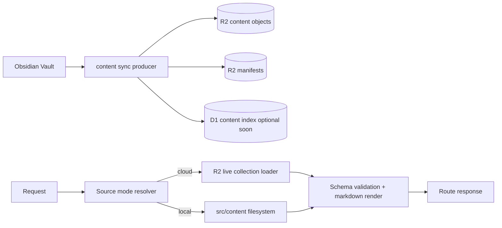

# LLD Handoff - Global Content Source Mode (All Local vs All Cloud) with R2 Live Collections

## Status

- Date: 2026-03-19
- Audience: Implementation handoff to code
- Scope: Runtime read path + sync contract for all collections

## Context

Current state has an incomplete split:

- Sync can upload to R2 (`scripts/content-sync/apply-sync.mjs`).
- Runtime still reads local Astro collections from `src/content` (`src/content.config.ts`).

This causes local files to mask cloud state and blocks true cloud-backed operation in dev and production parity lanes.

Project direction is now explicit:

1. Move to cloud-backed content as canonical source.
2. Use an all-or-nothing source mode (`local` or `cloud`) as the primary control.
3. Keep a constrained fallback hatch for incident rollback.

## Alignment with Existing ADRs

- `plans/adrs/0001-obsidian-first-content-architecture.md`: Obsidian remains authoring source.
- `plans/adrs/0009-campaign-content-source-separation-for-public-repo.md`: cloud runtime source direction.
- `plans/adrs/0004-campaigns-astro-native-content-access-policy.md`: this is a trigger-based evolution (second active data source), not a speculative abstraction.

## Goals

1. Enable all collections to be read from R2 in `cloud` mode.
2. Keep one global source switch for operational clarity.
3. Preserve existing route surfaces and page behavior.
4. Keep implementation Astro-native via live collections/custom loaders.
5. Prepare identity/index contracts for future Worker + GitHub Actions + D1 indexing.

## Non-Goals

- No service split/microservice extraction in this phase.
- No CMS rewrite.
- No broad auth redesign in this delivery unit.

## Decision

Adopt a **global source mode**:

- `CONTENT_SOURCE_MODE=local|cloud`

Primary behavior:

- `local`: all collections resolve from filesystem (`src/content/**`) using existing Astro model.
- `cloud`: all collections resolve from R2 using live collection loader + manifest contract.

Secondary rollback hatch (not primary UX):

- `CONTENT_SOURCE_OVERRIDES=<collection>:local|cloud,...` for emergency exception only.

## Architecture



## Runtime Configuration Contract

Required:

- `CONTENT_SOURCE_MODE=local|cloud`
- `CONTENT_R2_PREFIX=content`

Cloud runtime needs existing binding/bucket setup.

Optional:

- `CONTENT_SOURCE_OVERRIDES` (emergency only)
- `CONTENT_SOURCE_ALLOW_LOCAL_FALLBACK=true|false` (default false in cloud mode for protected content)

## R2 Storage Contract (All Collections)

Object keys:

- Entry markdown: `{prefix}/entries/{collection}/{id}.md`
- Collection manifest: `{prefix}/manifests/{collection}.json`
- Global index manifest: `{prefix}/manifests/_index.json`

Manifest schema v1:

```json
{
  "version": 1,
  "collection": "campaigns",
  "generatedAt": "2026-03-19T00:00:00Z",
  "entries": [
    {
      "collection": "campaigns",
      "id": "brad/index",
      "slug": "brad",
      "path": "campaigns/brad/index.md",
      "key": "content/entries/campaigns/brad/index.md",
      "etag": "...",
      "lastModified": "2026-03-19T00:00:00Z",
      "visibility": "campaignMembers",
      "campaignSlug": "brad"
    }
  ]
}
```

## Stable Identity Keys (for manifests and D1 indexing)

Canonical envelope:

- `collection` (required)
- `id` (required, primary immutable key)
- `slug` (required where route-facing)
- `path` (optional but recommended for diagnostics/migrations)
- `etag` (required version/content hash)
- `lastModified` (required)
- `visibility` (required for campaign-domain authorization-aware behavior)
- `campaignSlug` (required for sessions, nullable elsewhere)

Identity rule:

- `id` is immutable identity; `slug` is route identity and may change.
- Slug changes must not mutate `id`; use redirect/alias handling separately.

## Read Path Design

## 1) Source mode resolver

Add `src/content/source-mode.ts`:

- Parse env once.
- Return global mode and optional overrides.
- Fail closed in invalid cloud config for protected collections.

## 2) Live collection loader layer

Add/extend Astro live collection loaders in `src/content.config.ts`:

- Local mode uses existing filesystem loader behavior.
- Cloud mode uses R2 manifest + object fetch behavior.
- Same schemas remain authoritative to avoid model drift.

## 3) Markdown parse/render parity

Cloud markdown entries must use the same markdown processing rules as local content rendering to avoid output drift.

## 4) Error policy

- Protected content: deny-by-default on cloud fetch/parse/validation failure.
- Public content: return safe degraded response with error observability.

## Sync Pipeline Changes

## Must change now

1. Publish manifests for all collections in every sync.
2. In cloud target mode, detect stale local files under mapped local mirrors and prompt backup/remove.
3. Keep dry-run output explicit for:
   - object upserts/deletes
   - manifest updates
   - local stale cleanup actions

## Should change soon

1. Add non-interactive cleanup flag for CI/operator runs.
2. Add consistency guardrails for required non-content local files.

## Access Config Decoupling

Current coupling imports campaign access config from content tree:

- `src/utils/campaign-membership-config.ts` -> `src/content/campaigns/access.config.json`

Required change:

- Move access config to a non-content path (for example `config/campaign-access.config.json`) to avoid cleanup collisions in cloud mode.

## Dev and Verification Lanes

- `pnpm dev`: default `CONTENT_SOURCE_MODE=local` for speed.
- `pnpm dev:cf`: default `CONTENT_SOURCE_MODE=cloud` for authoritative parity.

Parity lane is the source of truth for cloud behavior.

## Rollout Plan

## Phase 1 - Core mode + contracts

1. Add global mode resolver.
2. Implement R2 manifest contract for all collections.
3. Implement cloud-mode live loaders for all collections.

## Phase 2 - Sync and cleanup hardening

1. Add stale local cleanup prompts in cloud mode.
2. Add manifest verification and deterministic dry-run reports.
3. Move campaign access config out of content tree.

## Phase 3 - Validation and indexing readiness

1. Add tests for local/cloud parity.
2. Add manifest identity checks including slug.
3. Add optional D1 content-index writer path (or noop contract) for upcoming Worker migration.

## Test Plan

Unit:

1. Source mode parsing and override precedence.
2. Manifest validation including `slug` and identity invariants.
3. Cloud entry parse + schema validation.

Integration:

1. `CONTENT_SOURCE_MODE=cloud` renders all collections from R2.
2. Local files do not override cloud in cloud mode.
3. Protected content deny path on R2 failures.
4. `content:sync` prompts backup/remove for stale local mirrors.

Operator checks:

1. `pnpm content:sync:dry-run` reports manifest + cleanup plans.
2. `pnpm dev:cf` works with local content mirrors removed.

## Acceptance Criteria

1. Single switch controls all collection sources (`local` vs `cloud`).
2. Cloud mode works end-to-end for all collections through live loaders.
3. Stable identity contract includes `slug` and is emitted in manifests.
4. Stale local content mirrors are explicitly handled in sync prompts.
5. Design is compatible with future producer migration to Cloudflare Worker + GitHub Action trigger + D1 indexing without changing runtime readers.
