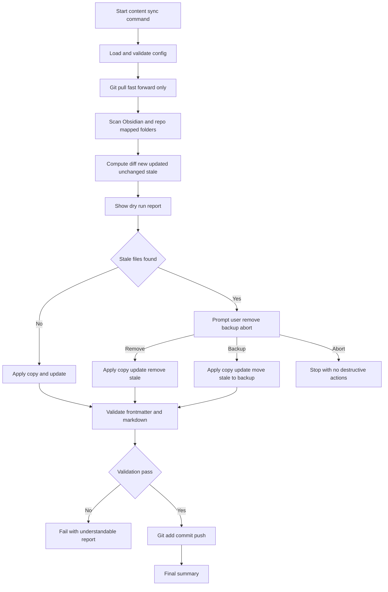

# Standalone Cross-Platform Obsidian Content Sync Plan

## Goal

Implement a Node.js-first workflow that safely syncs Obsidian-authored Markdown into `src/content`, validates content quality, and then performs Git update/commit/push with non-technical-user-friendly prompts and messages.

## Scope of This Step

- Include now:
  - Pull latest repo changes first
  - Sync Obsidian content to mapped folders under `src/content`
  - Validate required frontmatter and basic Markdown quality
  - Handle stale repo files with **mandatory dry-run report + explicit user choice**
  - Commit and push synced content changes
- Exclude now:
  - Downstream dev/draft/publish pipeline
  - Scheduled backup review automation (future follow-up only)

## User Experience Principles

- Single obvious command for normal use
- Clear phase-by-phase output with pass/fail markers
- No Bash-specific assumptions; works in Windows and Linux with Node.js
- Safe defaults: no destructive action without explicit confirmation
- Prompts must be concise and non-technical, but include short troubleshooting context for call-support

## Prompt and Error Message Standard

All interactive and failure output should follow this concise structure:

1. `What happened` in plain language
2. `What to do now` as a single next action
3. `Support code` for quick troubleshooting reference

Example style:

- `Could not update from GitHub because local branch is behind and needs manual merge.`
- `Action: stop and call for help before continuing.`
- `Support code: GIT-PULL-DIVERGED`

Additional messaging constraints:
- Keep prompt text short and explicit
- Avoid stack traces in normal output; print technical detail only in optional debug block
- Include file path in validation errors so fixes are easy to locate
- For stale-file decisions, show a one-line explanation per option: remove, backup, abort

## Workflow Commands and Behavior

### Primary command

- `npm run content:sync`

Behavior:
1. Validate config and environment
2. `git pull --ff-only`
3. Sync Obsidian -> `src/content` mapped targets
4. Run content validation checks
5. If valid and changes exist: commit and push
6. Print final summary report

### Interactive stale-file decision requirement

During sync, if stale repo files are detected in mapped targets:
1. Always generate and show dry-run report first
2. Require explicit user choice:
   - `remove` stale files permanently
   - `backup` stale files to backup folder outside `src/content`
   - `abort` with no destructive changes
3. Continue only after explicit selection

### Support commands

- `npm run content:sync:dry-run`
  - Full analysis/report mode, no file mutations
- `npm run content:validate`
  - Run frontmatter + markdown quality checks only
- `npm run content:git`
  - Run pull/commit/push phase only after sync/validation

## Configuration Model

Create a user-editable config file:

- `config/content-sync.config.json`

Suggested keys:

```json
{
  "vaultRoot": "C:/path/or/linux/path/to/ObsidianVault",
  "mappings": [
    { "from": "World/Lore", "to": "src/content/lore" },
    { "from": "World/Places", "to": "src/content/places" },
    { "from": "World/Sentients", "to": "src/content/sentients" },
    { "from": "World/Factions", "to": "src/content/factions" },
    { "from": "World/Flora", "to": "src/content/flora" },
    { "from": "World/Bestiary", "to": "src/content/bestiary" },
    { "from": "World/Systems", "to": "src/content/systems" },
    { "from": "World/Campaigns", "to": "src/content/campaigns" },
    { "from": "World/Meta", "to": "src/content/meta" }
  ],
  "includeExtensions": [".md"],
  "backupRoot": ".content-sync-backups",
  "staleFilePolicy": "prompt",
  "defaultCommitMessage": "chore(content): sync Obsidian content",
  "requireCleanWorkingTreeBeforePull": false
}
```

Constraints:
- `backupRoot` must be outside published content tree
- `to` paths restricted to `src/content/*`
- Reject path traversal and absolute `to` paths

## Sync Engine Design

### Deterministic phases

1. **Discover**
   - Enumerate source Markdown files from each mapping
   - Enumerate destination Markdown files in mapped target roots
2. **Diff**
   - `new`: exists in vault only
   - `updated`: exists both, content differs
   - `unchanged`: exists both, same content
   - `stale`: exists in repo target only
3. **Dry-run report**
   - Always print counts and file lists
   - If stale exists, show required decision prompt
4. **Apply file operations**
   - Copy new and updated files
   - For stale files apply selected action:
     - `remove`: delete from repo target
     - `backup`: move to timestamped backup tree outside `src/content`
5. **Post-apply summary**
   - Operation totals and destination paths

### Safe merge semantics

- Source of truth for mapped content is Obsidian
- Non-mapped repo files are untouched
- Astro/dev code outside mapped content directories is untouched
- No implicit deletions; stale file action always explicit per run

## Validation Plan

### Frontmatter validation

Checks for each synced Markdown file:
- Frontmatter exists
- Required keys exist per collection minimum:
  - `title`, `type`, `status`, `author`, `secret`
- Basic type checks:
  - `secret` is boolean
  - `tags` is array if present
  - `status` value belongs to allowed set from current content schema policy

Implementation note:
- Reuse schema expectations documented in `src/content.config.ts`
- Do not auto-fix values in first version; report and fail clearly

### Markdown quality checks

- No malformed frontmatter block delimiters
- Heading level progression sanity check
- No empty internal wiki links like `[[ ]]`
- Optional warning for very long lines, but non-blocking in first version

### Error messaging style

- Human-readable summary first
- Then file-by-file details
- Include exact key missing/invalid and expected format
- Example:
  - `FAIL frontmatter: src/content/lore/the-sequence-of-creation.md missing required key status`

## Git Stage Plan

### Intended sequence

1. Verify git repo availability
2. Pull latest with fast-forward only
3. If merge/rebase needed, stop and show clear instructions
4. Stage only sync target + backup paths:
   - `src/content/**`
   - `.content-sync-backups/**` if used
5. Commit with default or provided message
6. Push current branch

### Non-technical safety output

- If nothing changed: explain `No content changes to commit`
- If pull fails due to divergence: explain exact next action path
- If push rejected: show concise remediation guidance

## Proposed File-by-File Implementation

- `scripts/content-sync/index.mjs`
  - CLI entry, phase orchestration, user-facing logs
- `scripts/content-sync/config.mjs`
  - Load/validate config
- `scripts/content-sync/fs-diff.mjs`
  - Scan mappings and compute new/updated/unchanged/stale sets
- `scripts/content-sync/apply-sync.mjs`
  - Copy/update/delete/backup operations
- `scripts/content-sync/validate.mjs`
  - Frontmatter and markdown checks
- `scripts/content-sync/git-stage.mjs`
  - Pull, add, commit, push logic
- `scripts/content-sync/prompt.mjs`
  - Interactive stale decision prompt
- `config/content-sync.config.example.json`
  - Template for user setup
- `README.md`
  - Add non-technical quick-start for brother
- `plans/content-publishing-tasks.md`
  - Mark this standalone sync workflow workstream alignment

## Mermaid: Command Workflow



## Future Follow-Up (Mention Only)

Add scheduled checks using system scheduler options such as cron or platform equivalent to review backup folders and trigger a structured review process.

## Acceptance Criteria

- Works on Windows and Linux using Node.js only
- Dry-run report always shown before stale handling decision
- Stale file decision explicitly required each run when stale exists
- Backup location is outside published content tree
- Validation failures stop commit/push and are understandable to non-technical users
- Sync touches only mapped content and backup paths, preserving normal Astro/dev workflow
