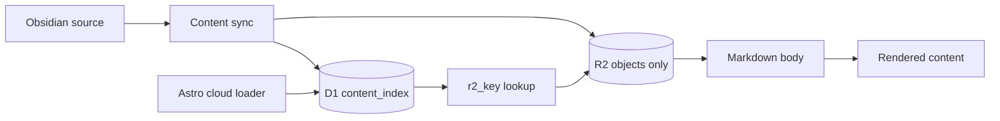

# D1 Manifest Removal and Index Hardening - Handoff to Code (2026-04-05)

## Status

- Date: 2026-04-05
- Audience: Completed implementation record and follow-up reference
- Scope: Complete removal of manifest-based cloud lookup assumptions and hardening of D1 as the sole cloud index
- Execution status: Core tranche implemented on 2026-04-05

## Intent

Finish the architectural cleanup that the runtime has already mostly completed:

1. D1 is the only cloud lookup/discovery index.
2. R2 stores markdown/media blobs only.
3. All active manifest assumptions are removed from code-adjacent docs, tests, and operational language.
4. `content_index` is hardened so it is safe to be the sole lookup source.

## Inputs

- `plans/adrs/0016-d1-as-canonical-cloud-content-index-and-r2-blob-storage.md`
- `plans/adrs/0011-discovery-navigation-and-search-index-strategy.md`
- `plans/adrs/0010-global-content-source-mode-cloud-default.md`
- `plans/adrs/0012-content-producer-extraction-strategy.md`
- `plans/adrs/0013-campaign-domain-collection-taxonomy-refactor.md`

## Verified Current State

Already true in repository:

- `src/lib/r2-content-loader.mjs` reads D1 lookup rows, then fetches markdown bodies from R2.
- `src/lib/content-index-loader.mjs` queries `content_index` and requires `r2_key`.
- `scripts/content-sync/apply-sync.mjs` publishes R2 objects first, then syncs D1 index rows.
- `scripts/content-sync/manifests.mjs` is absent from the repository.
- `docs/status-report-2026-03-24.md` already states manifests are no longer used for runtime lookup.

This is therefore a hardening-and-cleanup tranche, not a greenfield rewrite.

## Execution Status Update (2026-04-05)

This handoff has been executed in code.

Completed implementation work:

- Added `migrations/0008_content_index_collection_scoped_identity.sql` to rebuild `content_index` with collection-scoped identity.
- Updated `scripts/content-sync/content-index-writer.mjs` and `scripts/content-sync/content-index-writer.test.mjs` to upsert on `(collection, id)`.
- Updated `scripts/db-migrate-auth-plan.mjs` to include the new migration and avoid reapplying already-complete lookup-schema steps.
- Updated `src/lib/content-index-loader.test.mjs` to cover collection-local IDs under D1-only lookup.
- Updated `src/lib/content-index-repo.ts` and `src/lib/content-index-repo.test.ts` so query behavior stays correct after the schema change.
- Updated active manifest-era docs so the current architecture is documented as D1 lookup/index plus R2 blob storage.

Validation completed:

- `pnpm test`: passed
- `pnpm build`: passed
- `pnpm db:migrate:plan:local`: passed
- local D1 schema check: passed

Environment blocker still outstanding:

- `pnpm dev:cf:build` could not complete in this environment because Wrangler remote-mode authentication was unavailable (`Failed to fetch auth token: 400 Bad Request` and login required).

## In Scope

- D1 identity and uniqueness hardening for `content_index`.
- Removal of stale manifest language from active planning/runbook surfaces.
- Tests for D1-only lookup behavior and collision safety.
- Sync and loader contract cleanup where manifest-era assumptions remain.

## Out of Scope

- Reintroducing a manifest fallback lane.
- Service/repository abstraction layers beyond current Astro-native loaders and D1 query modules.
- Broad discovery/search redesign beyond what is needed for D1 contract hardening.
- Producer-repo extraction work except where docs mention manifests as an active contract.

## Architecture

## Required Decisions for Code

### 1. Treat D1 as Sole Lookup Contract

Code and docs should assume:

- no manifest reads,
- no manifest writes,
- no manifest verification step,
- no manifest recovery runbook.

Recovery model is explicit:

- rerun sync, or
- rebuild `content_index` from source content.

### 2. Fix `content_index` Identity Semantics

Current problem:

- `migrations/0006_content_index.sql` defines `id TEXT PRIMARY KEY`.
- Astro content IDs are collection-local, not globally unique.
- Two collections can legitimately contain the same `id`.

Required target:

- D1 uniqueness must be scoped by collection.

Preferred implementation shape:

1. Replace the current table definition with a rebuilt table that does not use global `id` primary-key semantics.
2. Enforce uniqueness with either:
   - `PRIMARY KEY (collection, id)`, or
   - equivalent `UNIQUE(collection, id)` plus a surrogate key if needed.
3. Update writer conflict handling to upsert on `(collection, id)`.
4. Preserve `id` as the collection-local Astro identity value.

Why this is preferred:

- preserves local/cloud parity for Astro IDs,
- avoids inventing a new prefixed ID contract,
- keeps route-facing semantics stable.

### 3. Keep `r2_key` in D1

Do not replace `r2_key` with implicit deterministic reconstruction in this tranche.

Reason:

- keeps runtime fetch contract explicit,
- preserves flexibility if object key shape changes,
- keeps lookup and discovery in one authoritative store.

## Implementation Surface

### Migrations

Expected new work under `migrations/`:

- rebuild `content_index` for collection-scoped identity,
- preserve existing columns and indexes,
- keep `r2_key` required for cloud-managed rows,
- add any supporting unique/index definitions needed by loader and repo queries.

Migration guidance:

1. create replacement table,
2. copy forward data,
3. recreate indexes,
4. swap tables,
5. verify row count parity.

### Sync Writer

Files:

- `scripts/content-sync/content-index-writer.mjs`
- `scripts/content-sync/content-index-writer.test.mjs`

Required changes:

- upsert using collection-scoped identity,
- keep delete-and-replace-per-managed-collection behavior unless a concrete regression appears,
- preserve fail-closed behavior when D1 sync fails.

### Cloud Metadata Derivation

Files:

- `scripts/content-sync/cloud-content-metadata.mjs`

Required review points:

- ensure `id` stays collection-local and stable,
- ensure `slug`, `campaign_slug`, and `r2_key` remain populated consistently,
- ensure derived rows remain deterministic for rebuilds.

### Runtime Loader

Files:

- `src/lib/content-index-loader.mjs`
- `src/lib/r2-content-loader.mjs`
- `src/lib/content-index-loader.test.mjs`

Required changes:

- keep D1-only lookup path,
- add or adjust tests for duplicate `id` values across different collections,
- ensure error messages describe D1 lookup failure, not manifest failure.

### Discovery Query Layer

Files:

- `src/lib/content-index-repo.ts`
- related tests

Required review points:

- no manifest dependency should remain,
- any direct row assumptions should remain compatible with collection-scoped identity.

### Doc Cleanup

Active docs to update in this tranche:

- `plans/adrs/0010-global-content-source-mode-cloud-default.md`
- `plans/adrs/0012-content-producer-extraction-strategy.md`
- `plans/adrs/0013-campaign-domain-collection-taxonomy-refactor.md`
- `plans/content-source-mode-all-local-or-cloud-lld-handoff-2026-03-19.md`
- `plans/discovery-navigation-and-search-index-lld-handoff-2026-03-20.md`
- `plans/content-producer-extraction-lld-handoff-2026-03-20.md`
- `docs/content-ingestion-user-guide.md`

Cleanup rule:

- if a document describes manifests as active architecture, update or explicitly mark it historical or superseded.

## Execution Order

### Phase A - D1 Schema Hardening

Status: completed on 2026-04-05.

1. Added migration for collection-scoped identity.
2. Updated writer conflict target.
3. Updated tests for collision cases.

### Phase B - Runtime and Sync Parity Validation

Status: partially completed on 2026-04-05. Local validation passed; Cloudflare remote parity remains environment-blocked.

1. Verified loader behavior against the new D1 schema through tests and local migration checks.
2. Verified sync/index code still publishes collection-scoped rows under the updated conflict target.
3. Verified runtime-path tests and active docs no longer describe manifests as the active lookup contract.

### Phase C - Documentation Cleanup

Status: completed for the active documents listed in this handoff.

1. Updated active ADRs and handoff docs.
2. Removed or superseded manifest-era language in the targeted runbook and planning surfaces.
3. Left older historical planning context in place only where it is no longer the active reference.

## Test Plan

### Must Pass

1. Migration applies cleanly in local D1.
2. Duplicate collection-local IDs across two collections no longer collide.
3. `pnpm test` passes.
4. `pnpm build` passes in local lane.
5. Cloud parity lane still resolves content through D1 lookup and R2 fetch.

### Add or Adjust Tests

1. `content-index-loader` test with same `id` in different collections.
2. `content-index-writer` test proving generated SQL upserts against collection-scoped identity.
3. Sync-path test confirming D1 failure still aborts authoritative publish.

## Acceptance Criteria

Implementation result as of 2026-04-05:

1. No active runtime path depends on manifests.
2. No active sync path writes manifests.
3. `content_index` safely supports collection-local IDs without cross-collection collision.
4. D1 remains the sole authoritative lookup for `collection/id/slug -> r2_key`.
5. Active docs and handoffs no longer describe manifests as current architecture.
6. Full remote Cloudflare parity verification is still pending Wrangler-authenticated execution.

## Risks and Notes

### Risk: Table-Rebuild Migration Complexity

The identity fix likely requires table rebuild semantics in SQLite/D1.

Mitigation:

- test locally first,
- verify row counts before and after,
- keep migration SQL straightforward and reversible through backup/copy steps.

### Risk: Historical Doc Drift

Older plans were written during the manifest-era design and can mislead implementation.

Mitigation:

- prefer ADR-0016 and this handoff as the authoritative direction,
- mark older docs historical or superseded when touched.

### Risk: Over-Refactor

This tranche is not permission to redesign discovery/search architecture.

Mitigation:

- keep changes bounded to D1 hardening, runtime lookup clarity, and doc cleanup.
