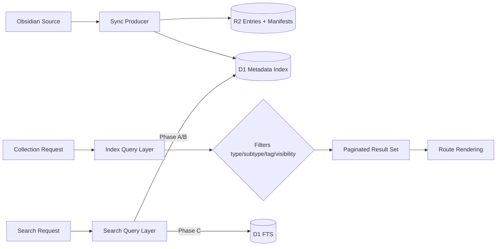

# Discovery, Type Views, Pagination, and Search Index - LLD Handoff (2026-03-20)

## Status

- Date: 2026-03-20
- Audience: Code implementation handoff
- Scope: Near-term discovery and search foundation

## Historical Status Note (2026-04-05)

Manifest-specific sync language in this handoff is superseded by `plans/adrs/0016-d1-as-canonical-cloud-content-index-and-r2-blob-storage.md` and `plans/d1-manifest-removal-and-d1-index-hardening-handoff-to-code-2026-04-05.md`.

- D1 `content_index` is the only supported cloud lookup/index.
- R2 stores markdown/media blobs only.

## Intent

Implement scalable content discovery in phased order:

1. metadata index and display-by-type,
2. indexed pagination,
3. search endpoint foundation,
4. FTS expansion.

This handoff is intentionally incremental to deliver value without blocking on full-text complexity.

## In Scope

- D1 metadata index schema and ingestion.
- Type/subtype filter and grouped list retrieval.
- Pagination strategy on indexed queries.
- Search API foundation with auth-aware filtering.
- FTS migration plan and phased enablement.

## Out of Scope

- Campaign service extraction.
- New framework adoption for search UI.
- Graph/relationship traversal beyond current taxonomy needs.

## Execution Status Update (2026-03-23)

Completed in repository:

- [x] Phase A migration added for `content_index` with indexes.
- [x] Sync-time index writer added and wired into `pnpm content:sync` flow.
- [x] Query utility + pagination contract implemented for index-backed list reads.
- [x] Index-backed list wiring added for type-bearing public collections (`lore`, `places`, `sentients`, `systems`, `bestiary`, `flora`, `factions`).
- [x] Grouped discovery views now ship on the same collection pages with local fallback support.

Still open or partial:

- [x] Type/subtype/tag display requirements are documented below and reflected in route behavior.
- [x] Type/subtype/tag UX/data-contract design is finalized for current discovery surfaces.
- [x] Display-by-type/grouped list views are implemented on supported collections.
- [x] Remote environment verification completed after `content_index` remediation in staging/prod.

Critical investigation:

- [x] P0: Investigate why staging/prod D1 are missing `content_index` despite successful local sync runs. See `plans/content-index-p0-root-cause-2026-03-24.md`.

## Pre-Implementation Gates (Required before additional Phase A feature work)

### Gate G1 - Taxonomy Filter Requirements and Design

- [x] Requirements: document use cases for type/subtype/tag filtering and grouped display behavior.
- [x] Design: define UX states, query parameters, default ordering, and empty/error states.
- [x] LLD: produce implementation handoff for filter + grouped display before coding those features.

Implemented contract (2026-04-02):

- Query params are `view`, `type`, `subtype`, `tag`, and `page`.
- `view=latest` is the default and keeps recency ordering (`updated_at desc`, `slug asc`).
- `view=grouped` groups by `type` unless a `type` filter is active and subtype facets exist; in that state the grouped view pivots to `subtype`.
- Tag filters narrow both latest and grouped views without changing the grouping field.
- Empty states stay collection-specific; index read failures render a safe fallback message instead of stale partial data.

### Gate G2 - Sync Hardening Requirements and Design

- [x] Requirements: define publish-failure semantics for cloud object writes and D1 index writes.
- [x] Design: define fail-fast vs partial-success behavior, operator visibility, and recovery steps.
- [x] LLD: produce hardening implementation handoff before changing sync runtime behavior.

Implemented contract (2026-04-02):

- Cloud object write failures abort authoritative publish before D1 index publication.
- D1 discovery index publication failures stop the sync with a dedicated support code (`SYNC-CONTENT-INDEX-FAILED`).
- Local repo-only sync behavior is unchanged; the hard fail-fast path applies to cloud-backed publish lanes.

## Inputs

- `plans/adrs/0011-discovery-navigation-and-search-index-strategy.md`
- `plans/adrs/0010-global-content-source-mode-cloud-default.md`
- `plans/adrs/0008-systems-taxonomy-type-subtype-model.md`
- `plans/campaign-permissions-phased-enhancement-plan.md`
- `plans/content-source-mode-all-local-or-cloud-lld-handoff-2026-03-19.md`

## Design Overview

## Cross-Phase Contracts

### Identity Rules

- `id` is immutable identity from manifest contract.
- `slug` is route identity and may change over time.
- Upserts are keyed by `id`.
- Stale rows are removed by manifest reconciliation.

### Query Policy

#### Discovery/List Inputs

- `collection` (required)
- `type` (optional)
- `subtype` (optional)
- `tags` (optional)
- pagination cursor/page

#### Discovery/List Rules

- apply visibility/authz constraints first,
- then apply taxonomy filters,
- then order (default: recency).

#### Search Rules

- Phase A/B: metadata/title/summary search only.
- Phase C: add body-text FTS.

### Security Policy

- Protected campaign content excluded unless session qualifies.
- Deny-by-default on ambiguous auth context for protected-scope queries.

## Delivery Phases

### Phase A - Metadata Index and Discovery Views

#### Data Model (D1)

1. `content_index`
   - `id TEXT PRIMARY KEY`
   - `collection TEXT NOT NULL`
   - `slug TEXT NOT NULL`
   - `title TEXT NOT NULL`
   - `type TEXT`
   - `subtype TEXT`
   - `tags_json TEXT` (JSON string)
   - `visibility TEXT`
   - `campaign_slug TEXT`
   - `summary TEXT`
   - `source_etag TEXT NOT NULL`
   - `source_last_modified TEXT NOT NULL`
   - `indexed_at TEXT NOT NULL`

2. Recommended indexes
   - `idx_content_index_collection_type_subtype`
   - `idx_content_index_collection_slug`
   - `idx_content_index_visibility_campaign`
   - `idx_content_index_source_etag`

#### Implementation Tasks (Must change now)

1. Add migration file(s) under `migrations/` for metadata index tables and indexes.
2. Add index writer module in sync path (`scripts/content-sync/`) to upsert index rows from manifests/frontmatter.
3. Add index reconciliation step (remove stale IDs absent from current manifests).
4. Add query utility for list retrieval and filter grouping.
5. Update collection list routes to consume index queries for high-volume collections.
6. Add pagination contract and route query param handling.
7. Implement type/subtype/tag display and grouped views only after Gate G1 (requirements -> design -> LLD) is completed.

### Phase B - Search Foundation (Non-FTS)

#### Implementation Tasks (Should change soon)

1. Add `/api/search` endpoint returning normalized JSON results.
2. Add basic search UI input/results on selected high-volume pages.
3. Add metrics/logging for query latency and index freshness drift.

### Phase C - Full-Text Search Expansion

#### Data Model Additions (D1)

1. `content_search_fts` (virtual table)
   - `title`, `body_text`, `slug`, `collection`, `type`, `subtype`

#### Implementation Tasks (Consider soon after)

1. Add FTS table and ingestion for body text.
2. Add ranking/snippets and typo tolerance tuning.

## Pagination Contract

Preferred initial mode:

- page-based (`?page=2`) for operator simplicity.
- include total count only when low-cost; otherwise return `hasNext` + cursor option for later migration.

Sort order default:

- `updated_at desc`, tie-break by `slug asc`.

## Failure Handling

1. Index read failure on public pages: render safe fallback state with clear user message.
2. Index read failure on protected routes: deny-by-default for protected content subset.
3. Index writer failure during sync: fail sync publish phase and report exact support code.

## Test Plan

Unit:

1. Upsert-by-id behavior.
2. Stale reconciliation behavior.
3. Type/subtype filter correctness.
4. Visibility/auth filtering behavior.

Integration:

1. Sync run updates D1 index and serves latest filters.
2. Collection page renders paginated type views from index.
3. Unauthorized user cannot retrieve protected search/list rows.

Verification commands:

1. `pnpm content:sync:dry-run`
2. `pnpm content:sync`
3. `pnpm test`
4. `pnpm build`

## Acceptance Criteria

1. Display-by-type works on index-backed list pages.
2. Pagination works for high-volume collections without local file scans.
3. Search foundation endpoint exists and respects auth-aware visibility filtering.
4. Phase C FTS can be added without rewriting Phase A contracts.
