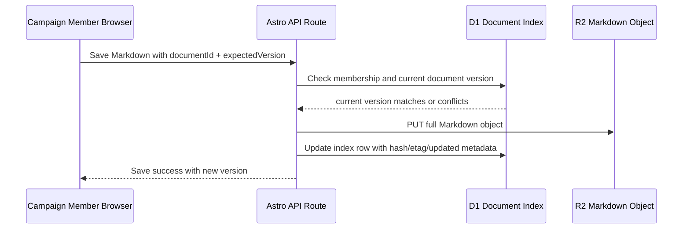

# Campaign Notes Source and Live Editing LLD

## Status

- Date: 2026-06-20
- Status: Draft requiring owner approval before runtime implementation
- Scope: Campaign session/note source-of-truth options, R2 Markdown persistence, D1 indexing, Obsidian/Markdown sync compatibility, member-authenticated editing, and live-editing technology boundary.
- Replaces draft assumptions in: `plans/features/campaign-notes-tenancy-hld-2026-06-19.md`
- Related ADRs: `0001`, `0004`, `0007`, `0009`, `0010`, `0016`, `0019`, `0021`, `0024`, `0025`

## Correction From Prior Draft

The prior LLD draft made two incorrect assumptions:

1. **GM-only V1 access.** The intended V1 audience is campaign `member` plus `gm`, with authorization still enforced by exact `campaign_memberships.campaign_slug` and role checks.
2. **D1 event log as primary live-note source.** The intended direction is that campaign sessions/notes may need to persist as Markdown-format documents in R2, with D1 used for indexing/search/discovery rather than as the canonical body store.

The corrected design below treats Campaigns as the likely exception to the normal Obsidian-first source-of-truth model, while preserving Obsidian/Markdown as the preferred source model for most of the site.

## Product Direction

Campaign session writing has different requirements from Canon and Using Aletheia content:

- Canon and most static/reference content should remain Obsidian/Markdown source-of-truth.
- Campaign session notes should be writable by average campaign users without requiring them to install Obsidian, clone a repo, configure a vault, or understand the producer pipeline.
- Campaign session/note bodies should still be Markdown so Obsidian can remain a first-class authoring/sync client where desired.
- R2 is the likely canonical storage layer for campaign session/note Markdown documents.
- D1 should index campaign/session/note metadata for route lookup, permissions, search, filtering, and sync reconciliation.

This is not a rejection of Obsidian. It is a narrower exception for campaign-session authoring because Campaigns are expected to become more app-like than the rest of the site.

## Goals

- Support campaign members writing session notes without requiring Obsidian setup.
- Preserve Markdown as the durable document format.
- Keep Obsidian usable as a front-end/editor for users who prefer it.
- Keep campaign tenant isolation keyed by exact `campaign_slug`.
- Use D1 for indexing/search, not as the canonical long-form Markdown body store.
- Avoid implementing collaborative/live editing before the tech model is agreed.
- Avoid changing the source-of-truth model for Canon, Using Aletheia, Reference, and ordinary static content.

## Non-goals

- No broad CMS conversion for the whole site in this phase.
- No Cloudflare Access.
- No campaign member mutation endpoints.
- No privileged admin/taxonomy console in this repo.
- No edits under `docs/contracts/`.
- No real-time collaborative editor implementation until the technology decision is explicit.
- No assumption that all users need Obsidian.
- No assumption that R2-backed Campaigns must immediately force all site content into R2 as canonical source.

## Source-of-Truth Model

### Current normal site model

```text
Obsidian or portable Markdown source
  -> producer/content sync
  -> D1 content_index + R2 published blobs
  -> Astro runtime rendering
```

This remains preferred for most of the site.

### Proposed Campaign session/note model

```text
Website editor or Obsidian/Markdown client
  -> R2 canonical Markdown document
  -> D1 campaign note/session index rows
  -> Astro runtime rendering + search/listing
```

Under this model:

- R2 owns the current Markdown body for campaign session/note documents.
- D1 owns queryable metadata and lookup state.
- Obsidian can still be a client/source interface if it can sync Markdown files to/from the R2-backed document model.
- The website can write Markdown documents for members who do not use Obsidian.

## Storage Responsibilities

| Concern | Proposed V1 responsibility | Notes |
| --- | --- | --- |
| Markdown body | R2 | Canonical for campaign session/note documents if this model is approved. |
| Metadata/index | D1 | Campaign slug, document id, session/date fields, title, visibility, authors, updated timestamp, R2 key, search fields. |
| Search/list/filter | D1 | Start with metadata; add FTS/search indexing as needed. |
| Auth/session | Better Auth + D1 `campaign_memberships` | Existing boundary. |
| Obsidian compatibility | Markdown/frontmatter contract | Obsidian is an allowed client/front-end, not mandatory for campaign users. |
| Live collaboration state | Not decided | Requires explicit technology choice before implementation. |

## R2 as Canonical Campaign Markdown Store

R2 is a good fit for canonical campaign Markdown bodies if the implementation accepts object-storage constraints:

### Benefits

- Stores Markdown files directly.
- Works with public-site Cloudflare architecture.
- Does not require campaign users to understand Git or Obsidian.
- Keeps D1 rows small and query-focused.
- Leaves room for Obsidian/R2 sync tooling later.

### Constraints and risks

- R2 objects are whole-file writes; there is no relational transaction spanning R2 and D1.
- Concurrent edits need explicit conflict detection.
- D1 index rows can drift from R2 objects unless writes and reconciliation are designed carefully.
- Search indexing needs update discipline after each R2 write.
- If Obsidian and the website can both edit the same document, same-file conflict policy must be explicit.

### Required mitigations

- Use document-level version metadata for optimistic concurrency.
- Use D1 rows as the write coordination/index state.
- Store R2 object key and latest version/hash in D1.
- On write, verify the client is editing the expected version before overwriting the R2 object.
- After R2 write, update D1 index metadata; on partial failure, surface recoverable error and provide reconciliation tooling later.
- Do not allow blind last-write-wins for shared campaign documents.

## Document Identity

A campaign note/session document needs a stable identity that works in both Obsidian and the website.

Recommended identity model:

```text
campaign_slug + document_id
```

Recommended document id / filename convention:

```text
{campaign_slug}-{session_date_or_sequence}-{short_uid}.md
```

Examples:

```text
barry-2026-06-20-7k3f9q.md
barry-session-012-7k3f9q.md
crownfall-2026-06-20-z8p2aa.md
```

Rationale:

- Filename remains human-readable in Obsidian.
- Short UID avoids collisions when multiple users create notes for the same session/date.
- The filename can serve as the practical Obsidian-facing id.
- D1 still stores `document_id` explicitly so future object-key changes do not break identity.

## Markdown Frontmatter Contract

Campaign session/note Markdown should carry enough frontmatter to be portable between website writing, R2 storage, and Obsidian clients.

Recommended starting frontmatter:

```yaml
---
collection: campaignSessions
campaign: barry
documentId: barry-2026-06-20-7k3f9q
type: session-note
title: Session Notes - 2026-06-20
visibility: campaignMembers
authors:
  - user:better-auth-user-id-or-contributor-id
sessionDate: 2026-06-20
source: campaign-site
createdAt: 2026-06-20T17:00:00.000Z
updatedAt: 2026-06-20T17:20:00.000Z
version: "r2-etag-or-content-hash"
---
```

Notes:

- `campaign` is required and must match the exact campaign slug.
- `documentId` is required and should match the stable filename stem.
- `visibility` defaults to `campaignMembers`.
- `visibility: public` is allowed as a product option, but whether members can publish directly or require GM approval remains an open decision.
- `authors` should include the member who created/wrote the document.
- `source` can distinguish `campaign-site`, `obsidian`, `import`, or future writer sources.
- `version` supports optimistic concurrency but should not be treated as a security boundary.

## Authorization Model

Authentication remains Better Auth.

Authorization remains exact `campaign_memberships` checks using the canonical campaign slug.

### V1 access defaults

| Actor | Read `campaignMembers` note | Create note | Update own/shared note | Set public visibility | Delete/archive |
| --- | --- | --- | --- | --- | --- |
| Anonymous | Deny | Deny | Deny | Deny | Deny |
| Authenticated non-member | Deny | Deny | Deny | Deny | Deny |
| Campaign `member` | Allow | Allow | Allow by document policy | Open decision | Open decision |
| Campaign `gm` | Allow | Allow | Allow | Allow | Allow |

Implementation predicate for campaign member access:

```sql
SELECT role
FROM campaign_memberships
WHERE user_id = ?
  AND campaign_slug = ?
  AND role IN ('member', 'gm')
LIMIT 1;
```

GM-only capabilities, if needed, use:

```sql
AND role = 'gm'
```

`gmSpoilers`, `audienceWarnings`, legacy `secret`, and `publication` are never campaign note authorization inputs.

## Visibility Model

V1 campaign note visibility should align with existing campaign visibility vocabulary:

- `campaignMembers` default;
- `public` optional;
- `gm` optional only if GM-private notes are explicitly included.

Open policy decisions:

1. Can any member set a note to `public`, or must a GM approve public visibility?
2. Are member-authored notes editable by all members, only original authors, or GMs plus original authors?
3. Is `gm` visibility in V1, or deferred until there is a concrete GM-private note need?

## Live Editing Technology Boundary

### Astro-native is sufficient for bounded non-collaborative editing

Astro can support a first website editor if the scope is:

- authenticated campaign member opens one Markdown document;
- client-side state is local to one Astro Island;
- save/update happens through Astro API routes/actions;
- R2 stores whole Markdown object;
- D1 stores lookup/index/version metadata;
- conflicts are detected by version/ETag and shown to the user.

This does not require a client framework by default. A vanilla TypeScript island is consistent with ADR-0007 for bounded interaction.

### Astro-native is not enough by itself for collaborative live editing

If the desired feature is Google-Docs-like or Notion-like shared live editing, the design needs a separate technology decision before coding. Candidates include:

- Durable Objects + WebSockets for per-document/session coordination;
- a CRDT library and sync protocol;
- an external editor/collaboration backend;
- eventual extraction of Campaigns into a dedicated app/service.

Do not implement collaborative live editing accidentally as repeated R2 overwrites from multiple clients.

## Recommended Phasing

### Phase 0: Decide source/write architecture

Before runtime code, approve or amend this model:

- R2 Markdown document is canonical for campaign sessions/notes.
- D1 indexes and coordinates document metadata/version.
- Obsidian remains an optional Markdown client/sync source, not mandatory for campaign users.
- V1 editor is not collaborative live editing.

### Phase 1: R2-backed Markdown document foundation

Implement the storage/index contract without a rich editor:

- D1 table for campaign note/session documents.
- R2 key convention for Markdown documents.
- Markdown/frontmatter validation.
- API read/write for campaign members using optimistic version checks.
- Tests for campaign slug tenancy, visibility, and version conflict handling.

### Phase 2: Basic Campaigns Astro Island editor

Implement a simple editor:

- textarea/Markdown editor island;
- local draft state;
- save button;
- conflict detection and explicit reload/merge prompt;
- no real-time shared editing;
- no global client state.

### Phase 3: Obsidian/R2 sync compatibility

Define how local Markdown/Obsidian files sync with R2 canonical campaign documents:

- accepted filename/frontmatter contract;
- conflict behavior;
- source attribution;
- reconciliation tooling;
- whether Obsidian plugin/sync is expected or just generic R2 Markdown sync.

### Phase 4: Collaborative live editing decision, if needed

Only if product needs exceed simple editing:

- evaluate Durable Objects/WebSockets/CRDT/external backend;
- decide collaboration protocol;
- decide whether Campaigns extraction is required;
- update ADR/LLD before coding.

## D1 Schema Proposal: Document Index

This schema replaces the prior event-log-first proposal for the first R2-backed document implementation.

```sql
CREATE TABLE IF NOT EXISTS campaign_note_documents (
  document_id TEXT PRIMARY KEY,
  campaign_slug TEXT NOT NULL,
  scope TEXT NOT NULL CHECK (scope IN ('campaign', 'session')),
  session_slug TEXT,
  title TEXT NOT NULL,
  visibility TEXT NOT NULL DEFAULT 'campaignMembers' CHECK (visibility IN ('public', 'campaignMembers', 'gm')),
  r2_key TEXT NOT NULL,
  content_hash TEXT NOT NULL,
  r2_etag TEXT,
  created_by_user_id TEXT NOT NULL,
  updated_by_user_id TEXT NOT NULL,
  created_at TEXT NOT NULL,
  updated_at TEXT NOT NULL,
  source TEXT NOT NULL DEFAULT 'campaign-site' CHECK (source IN ('campaign-site', 'obsidian', 'import', 'system')),
  metadata_json TEXT NOT NULL DEFAULT '{}',
  CHECK (
    (scope = 'campaign' AND session_slug IS NULL)
    OR (scope = 'session' AND session_slug IS NOT NULL)
  )
);

CREATE INDEX IF NOT EXISTS idx_campaign_note_documents_campaign_updated
  ON campaign_note_documents(campaign_slug, updated_at DESC, document_id);

CREATE INDEX IF NOT EXISTS idx_campaign_note_documents_session_updated
  ON campaign_note_documents(campaign_slug, session_slug, updated_at DESC, document_id);

CREATE INDEX IF NOT EXISTS idx_campaign_note_documents_visibility
  ON campaign_note_documents(campaign_slug, visibility, updated_at DESC);

CREATE UNIQUE INDEX IF NOT EXISTS idx_campaign_note_documents_r2_key
  ON campaign_note_documents(r2_key);
```

Future search can either extend this table with search fields or add an FTS table keyed by `document_id`.

## R2 Key Convention

Use a campaign-notes prefix distinct from published static content blobs:

```text
campaign-notes/documents/v1/campaign={encoded_campaign_slug}/scope={scope}/document={document_id}.md
```

Examples:

```text
campaign-notes/documents/v1/campaign=barry/scope=session/document=barry-2026-06-20-7k3f9q.md
campaign-notes/documents/v1/campaign=crownfall/scope=campaign/document=crownfall-campaign-notes-z8p2aa.md
```

D1 stores the canonical unencoded `campaign_slug` and `document_id`.

## Write Flow: Basic Non-collaborative Save



Conflict behavior:

- If expected version does not match D1 current version, return `409 Conflict`.
- Client must show that the document changed and offer reload/manual merge.
- Do not silently overwrite another member's changes.

## V1 Editing Model

V1 should use normal document editing, not append-only notes.

The intended first editor model is:

1. User opens a campaign session/note document.
2. Server authorizes the user through exact campaign membership.
3. Server loads the current Markdown document from R2.
4. Client edits the Markdown document in a bounded Astro Island editor.
5. Client saves the full Markdown document with the version it originally loaded.
6. Server verifies the expected version still matches the D1 index/current R2 metadata.
7. Server writes the full Markdown object back to R2 and updates D1 index metadata.

This is not the same as shared multi-user realtime editing. V1 can be single-user-at-a-time, whole-document load/edit/save with optimistic concurrency. If another user saves between load and save, the server returns `409 Conflict` and the client must show a reload/manual-merge path rather than silently overwriting.

## Test Plan

### Unit tests

- R2 key builder encodes campaign slugs and document ids safely.
- Frontmatter parser validates required campaign/document/visibility fields.
- Markdown writer preserves required frontmatter on save.
- Version conflict checker rejects stale writes.

### D1/repository tests

- Document queries always include exact `campaign_slug`.
- Member/gm access uses `role IN ('member', 'gm')`.
- Public listing only includes `visibility = 'public'` unless authenticated campaign access is present.
- Save flow updates `content_hash`, `r2_etag`, `updated_by_user_id`, and `updated_at`.

### API tests

- Anonymous users cannot read/write `campaignMembers` documents.
- Authenticated non-members cannot read/write campaign documents.
- Campaign members can read/write `campaignMembers` documents for their exact campaign.
- GMs can read/write campaign documents for their exact campaign.
- Cross-campaign access fails even if the same document id is guessed.
- Stale version write returns `409` and does not update R2.

### UI checks

- Campaign member sees editor only for campaigns they belong to.
- Non-member/anonymous users receive no document body in HTML or API response.
- Save success and conflict errors are visible and accessible.
- Works in at least one light and one dark theme.

## Open Decisions Before Coding

1. Confirm R2 Markdown documents are canonical for campaign sessions/notes.
2. Confirm D1 is index/search/coordination, not canonical body storage.
3. Confirm V1 is non-collaborative whole-document Markdown editing, not real-time shared editing.
4. Decide whether V1 creates session-scoped documents only or also campaign-scoped documents.
5. Decide whether `visibility: public` can be set by members or only by GMs.
6. Decide edit policy: all members can edit all member-visible notes, or only original author plus GMs.
7. Decide whether `gm` visibility exists in V1.
8. Decide whether Obsidian/R2 sync compatibility is Phase 1 requirement or Phase 3 follow-up.
9. Decide if this architecture is significant enough to require a new ADR before implementation.

## Readiness Gate

Do not implement live editing until the source/write architecture is approved. The next safe coding slice after approval is the R2-backed Markdown document foundation: D1 index table, R2 key builder, frontmatter validation, optimistic version checks, and API tests. The Astro Island editor should come after the storage/index/write contract is proven.
