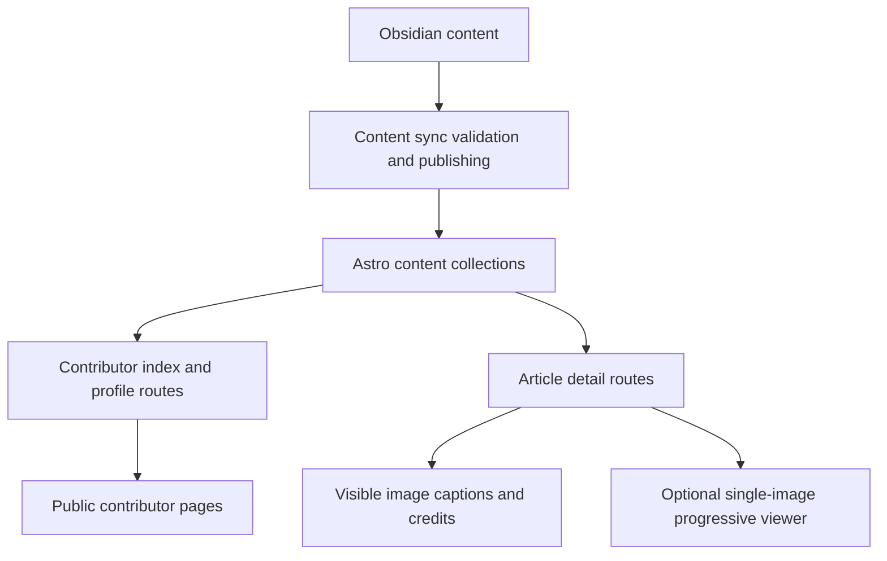

# Contributors and Attribution High-Level Design

## Status

- Date: 2026-05-29
- Updated: 2026-05-30
- Status: Draft HLD for review
- Owner: Brad
- Scope: Contributors IA, contributor metadata, contribution attribution, and image attribution/viewing direction


## Relational Attribution Addendum

This HLD is amended by `plans/features/contributor-relational-attribution-hld-2026-05-30.md` and ADR `plans/adrs/0022-relational-contributor-attribution-index.md`. The addendum keeps this document's IA/profile/source-frontmatter direction, but replaces broad contributor-search semantics with a relational D1 model using `contributors` and `attributions` tables.

## Problem Statement

World of Aletheia now has its first external contributor. The site needs a way to recognize contributors publicly, support contributor bios and links, and connect contributors back to the public work they helped create.

The design must also account for image contributors and visible image attribution, because art credits are often more specific than article-level authorship. A related backlog feature is full-size image viewing from article images and thumbnails; this HLD captures the direction but keeps that feature separable from the initial contributors MVP.

## Goals

1. Add a public contributors area without promoting it to the same IA level as Canon, Reference, or Campaigns.
2. Provide one contributors index page and individual contributor profile pages.
3. Rename article authorship metadata to `authors` while adding separate non-author contribution credits.
4. Support contributor roles such as artist, editor, researcher, consultant, cartographer, photographer, or other material contributor.
5. Support per-image attribution near the rendered image with sync-time validation.
6. Keep all public pages easy to navigate back into the main site through existing global layout/navigation.
7. Keep implementation Astro-native, static-first, and Obsidian-friendly.
8. Avoid speculative service/adapter/contract layers.

## Non-Goals

1. No privileged contributor admin dashboard in this repository.
2. No CMS-style contributor management.
3. No bidirectional sync with Obsidian.
4. No client framework adoption for contributor pages.
5. No requirement to ship full-size image viewing in the first contributors MVP.
6. No complex rights-management system for image licensing in the first phase.
7. No automatic sync-time frontmatter rewriting in the MVP; sync reports issues and authors fix the Obsidian source of truth.

## Architectural Constraints

- Obsidian remains the source of truth for authoring.
- Content flows one way: Obsidian -> repo/cloud content -> build/runtime -> deploy.
- Astro content collections and existing content/index patterns remain the application data model.
- Public Canon and Using Aletheia content remains static-first.
- Image rendering must continue to follow the Astro image policy:
  - `<Picture>` for hero/banner/high-impact responsive surfaces.
  - `<Image>` for inline, card, avatar, and thumbnail surfaces.
- Any site-wide full-size image viewer should be progressive enhancement on top of semantic links and Astro-rendered images.

## Information Architecture

Contributors should be treated as a public support/community area, not a fifth primary product layer.

Recommended routes:

- `/contributors` — contributor index
- `/contributors/[slug]` — contributor profile

Primary discovery path:

- Footer link to `Contributors`
- Optional link from `/about`
- Optional contextual link from `/contribute`

Global navigation should continue to prioritize the four current site layers:

1. World of Aletheia / Canon
2. Using Aletheia
3. Reference
4. Campaigns

The existing prominent `Contribute` CTA can remain because it is an action, not a primary content domain.

## Contributor Collection

Introduce a new `contributors` content collection.

Example file layout:

```txt
src/content/contributors/brad.md
src/content/contributors/barry.md
src/content/contributors/example-artist.md
```

Draft frontmatter shape:

```yaml
title: Example Artist
displayName: Example Artist
status: publish
avatar: /images/contributors/example-artist.jpg
bioExcerpt: Short public summary used on cards and index pages.
socials:
  - label: Website
    url: https://example.com
  - label: Bluesky
    url: https://bsky.app/profile/example.bsky.social
profileMode: standard
featuredContributions:
  - collection: lore
    slug: people/example-entry
```

Markdown body contains the full contributor bio.

### Contributor Index Display

The contributors index should start as one unified list. Do not initially group contributors into authors, artists, researchers, etc. Role data can support badges, filters, grouping, or other treatment later after the contribution model has real usage.

### Profile Display Modes

Core contributors such as Brad and Barry are already associated with too much content for a simple "list everything" profile. Contributor profiles should support two modes:

- `standard` — show all matching public authored/contributed entries and always include a link to search results for this contributor.
- `featured` — show only curated `featuredContributions` and always include a link to search results for this contributor.

The search link should match both authored and contributed content, conceptually: `authors contains contributor OR contributors contains contributor`. The exact query contract can be refined when search supports this filter explicitly.

Curation belongs on the contributor profile frontmatter, not on individual articles. Whether an article is featured for Brad's or Barry's profile is profile UX metadata, not an intrinsic article property.

## Article Authorship and Contributor Credits

Rename `author` to `authors` as part of this data-model change. The Obsidian vault will be brute-force migrated to the new field name, making this the best time to remove the legacy singular field.

Recommended article-level fields:

```yaml
authors:
  - brad
  - barry
contributors:
  - id: example-researcher
    roles:
      - researcher
  - id: example-artist
    roles:
      - artist
      - cartographer
  - id: example-editor
    roles:
      - editor
```

### Semantics

- `authors` identifies the person or people responsible for writing or maintaining the article text.
- `contributors` identifies people who materially contributed but are not necessarily authors.
- Every author is also conceptually a contributor, but authors do not need to be duplicated in `contributors`.
- Contributor roles are derived from `contributors[].roles`; author treatment is derived from `authors`.
- A contributor can have multiple roles for the same article.

### Draft Contributor Roles

Use role nouns, not activity nouns. Start with a small enum and expand only when real content requires it:

- `artist`
- `editor`
- `researcher`
- `consultant`
- `cartographer`
- `photographer`
- `other`

Do not include `author` in `contributors[].roles`; `authors` is the author contract.

## Contribution Indexing and Profile Backlinks

Contributor profile pages should list or link to public work connected through article frontmatter.

Initial lookup rules:

1. Match articles where `authors` contains the contributor slug.
2. Match articles where `contributors[].id` equals the contributor slug.
3. Respect existing publication/visibility rules.
4. Render matching entries with the existing content card pattern where possible.
5. Always include a search link for the contributor profile, even when the page is in `featured` mode.

For Brad and Barry, use `profileMode: featured` from the beginning to avoid overwhelming their pages.

Do not use per-image captions as the primary source for profile contribution indexing. Captions are display attribution and validation evidence; frontmatter is the indexing contract.

## Image Attribution

Image attribution has two separate layers:

1. Article frontmatter contributor metadata for indexing and profile backlinks.
2. Per-image visible attribution immediately after the image for reader-facing credit.

### Required Caption Position

A credited image caption must immediately follow the Markdown image, with only whitespace or linefeeds between the image and caption.

Valid:

```md


*Art by [Example Artist](../contributors/example-artist.md). Used with permission.*
```

Invalid because paragraph text appears between image and credit:

```md


Some paragraph text.

*Art by [Example Artist](../contributors/example-artist.md). Used with permission.*
```

The content sync validation can therefore look for a Markdown image, optional whitespace-only lines, and then a following caption line containing a Markdown link whose `()` target includes `contributors/`.

### Validation Direction

Contributor and image attribution validation belongs at content sync time because invalid content should be caught before it is allowed into the published content path.

Initial validation can warn while the convention stabilizes, then promote important structural problems to failures.

Desired validation over time:

1. `authors[]` ids resolve to existing contributor entries.
2. `contributors[].id` ids resolve to existing contributor entries.
3. Image credit links using Markdown link targets that include `contributors/...` resolve to existing contributor entries.
4. If `contributors[].roles` includes `artist`, the article should contain at least one immediate image caption crediting that contributor.
5. If an image caption credits a contributor, the article should list that contributor in frontmatter with `roles: [artist]` or an equivalent multi-role array containing `artist`.
6. Non-decorative images include alt text.
7. Broken contributor references fail validation once the convention is stable.

Sync should report missing or mismatched frontmatter rather than auto-populating it. The fix should happen in Obsidian, the source of truth.

## Full-Size Image Viewing Direction

Astro `<Image>` and `<Picture>` solve responsive image optimization and delivery. They do not provide modal/full-size viewing, ESC close behavior, focus management, or caption display in an overlay.

If full-size viewing is implemented, it should be a site-wide progressive enhancement:

```astro
<a href={fullSizeSrc} data-lightbox>
  <Image src={thumbnailSrc} alt={alt} />
</a>
```

MVP behavior:

- Single-image overlay only; no gallery previous/next controls in the MVP.
- Without JavaScript, the anchor opens the full-size image normally.
- With JavaScript, the anchor opens a lightweight overlay.
- Close via visible close button, ESC, or backdrop click.
- Focus returns to the thumbnail/link that opened the overlay.
- Captions and attribution are available in the overlay where possible.

Implementation should use vanilla TypeScript and DOM APIs, aligned with the Astro Islands vanilla-first policy. No new dependency is justified for the MVP.

## Data Flow



## UX Requirements

### Contributors Index

- Short intro explaining that contributors help build and refine Aletheia.
- One unified card/grid of published contributors.
- Each card includes name, avatar if available, and short excerpt.
- Link to individual profile.
- Preserve normal global header/footer.

### Contributor Profile

- Display name, avatar, bio, and optional social links.
- `standard` mode lists all public authored/contributed entries.
- `featured` mode lists curated `featuredContributions` only.
- Both modes include a search link for matching authored/contributed content.
- Contribution cards should use existing article card styling where practical.
- Distinguish authored work from other credited contributions where useful, but keep the initial page structure simple.
- Include `Back to Contributors` contextual link.
- Preserve normal global header/footer for return to main site navigation.

### Article Attribution

- Article pages may show authors and contributor credits in metadata areas if enough signal exists.
- Per-image art credits must appear immediately after credited images, not only in a page-level credit block.

## SEO and Privacy

- Public contributor pages are indexable by default if `status: publish`.
- Contributor social links should be explicit opt-in frontmatter.
- No private contributor contact data should be exposed.
- Protected campaign content must not leak through contribution listings or search links.

## Open Questions

1. Exact contributor collection schema field names beyond the draft above.
2. Exact search URL/query parameter contract for contributor profile search links.
3. Should contributor profiles show role badges in the MVP, or defer badges until there is more contribution data?
4. Which content sync validation failures begin as warnings versus hard failures?
5. Where should contributor/content authoring documentation live?

## Recommendation Summary

Proceed with `/contributors` and `/contributors/[slug]` as a support/community area linked from the footer. Rename `author` to `authors`, add structured article-level `contributors` with `roles: []`, and establish immediate per-image attribution captions validated during content sync. Treat full-size image viewing as a separate site-wide single-image progressive enhancement that continues to render images through Astro `<Image>` and `<Picture>`.
