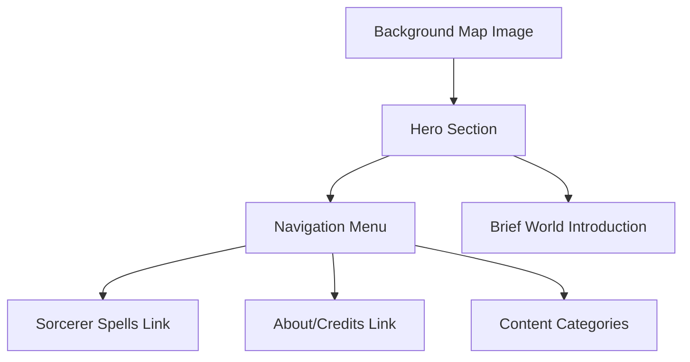

# World of Aletheia - Homepage Architecture

## Design Principles
- Immersive fantasy aesthetic
- Performance-first approach
- Mobile-responsive
- Clear navigation

## Layout Structure

## Component Breakdown
1. **Background Map**
   - Full-width, slightly muted
   - Responsive scaling
   - Lazy-loaded for performance

2. **Hero Section**
   - Overlaid on map
   - Project title: "World of Aletheia"
   - Tagline: Immersive Tabletop RPG Setting

3. **Navigation**
   - Minimal, clear links
   - Mobile-friendly hamburger menu
   - Consistent with spell index project design

4. **Typography**
   - Headings: Lora
   - Body/UI: Inter
   - Parchment/ink color scheme

## Performance Considerations
- Optimize map image
- Minimal JavaScript
- Static generation
- Cloudflare Pages deployment

## Responsive Breakpoints
- Mobile: Stacked, full-width
- Tablet: Slight layout adjustments
- Desktop: Expanded navigation