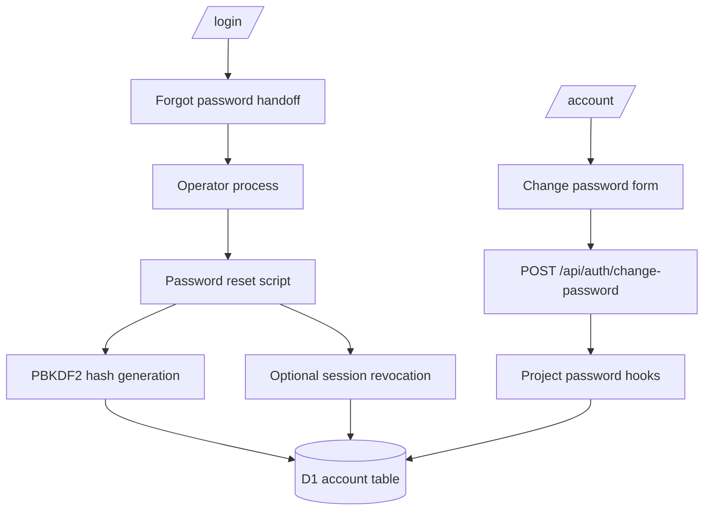

# Password Recovery and Account Password UX HLD

## Status

- Date: 2026-06-02
- Status: Proposed
- Correction: reset-password completion is operator-script-owned, not public-site UI.
- Related ADRs:
  - `plans/adrs/0015-seo-and-crawler-governance-policy.md`
  - `plans/adrs/0021-external-admin-capability-boundary.md`
  - `plans/adrs/0023-cloudflare-worker-friendly-versioned-password-hashing.md`

## Context

ADR-0023 replaces Better Auth's default password hashing with project-owned WebCrypto PBKDF2 hooks. Existing credential hashes are intentionally not supported by the new verifier, so users with old credential hashes need a reset/recreation path.

The public site should not host a token-bearing reset-password page. The owner clarified that reset-password completion feels like admin/operator functionality and does not belong on the user-facing site. Password resets are expected to be rare: initial ADR-0023 migration, pepper/key incidents, or occasional account repair.

Given that frequency, a small operator script is the right fit. It avoids a permanent public reset surface, avoids an admin dashboard in this repo, and keeps the reset operation explicit, auditable, and operator-controlled.

## Goals

1. Add an obvious public-site “Forgot password?” handoff without adding reset-token completion UI.
2. Add signed-in “Change password” UX on `/account` for normal future password changes.
3. Provide an operator script for rare credential reset/recreation.
4. Preserve Better Auth + D1 + Cloudflare as the current auth architecture.
5. Preserve `user.id` and campaign memberships wherever possible.
6. Avoid admin dashboards, service/adaptor/contract layers, new dependencies, and external auth services.

## Non-goals

1. Do not add `/reset-password` or equivalent token completion to the public site.
2. Do not wire Better Auth `sendResetPassword` for public-site token reset.
3. Do not build privileged account-management UI in this repository.
4. Do not implement legacy scrypt compatibility.
5. Do not log passwords, full hashes, salts, derived keys, pepper values, or generated SQL containing full hashes.

## Capability Boundary

### Public site

The public site owns:

- normal sign-in/sign-up UX
- a “Forgot password?” link or page that explains the operator-assisted recovery path
- signed-in change password on `/account`

### Operator script

A repo script owns rare password reset/recreation. This is not a public runtime feature. It is invoked intentionally by an operator with access to the relevant environment and D1 database.

The script should:

- identify the target user by canonical email or explicit user ID
- generate a new ADR-0023-compatible PBKDF2 hash using the same versioned format
- update or create the Better Auth credential account row for that existing user
- preserve the `user.id` so campaign memberships continue to work
- optionally revoke sessions for the user
- avoid printing secrets or full hashes to terminal output

### External admin dashboard

A future external admin dashboard may replace or wrap this script, but that belongs outside this public-site repo under ADR-0021 unless a later ADR changes the boundary.

## Proposed Architecture



## Operator Script Policy

Add a script under `scripts/`, for example:

```text
scripts/operator-reset-password.mjs
```

The script should be standalone Node ESM and use only built-ins plus project code that is safe to import from Node. If importing TypeScript from `src/lib/password-hashing.ts` is not practical in plain Node, duplicate the minimal PBKDF2 hash generation in the script and keep constants/format aligned with ADR-0023 through tests.

### Inputs

Preferred inputs:

- `--email <email>` or `--user-id <id>`
- `--env local|staging|prod`
- optional `--revoke-sessions`
- optional `--dry-run`

Password input should be interactive and hidden if practical. If hidden prompt is too much for a first pass, read from stdin rather than a command-line flag so the password is not captured in shell history.

The script must require `PASSWORD_HASH_PEPPER` from the operator environment and should not read it from tracked plain vars.

### Behavior

1. Resolve target user.
2. Fail if zero or multiple users match.
3. Prompt/read new password and confirmation.
4. Enforce minimum length consistent with Better Auth UI policy.
5. Generate `woa-pbkdf2-sha256-v1:<iterations>:<salt>:<derivedKey>` hash.
6. Upsert/update the existing user's credential account row.
7. Optionally delete sessions for that user.
8. Print only sanitized success metadata: user ID, email, environment, whether credential was updated/created, whether sessions were revoked.

### D1 execution model

Two acceptable implementation models:

1. **Generate SQL and pipe to Wrangler** from the script.
2. **Use `wrangler d1 execute` as a child process** with generated SQL.

Do not add a direct SQLite/D1 client dependency.

For safety, prefer staging/local dry runs first and require explicit `--env prod` for production.

## Public UX Policy

### `/login`

Add a visible “Forgot password?” link near the email sign-in form.

### `/forgot-password`

Use a small handoff page, not a token reset form.

Recommended copy direction:

- explain that password reset is operator-assisted for now
- tell the user what contact channel or next step to use
- avoid promising instant automated reset
- no account existence disclosure
- no token fields
- `noindex,nofollow`

### `/account`

Add a signed-in “Change password” section for users who know their current password. This is useful after migration and for normal future changes, but it cannot migrate old unsupported hashes.

## Migration Implications

Initial old-hash migration should use the operator script:

1. Set `PASSWORD_HASH_PEPPER` in staging/production secrets.
2. Deploy ADR-0023 hashing hooks.
3. For each existing credential user, run the reset script against staging/prod as appropriate.
4. Preserve existing Better Auth `user.id`.
5. Revoke sessions after reset unless there is a reason not to.
6. Verify new hashes use the `woa-pbkdf2-sha256-v1` prefix.
7. Verify `/account` and campaign membership access.

## Acceptance Criteria

1. Public site has no reset-token completion page.
2. Public site has a forgot-password handoff.
3. Public site has signed-in change password on `/account`.
4. Operator script can reset/recreate a credential password for an existing user while preserving `user.id`.
5. Operator script uses ADR-0023 hash format and required pepper.
6. Operator script does not log passwords, full hashes, salts, derived keys, or pepper values.
7. Campaign memberships remain valid after reset.
8. `pnpm test` and `pnpm build` pass for implementation work.
