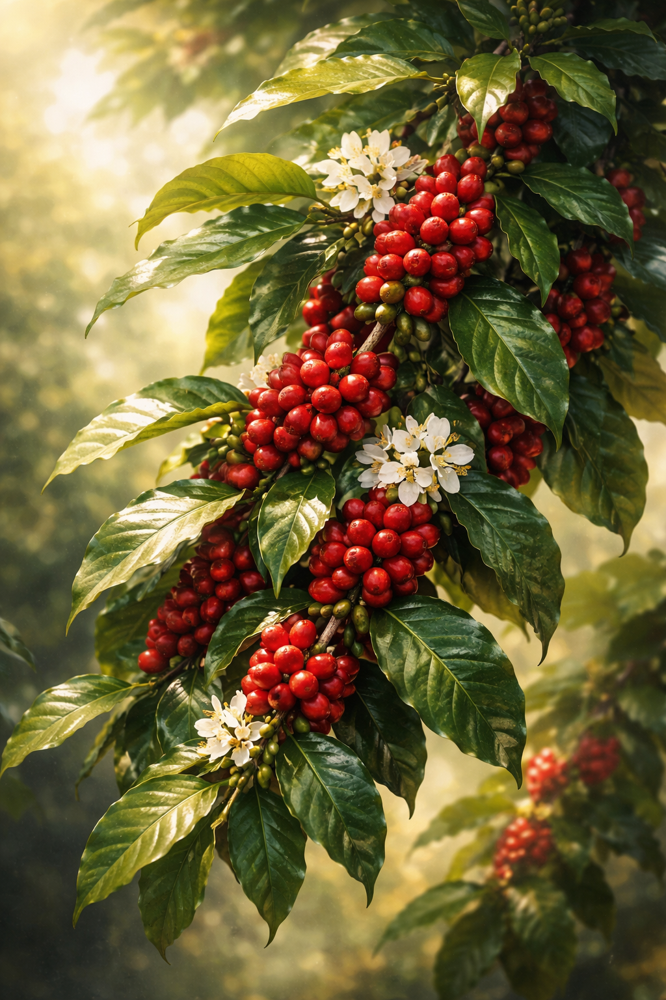

## Overview

**Káfa** is a perennial evergreen shrub cultivated for its seeds.

It is one of the most economically significant agricultural plants in several temperate and subtropical regions of Aletheia. While the beverage derived from its roasted seeds is culturally influential (see: _Káfa_), this article concerns the plant itself — its structure, cultivation, and geographic distribution.

The plant is unassuming.

Its impact is not.

---

## Botanical Description

Káfa is a broad-leafed evergreen shrub typically growing between 1.5 and 3 meters when cultivated. Wild specimens may grow taller under favorable conditions.

Key features include:

- Dark, waxy, oval leaves
    
- Small, fragrant white blossoms
    
- Red to deep-crimson berries
    
- Two pale, hard seeds within each berry
    

The plant flowers seasonally, often after sustained rainfall. Blossoms are short-lived but aromatic. Berries mature over several months before harvest.

The seeds — once dried and roasted — are used to produce a widely consumed stimulant beverage. In their raw state, they are pale and relatively unremarkable.

---

## Growing Conditions

Káfa requires:

- Warm climates
    
- Moderate elevation
    
- Reliable rainfall or irrigation
    
- Well-drained, mineral-rich soil
    

It thrives particularly in:

- Highland terraces
    
- Humid foothills
    
- Subtropical uplands
    

It performs poorly in:

- Cold northern climates
    
- Waterlogged marshland
    
- Arid deserts
    

As a result, cultivation is geographically concentrated, and regions capable of producing high-quality káfa often become economically significant beyond their size.

---

## Cultivation

Káfa is a long-term crop. Plants require several years before reaching reliable productivity.

Harvesting is labor-intensive. Berries must be:

1. Hand-picked
    
2. Sorted
    
3. Dried or fermented (regional variation)
    
4. Hulled to extract the seeds
    

Processing methods influence the final seed quality and therefore market value.

Because káfa requires sustained tending and does not yield immediate returns, plantations represent stable agricultural investment rather than speculative planting. This makes káfa-growing regions particularly sensitive to political instability.

---

## Wild Varieties

Wild káfa grows in certain forested uplands and produces smaller berries with variable seed quality.

Most cultivated strains are selectively bred for:

- Berry size
    
- Yield consistency
    
- Disease resistance
    
- Flavor characteristics once processed
    

Wild populations are occasionally harvested, but rarely form the basis of major trade.

---

## Trade Significance

Although the plant grows only in specific climates, its seeds are widely traded.

Transported dried, they are durable and compact, making them well-suited to long-distance commerce.

Regions unable to cultivate káfa often rely heavily on imports, creating sustained trade routes and periodic price volatility.

---

## Magical Considerations

Káfa has no known direct interaction with the Lattice.

It is not inherently magical.

It does not enhance arcane ability in plant form.

It is simply a plant whose agricultural success has had disproportionate economic and cultural consequences.

---

## Summary

Káfa is:

- A perennial evergreen shrub
    
- Climate-sensitive and regionally concentrated
    
- Labor-intensive to cultivate
    
- Economically significant
    
- Botanically ordinary
    

It grows quietly.

Others make noise about what it becomes.